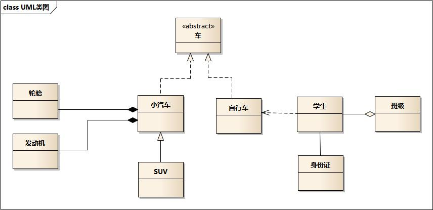

# UML

- 车的类图结构为 abstract，表示车是一个抽象类

- 车有小汽车和自行车两个继承类，它们与车的关系为实现关系，使用带空心箭头的虚线表示

- 小汽车为与 SUV 之间是泛化关系，使用带空心箭头的实线表示

- 小汽车与发动机之间是组合关系，使用带实心箭头的实线表示

- 学生与班级之间是聚合关系，使用带空心箭头的实线表示

- 学生与身份证之间为关联关系，使用一根实线表示

- 学生上学需要用到自行车，与自行车是一种依赖关系，使用带箭头的虚线表示

## 实现关系

实现关系表现为继承抽象类

实现关系用一条带空心箭头的虚线表示

## 泛化关系

泛化关系表现为继承非抽象类

泛化关系用一条带空心箭头的实接表示

## 聚合关系

聚合关系用于表示实体对象之间的关系，表示整体由部分构成的语义

整体和部分不是强依赖的，即使整体不存在了，部分仍然存在

聚合关系用一条带空心菱形箭头的实线表示

## 组合关系

与聚合关系一样，组合关系同样表示整体由部分构成的语义

组合关系是一种强依赖的特殊聚合关系，如果整体不存在了，则部分也不存在了

组合关系用一条带实心菱形箭头实线表示

## 关联关系

关联关系描述不同类的对象之间的结构关系

它是一种静态关系，通常与运行状态无关，一般由常识等因素决定的，它一般用来定义对象之间静态的、天然的结构

关联关系是用一条实线表示的

关联关系默认不强调方向，表示对象间相互知道，如果强调方向，可以在直线上加箭头

## 依赖关系

依赖关系描述一个对象在运行期间会用到另一个对象的关系，与关联关系不同的是，它是一种临时性的关系，通常在运行期间产生，并且随着运行时的变化

依赖关系是用一套带箭头的虚线表示