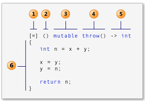

# lambda 表达式

```cpp
[capture](parameters)->return-type {body}
```


lambda 表达式使得可以使用匿名函数

使用 `auto` 关键字保存 lambda 表达式，之后就可以当做正常的函数使用

lambda 表达式是 inline 函数

- `[...]`：标识一个 lambda 表达式的开始，不能省略；表达式可以引用在它之外声明的变量，但只能使用定义 lambda 为止时所在作用范围内可见的变量，这些变量的集合成为闭包，被定义在 `[]` 内
1. `[]`：没有任何参数
2. `[=]`：所在范围内所有可见的局部变量按值传递
3. `[&]`：所在范围内所有可见的局部变量按引用传递
4. `[this]`：所在类中的成员变量
5. `[a]`：将 a 按值进行传递
6. `[&a]`：将 a 按引用进行传递

- `()`：标识重载 `()` 操作符参数，接受参数可以按值和按引用传递

- `->`：标识返回值类型；当只有一个返回语句或返回类型为 void 时可以自动推导返回类型，故可以省略

- `{}`：函数体

- lambda 表达式默认是 const 函数，表达式内无法修改捕获的任何变量，但可以指定为 `mutable`，修改为非 const 函数

lambda 表达式在编译时被翻译成一个未命名的未命名对象，产生的类中含有一个重载的函数调用运算符 `operator()`

```cpp
auto lambda = [&os, str](const string &s) {
    os << s << str;
};

class LambdaImpl {
public:
    // [] 引用/值捕获
    LambdaImpl(ostream &os, string str) : os_(os), str_(str) {}

    // () 调用参数
    void operator()(const string& s) const {
        cout << s << str_;
    }

private:
    ostream &os_;
    string str_;
};
```