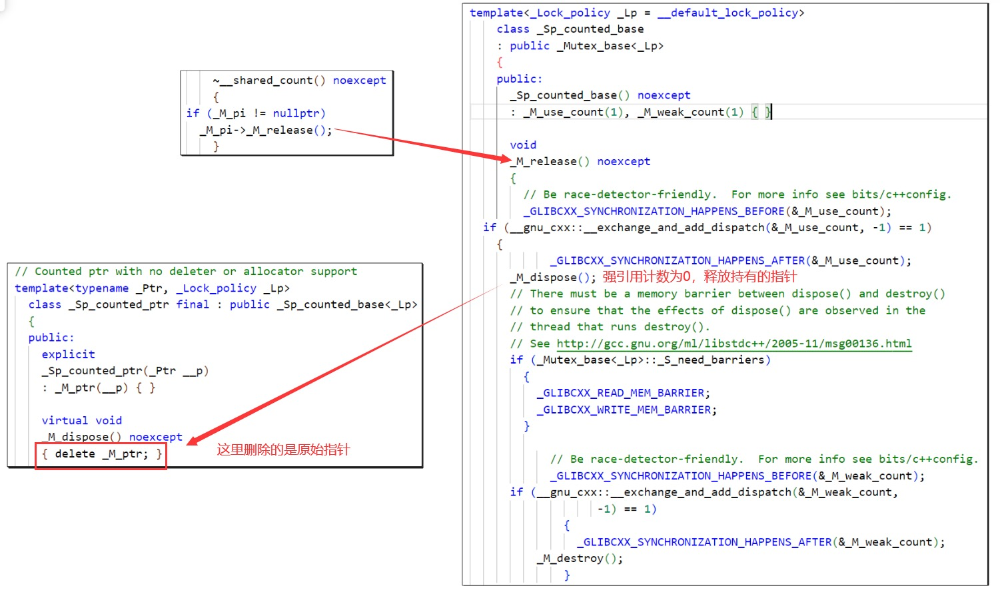
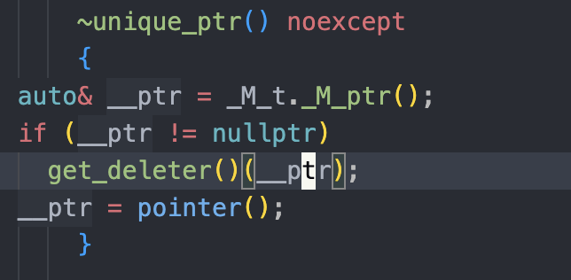

# shared_ptr

```cpp
template<class T>
class SharedPtr // 模拟实现shared_ptr
{
public:
	SharedPtr(T* tmp = nullptr)
		:_ptr(tmp)
		,count(new int(1))
	{}

	~SharedPtr()
	{
		if (--(*count) == 0)
		{
			delete _ptr;
			delete count;
		}
	}

	T& operator*()
	{
		return *_ptr;
	}

	T* operator->()
	{
		return _ptr;
	}
	
	SharedPtr(SharedPtr<T>& tmp)
		:_ptr(tmp._ptr)
		,count(tmp.count)
	{
		(*count)++;
	}

	SharedPtr<T>& operator=(SharedPtr<T>& tmp)
	{
		if (_ptr != tmp._ptr)  // 排除自己给自己赋值的可能
		{
			// 先要判断原来的空间是否需要释放
			if (--(*count) == 0)
			{
				delete _ptr;
				delete count;
			}
			_ptr = tmp._ptr;
			count = tmp.count;
			(*count)++;
		}
		return *this;  // 考虑连等的可能
	}
private:
	T* _ptr;
	int* count;
};
```

- 通过引用计数的方式来实现多个 `shared_ptr` 对象之间共享资源；`shared_ptr` 在其内部，给每个资源都维护了着一份计数，用来记录该份资源被几个对象共享；在对象被销毁时(也就是析构函数调用)，就说明自己不使用该资源了，对象的引用计数减一；如果引用计数是 0，就说明自己是最后一个使用该资源的对象，必须释放该资源;如果不是 0，就说明除了自己还有其他对象在使用该份资源，不能释放该资源，否则其他对象就成野指针了

- 在多线程程序下，多个线程都去访问 `shared_ptr` 管理的空间，如果线程是并行的，那么引用计数会可能发生错误；C++11 定义一个互斥锁，对所有引用计数 `++` 或者 `–-` 进行加锁处理，这样就能保障引用计数在操作的过程中能够不被切出去，因此 `shared_ptr` 本身引用计数是线程安全的

- `shared_ptr` 内部有两个指针，这两个指针的拷贝在多线程下是不安全的

- `shared_ptr<void>` 可以持有任何对象，并且安全释放

```cpp
// 指定删除器来释放内存
void deleter(int * pt) {
	delete [] pt;
}

shared_ptr<int> sp(new int [10], deleter);
```

- 循环引用问题

```cpp
struct Node
{
	int _data;
	shared_ptr<Node> _prev;
	shared_ptr<Node> _next;

	~Node(){ cout << "~Node()" << endl; }
};
int main()
{
	shared_ptr<Node> node1(new Node);
	shared_ptr<Node> node2(new Node);
	//ues_count == 1
	cout << node1.use_count() << endl;
	cout << node2.use_count() << endl;

	node1->_next = node2;
	node2->_prev = node1;

	//ues_count == 2
	cout << node1.use_count() << endl;
	cout << node2.use_count() << endl;
	return 0;
}
```

node1 和 node2 两个智能指针对象指向两个节点，引用计数变成 1，不需要手动 `delete`；node1 的_next 指向 node2 ，node2 的 _prev 指向 node1，它们的引用计数变成 2；node1 和 node2 析构，引用计数减到 1，但是 node1->_next 还指向 node2 节点，node2->_prev 还指向 node1；当 _next 析构时，node1 释放资源，当 _prev 析构时node2 释放资源。但是 _next 属于 node1 的成员，node1 释放了，_next 才会析构，而 node1 由 _prev 管理，_prev 属于 node2 成员，所以这就叫循环引用，谁也不会释放

## 缺点

- `shared_ptr` 的非侵入式引用计数，引用计数完全由 `shared_ptr` 控制，资源对象对与自己对应的引用计数一无所知，而引用计数与资源对象的生存期息息相关，这就意味着资源对象丧失了对生存期的控制权

- 由于使用了 `shared_ptr` 的资源对象必须仰仗 `shared_ptr` 的存在才能维系生存期，这就意味着使用资源的客户对象也必须使用 `shared_ptr` 来持有资源对象的引用，于是 `shared_ptr` 的势力范围成功地从资源对象本身扩散到了资源使用者，侵入了资源客户对象的实现。同时为了向客户转交资源对象的所有权，资源分配器也不得不在接口中传递 `shared_ptr`，于是 `shared_ptr` 也会侵入资源分配器的接口

- 资源对象的成员方法（不包括构造函数）需要获取指向对象自身，即包含了 `this` 指针的 `shared_ptr`，需要继承 `enable_shared_from_this`，对资源对象的继承体系有了要求

- 虽然采用了 `lock-free` 的原子整数操作一定程度上降低了线程同步开销，但本质上也仍然是串行化访问，线程同步的开销多少都会存在

## weak_ptr

为解决 `shared_ptr` 的循环引用问题，引出 `weak_ptr` 智能指针，`weak_ptr` 在指向被监视的 `shared_ptr` 后，并不会使被监视的引用计数增加，且当被监视的对象析构后就自动失效

- 只能通过 `shared_ptr` 或 `weak_ptr` 构造新的 `weak_ptr`，`shared_ptr` 可以直接赋值给 `weak_ptr`

- 没有重载 `opreator*` 和 `->` 操作符，也就意味着即使分配到对象，他也没法使用该对象，使用 `lock()` 可以得到 `shared_ptr` 或直接转化为 `shared_ptr`

```cpp
weak_ptr<A> wptr;
shared_ptr<A> obj(wptr.lock());
if(obj) {
	// 转化成功
}
else {
	// 转化失败，wptr 指向的对象已析构
}
```

- 通常先使用 `expired` 检测是否引用资源，然后调用 `lock` 获取 `shared_ptr`，但在多线程下存在安全隐患

## 细节

```cpp
namespace Test {
  class Object {
  public:
    using pointer = std::shared_ptr<Object>;
    // virtual ~Object(){};
  };

  class RealObject: public Object {
  public:
    RealObject(const std::string& str) {
	  str_ = str;
      std::cout << "construct " << str_ << std::endl;
    }
    ~RealObject() {
      std::cout << "destruct " << str_ << std::endl;
    }

  private:
    std::string str_;
  };

  void testCase() {
    std::shared_ptr<Object> sObj = std::make_shared<RealObject>("shared_ptr");
    std::unique_ptr<Object> uObj = std::make_unique<RealObject>("unique_ptr");
  }
}

int main(int argc, char** argv) {
  Test::testCase();
  return EXIT_SUCCESS;
}

/*
注释基类析构函数
construct shared_ptr
construct unique_ptr
destruct shared_ptr
*/

/*
放出析构函数
construct shared_ptr
construct unique_ptr
destruct unique_ptr
destruct shared_ptr
*/
```

`shared_ptr` 内部保存了外部传入的原始指针类型




`unique_ptr` 内部只有实例化时的类型，没有原始指针类型，`unique_ptr` 的表现跟裸指针一致



