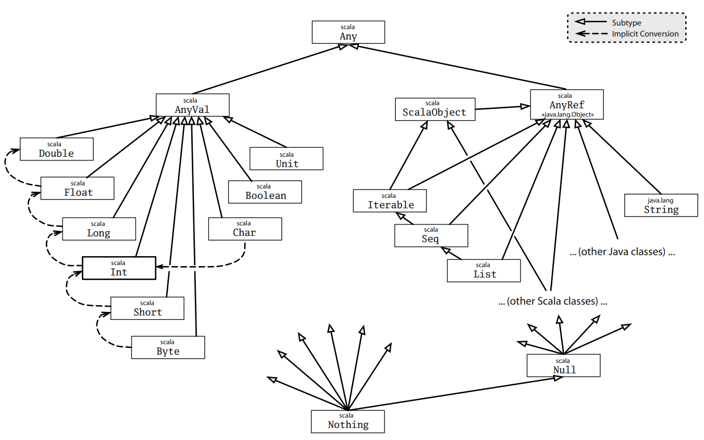

# 内置数据类型继承关系

## 概述

Scala 中每个类都继承自同一个名为 `Any` 的父类，`Any` 中定义的方法时全类型的

Scala 还在底部定义了 `Nothing`，它是所有类的子类



## Any

`Any` 包含 `AnyVal` 和 `ValRef` 两个子类

```scala
// Any 类定义方法
// 比较方法
final def ==(that: Any): Boolean
final def !=(that: Any): Boolean
def equals(that: Any): Boolean
// 哈希方法
def ##: Int
def hashCode: Int

def toString: String
```

`==` 与 `equals` 本质上是相同的，`!=` 与 `equals` 一定相反

可以重写 `equals` 方法来定制 `==` 和 `!=` 的行为

### AnyVal

`AnyVal` 是所有值类型的父类，值类型不能用 `new` 来创建实例

值类空间是扁平的，各个值类型之间没有继承关系，但存在隐式转换

隐式转换实现了类型的放宽，如 `Int` 转 `Long`，还提供了一些方法，如 `abs`、`max`、`min` 和 `to` 等，这些都定义在 `Scala.runtime、Rich***` 中

存在从普通值类型到 `Rich***` 类型的隐式转换，当调用普通值类型没有定义的方法，而 `Rich***` 类型中定义了的方法时，隐式转换就会被自动应用

### AnyRef

`AnyRef` 是所有引用类的父类

## 相等性

对于值类型，`==` 表示自然相等性

对于引用类型，`==` 会调用 `equals` 方法，`equals` 方法默认比较引用相等性，但很多子类都重写了这个方法用于比较元素的相等性

`AnyRef` 定义了不能被重写的 `eq`、`ne` 方法比较引用相等性

## Null

`Null` 是每个引用类型的子类，并不兼容值类型

## Nothing

`Nothing` 是所有类型的子类，不存在这个类型的任何值，可以给出非正常终止的信号