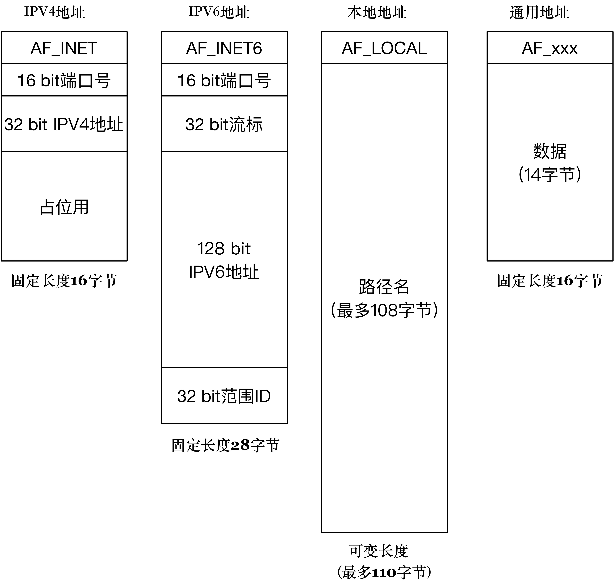

# bind()

调用 `socket()` 创建一个 socket 时，返回的 socket 描述符没有一个具体的地址

给 socket 赋值一个地址，就必须调用 `bind()` 函数，否则当调用 `connect()`、`listen()` 时系统会自动随机分配一个端口

`bind()` 通过传递进来的文件描述符找到对应的 socket 结构，把一个地址族中的特定地址赋给 socket，也可以说是绑定 ip 端口和 socket

```cpp
int bind(int sockfd, const struct sockaddr *addr, socklen_t addrlen);

/*
addr: 一个 const struct sockaddr * 指针，指向要绑定给 sockfd 的协议地址
ipv4: sockaddr_in
ipv6: sockaddr_in6
unix: sockaddr_un

addrlen：对应的是地址的长度
*/
```

