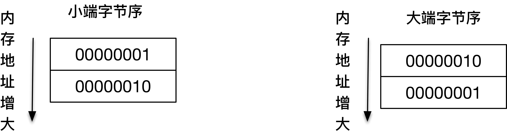

# 网络字节序和主机字节序

网络字节序（NBO，network byte order）和主机字节序（HBO，host byte order）

主机字节序就是我们平常说的大端和小端模式：不同的 CPU 有不同的字节序类型，这些字节序是指整数在内存中保存的顺序，这个叫做主机序

- 小端：低位字节排放在内存的低地址端，高位字节排放在内存的高地址端

- 大端：高位字节排放在内存的低地址端，低位字节排放在内存的高地址端

对于数值 0x1234567，使用四个字节存储


对于数值 0x0201



```cpp
void judge_bigend_littleend() {
    int i = 1;
    char c = (*(char*)&i);
    if (c)
        printf("小端\n");
    else
        printf("大端\n");
}

void judge_bigend_littleend() {
    union {
        int i;
        char c;
    }un;
    un.i = 1;
    if (un.c == 1)
        printf("小端\n");
    else
        printf("大端\n");
}
```

网络字节序为大端字节序，由于 TCP/IP 首部中所有的二进制整数在网络中传输时都要求以这种次序，因此它又称作网络字节序

```cpp
#include <endian.h>

// host to net 本机字节序转换为网络字节序
uint32_t htonl(uint32_t hostlong);
uint16_t htons(uint16_t hostshort);
// net to host 网络字节序转换为本机字节序
uint32_t ntohl(uint32_t netlong);
uint16_t ntohs(uint16_t netshort);


uint16_t htobe16(uint16_t bits);
uint16_t htole16(uint16_t bits);
uint16_t be16toh(uint16_t bits);
uint16_t le16toh(uint16_t bits);

uint32_t htobe32(uint32_t bits);
uint32_t htole32(uint32_t bits);
uint32_t be32toh(uint32_t bits);
uint32_t le32toh(uint32_t bits);

uint16_t htobe64(uint64_t bits);
uint16_t htole64(uint64_t bits);
uint16_t be64toh(uint64_t bits);
uint16_t le64toh(uint64_t bits);
```

- 字符类型的数据，就没有所谓的网络顺序了

- 如果作为一个数据型数据，可能就要作为一个 4 字节的整型数据进行传输，那么就会有字节序的问题

- 对于浮点数，编译器是按照 IEEE 标准解释的，因此不需要考虑字节顺序