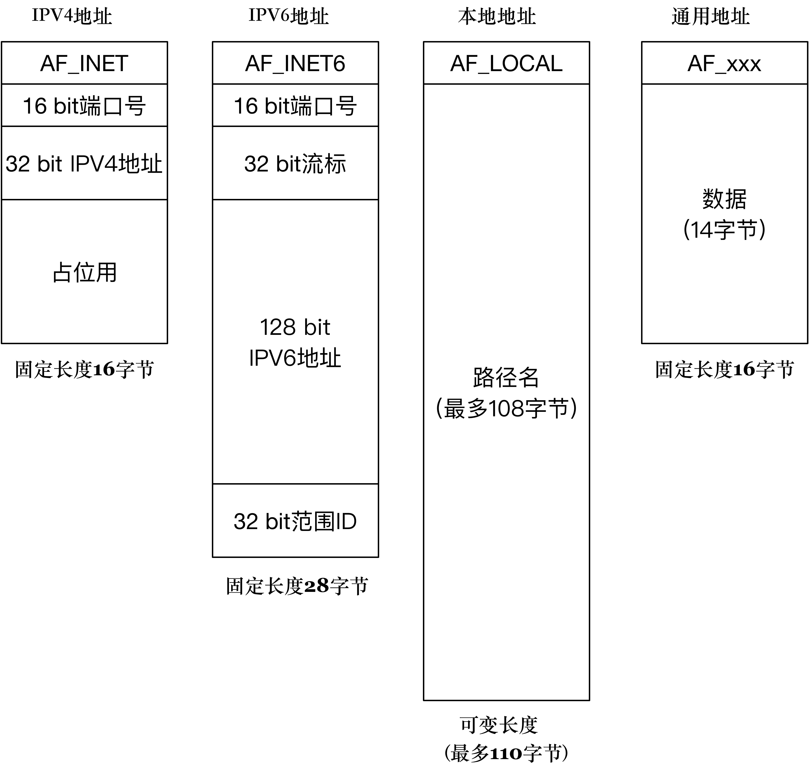

# sockaddr

```cpp
#include <netinet/in.h>
// 通用地址结构
struct sockaddr {
    // 2 bytes address family, AF_xxx
    unsigned short    sa_family;
    // 14 bytes of protocol address
    char              sa_data[14];
};

// IPv4 地址结构
// sockaddr_in 把 port 和 addr 分开存储
// sin_port 和 sin_addr 必须是 NBO
struct sockaddr_in {
    // 2 bytes
    short            sin_family;
    // 2 bytes e.g. htons(3490)
    unsigned short   sin_port;
    // 4 bytes see struct in_addr
    struct in_addr   sin_addr;
    // 8 bytes zero this if you want to
    char             sin_zero[8];
};

struct in_addr {
    // 4 bytes load with inet_aton()
    unsigned long s_addr;
};

/*
sockaddr 和 sockaddr_in 两个结构体一样大，都是 16 个字节，而且都有 family 属性

sckaddr 和 sockaddr_in 包含的数据都是一样的，sockaddr 是给操作系统用的，程序应使用 sockaddr_in 来表示地址，因为sockaddr_in 区分了地址和端口，使用更方便
*/

// IPv6 地址结构
struct sockaddr_in6 {
    sa_family_t sin6_family; /* 16-bit */
    in_port_t sin6_port; /* 传输端口号 # 16-bit */
    uint32_t sin6_flowinfo; /* IPv6流控信息 32-bit*/
    struct in6_addr sin6_addr; /* IPv6地址128-bit */
    uint32_t sin6_scope_id; /* IPv6域ID 32-bit */ 
};

struct in6_addr {
    union {
        uint8_t u6_addr8[16];
        uint16_t u6_addr16[8];
        uint32_t u6_addr32[4];
    } in6_u;

    #define s6_addr                 in6_u.u6_addr8
    #define s6_addr16               in6_u.u6_addr16
    #define s6_addr32               in6_u.u6_addr32
};

// 本地套接字地址结构
struct sockaddr_un {
    unsigned short sun_family; /* 固定为 AF_LOCAL */
    char sun_path[108]; /* 文件绝对路径 */
};
```



```cpp
// 将 ipv4 字符串格式地址转化成无符号长整型的十进制地址
#include <arpa/inet.h>
int inet_addr(const char * server_addr);
// 将 ipv4 字符串格式地址转化成网络地址
#include <sys/socket.h>
int inet_aton(const char * server_addr, struct in_addr * a);  
// 将 ipv4 网络地址转化成字符串格式
#include <arpa/inet.h>
char * inet_ntoa(sockaddr_in.sin_addr addr);  

// 将字符串格式地址转化成 IPv4 或 IPv6 网络地址
// ipv4 时 dst 是 in_addr
// ipv6 时 dst 是 in6_addr
#include <arpa/inet.h>
int inet_pton(int af, const char *src, void *dst);
// 将网络地址转化成 IPv4 或 IPv6 字符串格式
// ipv4 时 src 是 in_addr
// ipv6 时 src 是 in6_addr
#include <arpa/inet.h>
char * inet_ntop(int af, const void * src, char * dst,
                 socklen_t size);
```

通常服务器在启动的时候都会绑定一个众所周知的地址（如 ip 地址+端口号），用于提供服务，客户就可以通过它来接连服务器

客户端不一定需用指定，可以由系统自动分配一个端口号和自身的 ip 地址组合，这就是为什么通常服务器端在 `listen()` 之前会调用 `bind()`，而客户端可以在 `connect()` 时由系统随机生成一个