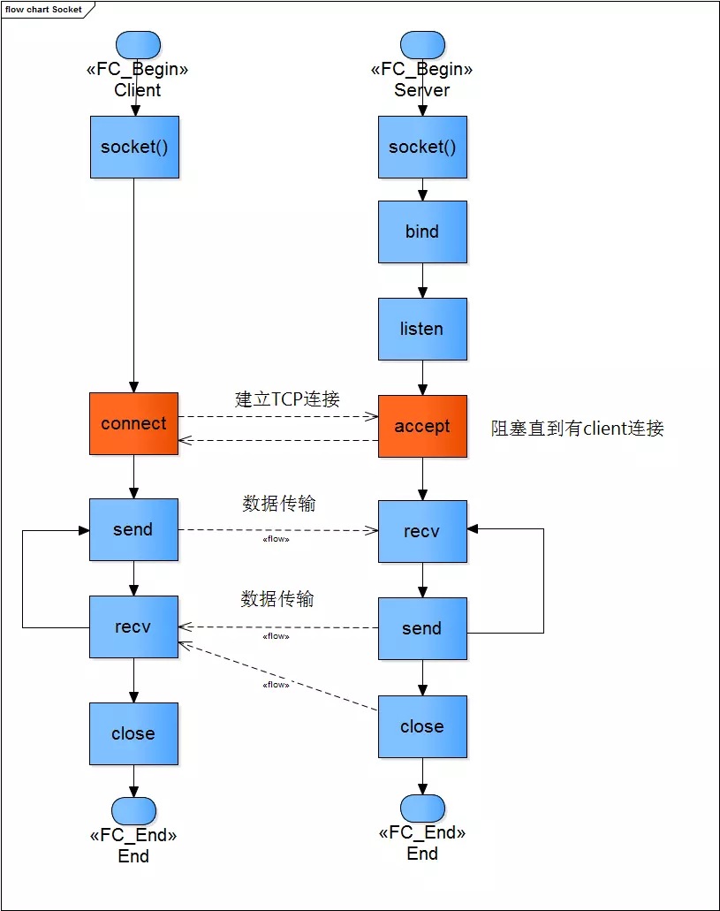
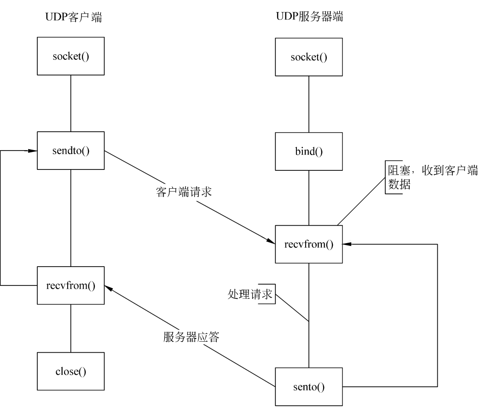
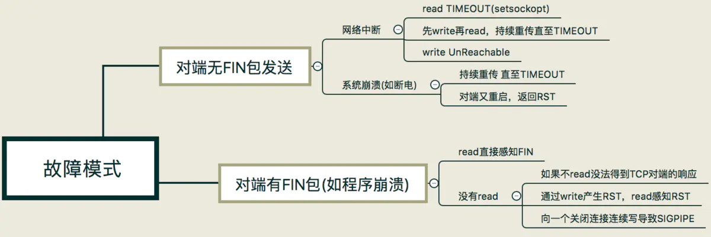

# Socket

## socket 套接字

Unix/Linux 基本哲学之一就是一切皆文件，都可以用 open –> write/read –> close 模式来操作

socket 即是一种特殊的文件，一些 socket 函数就是对其进行的操作（读/写 IO、打开、关闭）

### 套接字描述符

套接字描述符是一个整数，我们最熟悉的句柄是 0、1、2 三个，0 是标准输入，1 是标准输出，2 是标准错误输出，分别对应 `FILE*` 结构 `stdin`、`stdout`、`stderr`

当应用程序要创建一个套接字时，操作系统就返回一个小整数作为描述符来标识这个套接字，应用程序则使用这个描述符作为传递参数，通过调用函数来完成操作

应用程序只需记住这个描述符，并在以后操作该文件时使用它

系统为每个运行的进程维护一张单独的文件描述符表，当进程打开一个文件时，系统把一个指向此文件内部数据结构的指针写入文件描述符表，并把该表的索引值返回给调用者

### 工作流程

- tcp 



- udp



## socket()

`socket()` 用于创建一个 socket 描述符，它唯一标识一个 socket

```cpp
#include <sys/types.h>
#include <sys/socket.h>
int socket(int domain, int type, int protocol);
/*
domain: 协议域，其决定了 socket 的地址类型

type: 指定socket类型

protocol: 指定协议，为 0 时会自动选择 type 类型对应的默认协议

type 和 protocol 不可以随意组合的
*/
```

`AF_` 表示的含义是 Address Family

domain|说明|
-|-|
AF_INET|IPv4
AF_INET6|IPv6
AF_LOCAL|Unix 域协议，用于本地通信，也可以写成 AF_FILE、AF_UNIX
AF_ROUTE|路由套接字
AF_KEY|秘钥套接字

type|说明|
-|-|
SOCK_STREAM|字节流套接字
SOCK_DGRAM|数据包套接字
SOCK_SEQPACKET|有序分组套接字
SOCK_RAW|原始套接字
SOCK_NONBLOCK|非阻塞

protocol|说明|
-|-|
IPPROTO_TCP|TCP
IPPROTO_UDP|UDP
IPPROTO_SCTP|SCIP
IPPROTO_TIPC|TIPC

## socket 异常

TCP 连接建立之后，能感知 TCP 链路的方式是有限的，一种是以 `read` 为核心的读操作，另一种是以 `write` 为核心的写操作



### 客户端连接服务器未监听端口

服务端会对收到的 SYN 回应一个 RST，客户端收到 RST 之后，终止连接并进入 CLOSED 状态，返回 `ECONNREFUSED`

### 服务器不可达

服务端地址不可访问，返回 `EHOSTUNREACH`

### 超时连接

客户端发送的 SYN 丢失在网络中，没有得到确认，客户端的 TCP 会超时重发 SYN，发送 7 个 SYN 后等待一个超时时间，仍然没有收到 ACK，则 `connect()` 返回超时

### 服务器端 SYN-ACK 丢失

客户端没有收到 SYN-ACK 包，类似于超时连接错误

服务器端由 LISTEN 进入 SYN_RECV，服务端的 TCP 会重发 SYN-ACK，直到超时，即 SYN 攻击

### 客户端 ACK 丢失

服务器端没有收到 ACK 包，类似于 SYN 攻击

对于客户端来讲，由 SYN_SENT 状态进入了 ESTABLISED 状态，即连接成功，客户端可以发送数据，但实际上数据是发送不到服务端；客户端发送出去的数据得不到确认，最终，客户端产生一个复位信号并终止连接

### 网络断开且互相不发送数据

在没有 ICMP 报文的情况下，TCP 程序并不能理解感应到连接异常，双方都不知道网络已经不通，会一直保持 ESTABLISHDED 状态

如果程序是阻塞在 `read` 调用上，那么程序无法从异常中恢复，需要通过给 `read` 操作设置超时来解决

### 网络断开但仍需发送数据

接收一方不知道网络出问题，会一直等待数据到来

对于发送方发送数据，TCP 协议栈会不断尝试将发送缓冲区的数据发送出去，大概在重传 12 次、合计时间约为 9 分钟之后，协议栈会标识该连接异常

如果应用层 `write` 完数据后阻塞的 `read`，则 `read` 调用会返回一条 TIMEOUT 的错误信息，如果此时程序还执着地往这条连接写数据，写操作会立即失败，返回一个 SIGPIPE 信号给应用程序

需要引入心跳机制

### 网络断开后重启

当重传的 TCP 分组到达重启后的系统，由于系统中没有该 TCP 分组对应的连接数据，系统会返回一个 RST，TCP 程序通过 `read()` 或 `write()` 调用可以分别对 RST 进行错误处理

`read()` 会立即返回一个错误，错误信息为连接重置

`write()` 会立即失败，应用程序会被返回一个 SIGPIPE 信号

### 对端进程奔溃但仍接受数据

linux 下，按 ctrl+c 结束程序，会调用 `close()`，发送 FIN

接收方调用 `recv()` 返回 0

### 对端进程奔溃但仍发送数据

对端奔溃后内核会做一些清理的事情，为这个套接字发送一个 FIN 包；根据 TCP 协议，收到对方的 FIN 包只意味着对方不会再发送任何消息， 在一个双方正常关闭的流程中，收到 FIN 包的一端将剩余数据发送给对面（通过一次或多次 `write`），然后关闭套接字；当数据到达服务器端时，内核发现这是一个指向关闭的套接字，会再次向客户端发送一个 RST 包，对于发送端而言如果此时再执行 `write` 操作，立即会返回一个 RST 错误信息

第一次调用 `send()` 返回成功，数据会被发送到奔溃的对端，奔溃端会回一个 RST

再次调用 `send()` 返回 -1，errno 设置为 32 Broken pipe，会向应用程序发送 `SIGPIPE` 信号