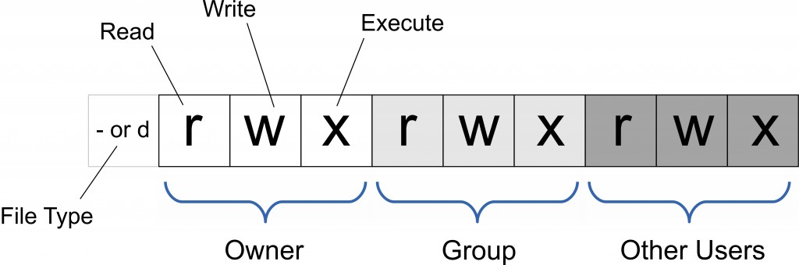

# chmod

文件所有者（Owner）、用户组（Group）、其它用户（Other Users）；只有文件所有者和超级用户可以修改文件或目录的权限



```
chmod abc file

# 其中a,b,c各为一个数字，分别表示User、Group、及Other的权限
# r=4，w=2，x=1
```

目录也是文件，也有 rwx 权限；目录的 r 权限就是可以读取这个目录内的信息，例如 `ls`；目录的 w 权限就是可以修改目录，即给文件改名、删除文件和子目录这些操作；目录的 x 权限就是可以进入该目录