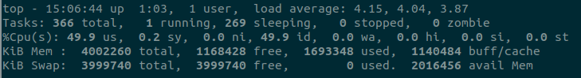
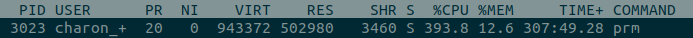

# top

`top` 能够实时显示系统中各个进程的资源占用状况，可以通过用户按键来不断刷新当前状态，该命令可以按 CPU 使用、内存使用和执行时间对任务进行排序

```
top -p pidid：显示指定的进程信息

// 交互命令
k: 终止一个进程

P：按 CPU 使用率排行

M：按 MEM 排行

1：显示各 CPU 情况

q: 退出程序

m: 切换显示内存信息模式

t: 切换显示进程和 CPU 状态信息模型
```



第一行：当前系统时间、系统已运行时间、当前登入用户、系统1分钟5分钟15分钟的负载情况，假设机器的 cpu 核心数为 n，则当负载的平均值为 n 的时候，机器就是刚好满负载运行了，如果大于 n，就是超负荷运行了

第二行：当前系统进程情况

第三行：用户空间占用 CPU 的百分比、内核空间占用 CPU 的百分比、改变过优先级的进程占用 CPU 的百分比、空闲 CPU 百分比、IO 等待占用 CPU 的百分比、硬中断（Hardware IRQ）占用 CPU 的百分比、软中断（Software Interrupts）占用 CPU 的百分比

第四行：物理内存总量、空闲内存总量、使用中的内存总量、缓存的内存量

第五行：交换区总量、空闲交换区总量、使用的交换区总量



PID   -- 进程id

USER  -- 进程所有者

PR    -- 进程优先级

NI    -- 负值表示高优先级，正值表示低优先级

VIRT  -- 进程使用的虚拟内存总量，VIRT = SWAP + RES

RES   -- 进程使用的、未被换出的物理内存大小，RES = CODE + DATA

SHR   -- 共享内存大小

S     -- 进程状态，D：不可中断的睡眠状态 R：运行 S：睡眠 T：跟踪/停止 Z：僵尸进程

%CPU  -- 上次更新到现在的CPU时间占用百分比

%MEM  -- 进程使用的物理内存百分比