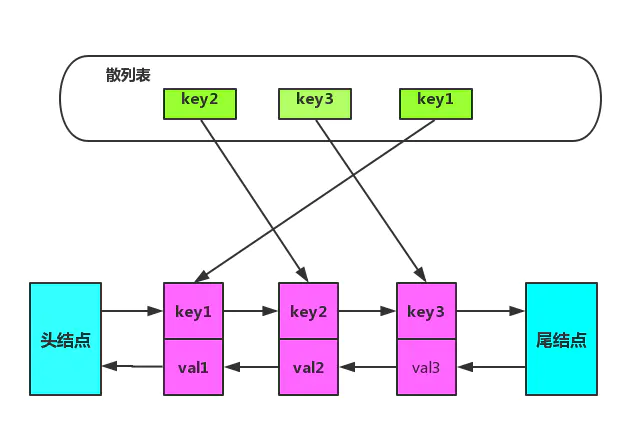

# 内存替换算法

常见的内存替换算法有：FIFO，LRU，LFU，LRU-K，2Q

- FIFO：最近刚访问的，将来访问的可能性比较大；使用一个队列，新加入的页面放入队尾，每次淘汰队首的页面，即最先进入的数据，最先被淘汰；无法体现页面冷热信息

- LFU：如果数据过去被访问多次，那么将来被访问的频率也更高；每个数据块一个引用计数，所有数据块按照引用计数排序，具有相同引用计数的数据块则按照时间排序，每次淘汰队尾数据块；产生排序开销；缓存颠簸

- LRU：如果数据最近被访问过，那么将来被访问的几率也更高，淘汰最长时间没有被访问的数据；使用一个栈，新使用过的数据放动到栈顶，每次替换栈顶的缓存数据

- LRU-K：最久未使用 K 次淘汰算法，K 代表最近使用的次数，因此 LRU 可以认为是 LRU-1

## LRU 实现

- 新数据直接插入到列表头部

- 缓存数据被命中，将数据移动到列表头部

- 缓存已满的时候，移除列表尾部数据

LRU 算法需要添加头节点，删除尾结点

链表添加节点/删除节点时间复杂度 O(1)，非常适合当做存储缓存数据容器，但链表有几个缺点：每次获取任意节点数据，都需要从头结点遍历下去，这就导致获取节点复杂度为 O(N)；移动中间节点到头结点，我们需要知道中间节点前一个节点的信息，单向链表就不得不再次遍历获取信息

使用散列表存储节点，获取节点的复杂度将会降低为 O(1)，节点移动问题可以在节点中再增加前驱指针，记录上一个节点信息，这样链表就从单向链表变成了双向链表



```cpp
class LRUCache {
private:
    unordered_map<int, list<pair<int, int>>::iterator> lru;
    list<pair<int, int>> his;
    int cap;
    
public:
    LRUCache(int capacity) {
        cap = capacity;
    }
    
    int get(int key) {
        if(lru.count(key) != 0) {
            his.splice(his.begin(), his, lru[key]);
            return lru[key]->second;
        }
        return -1;
    }
    
    void put(int key, int value) {
        if(lru.count(key)) his.erase(lru[key]);
        his.push_front(make_pair(key, value));
        lru[key] = his.begin();
        if(lru.size() > cap) {
            lru.erase(his.rbegin()->first);
            his.pop_back();
        }
    }
};
```