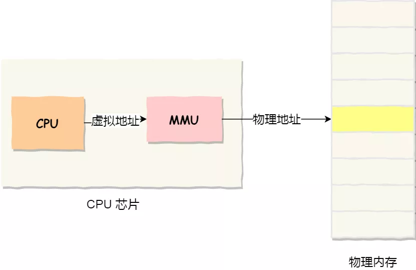
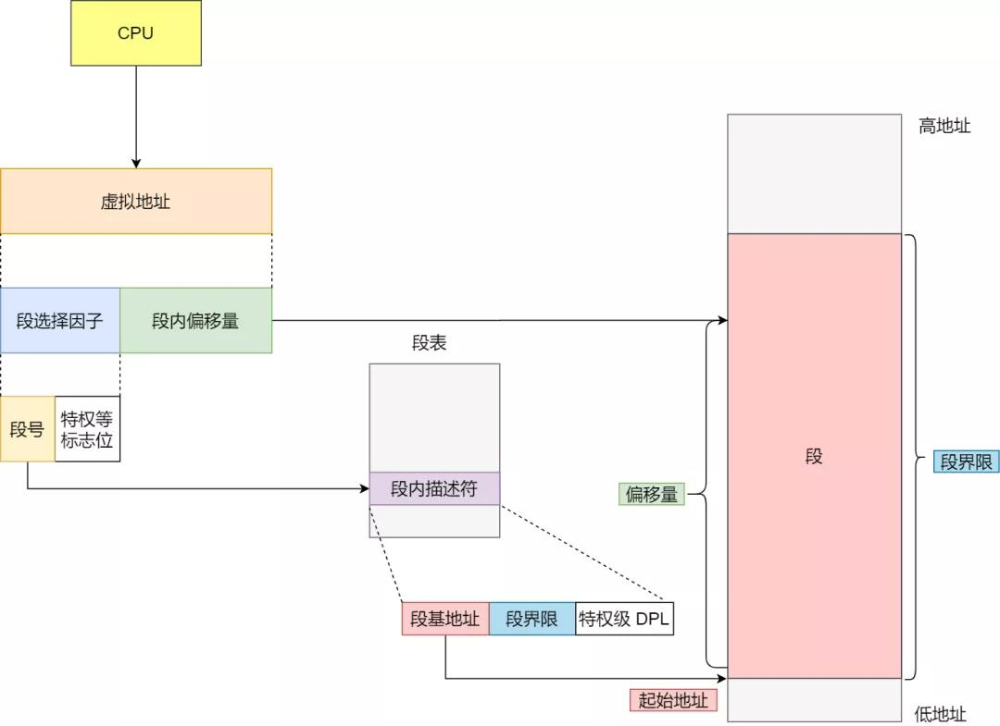
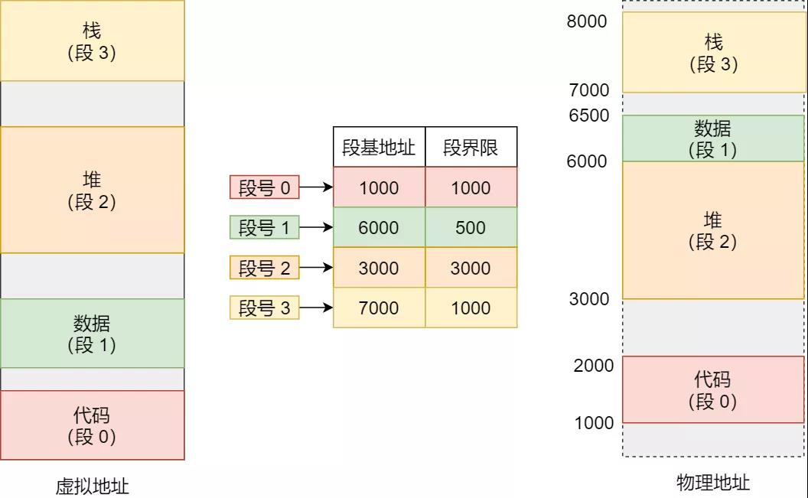
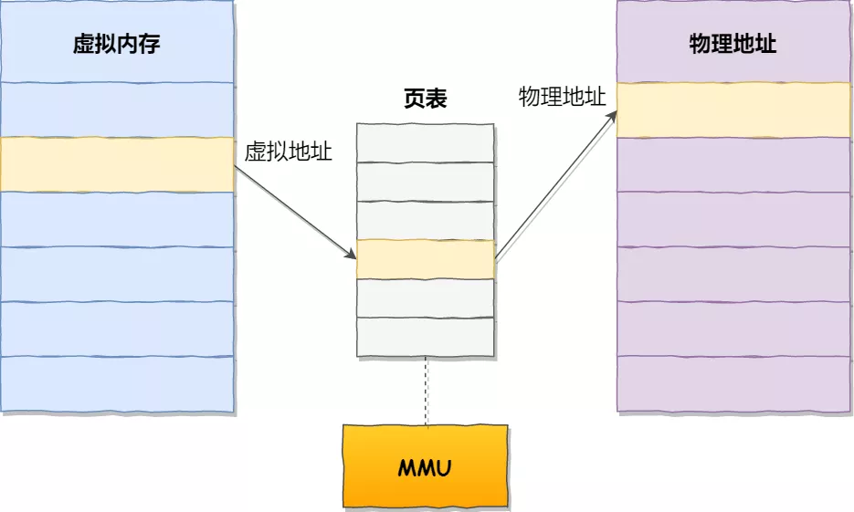
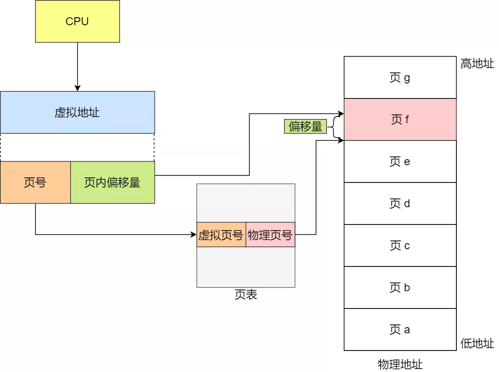
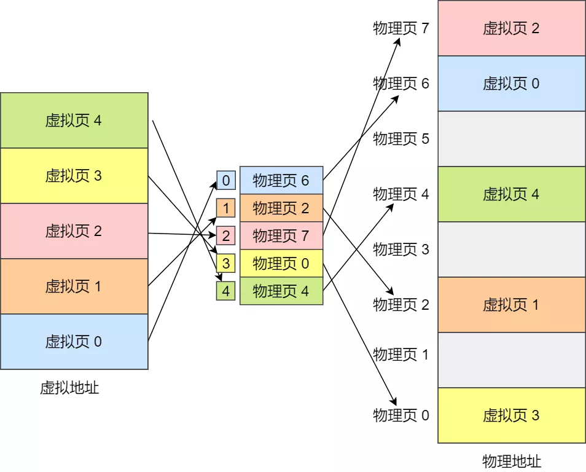
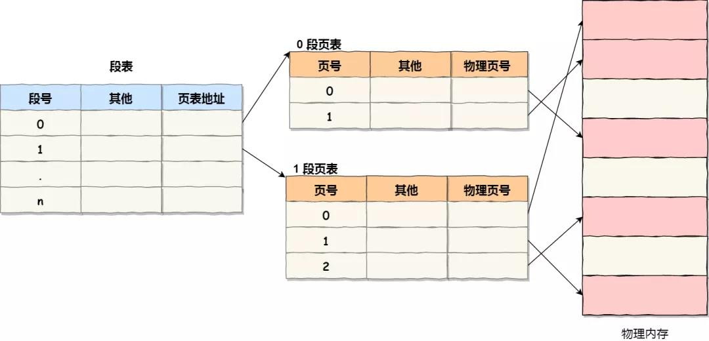

# 内存管理

## 虚拟地址空间

为了防止不同进程同一时刻在物理内存中运行而对物理内存的争夺和践踏，以及让程序获得更多可用内存，采用了虚拟内存

虚拟内存技术使得不同进程在运行过程中，它所看到的是自己独自占有了当前系统的内存；所有进程共享同一物理内存，每个进程只把自己目前需要的虚拟内存空间映射并存储到物理内存上

操作系统引入了虚拟内存，进程持有的虚拟地址会通过 CPU 芯片中的内存管理单元（MMU）的映射关系，来转换变成物理地址，然后再通过物理地址访问内存

在每个进程创建加载时，内核只是为进程创建了虚拟内存的布局，具体就是初始化进程控制表中内存相关的链表，实际上并不立即就把虚拟内存对应位置的程序数据和代码拷贝到物理内存中，只是建立好虚拟内存和磁盘文件之间的映射就好，等到运行到对应的程序时，才会通过缺页异常，来拷贝数据；进程运行过程中，要动态分配内存，比如 `malloc` 时，也只是分配了虚拟内存，即为这块虚拟内存对应的页表项做相应设置，当进程真正访问到此数据时，才引发缺页异常

优点：

- 扩大地址空间

- 内存保护：每个进程运行在各自的虚拟内存地址空间，互相不能干扰对方；对特定的内存地址提供写保护，可以防止代码或数据被恶意篡改

- 公平内存分配

- 当不同的进程使用同样的代码时，比如库文件中的代码，物理内存中可以只存储一份这样的代码，不同的进程只需要把自己的虚拟内存映射过去就可以了，节省内存

缺点：

- 虚拟地址到物理地址的转换，增加了指令的执行时间

- 页面的换入换出需要磁盘 I/O，非常耗时

## 内存分段

程序是由若干个逻辑分段组成的，如可由代码分段、数据分段、栈段、堆段组成，不同的段是有不同的属性的，所以就用分段的形式把这些段分离出来

进程空间中以段为单位进行分配，每个段在内存中占据连续空间，但各段之间可以不相邻；编译程序时会把段名转化为相应的段号，在执行的时候 cpu 是根据段号去寻找地址的

分段系统的逻辑地址结构由段号和段内偏移量所组成

程序分多个段，各段离散的装入内存，为了保证程序能正常运行，就必须从物理内存中找到各个逻辑段的存放位置，为此需要为每个进程建立一张段映射表，简称段表

段表里面保存的是这个段的基地址、段的界限和特权等级等，段内偏移量应该位于 0 和段界限之间，如果段内偏移量是合法的，就将段基地址加上段内偏移量得到物理内存地址

分段存在内存碎片和内存交换的效率低的问题

对于多进程的系统来说，用分段的方式，内存碎片是很容易产生的，产生了内存碎片，那不得不重新 Swap 内存区域，这个过程会产生性能瓶颈

为了解决内存分段的内存碎片和内存交换效率低的问题，就出现了内存分页

## 内存分页

分页是把整个虚拟和物理内存空间切成一段段固定尺寸的大小，在 Linux 下，每一页的大小为 4KB

页表实际上存储在 CPU 的内存管理单元 （MMU） 中，于是 CPU 就可以直接通过 MMU，找出要实际要访问的物理内存地址

当进程访问的虚拟地址在页表中查不到时，系统会产生一个缺页异常，进入系统内核空间分配物理内存、更新进程页表，最后再返回用户空间，恢复进程的运行

采用了分页，那么释放的内存都是以页为单位释放的，也就不会产生无法给进程使用的小内存

如果内存空间不够，操作系统会把其他正在运行的进程中的最近没被使用的内存页面给释放掉，
也就是暂时写在硬盘上，称为换出（Swap Out）。一旦需要的时候，再加载进来，
称为换入（Swap In）。所以，一次性写入磁盘的也只有少数的一个页或者几个页，
不会花太多时间，内存交换的效率就相对比较高

分页的方式使得我们在加载程序的时候，不再需要一次性都把程序加载到物理内存中。我们完全可以在进行虚拟内存和物理内存的页之间的映射之后，并不真的把页加载到物理内存里，而是只有在程序运行中，需要用到对应虚拟内存页里面的指令和数据时，再加载到物理内存里面去

在分页机制下，虚拟地址分为两部分，页号和页内偏移。页号作为页表的索引，页表包含物理页每页所在物理内存的基地址，这个基地址与页内偏移的组合就形成了物理内存地址

一个进程对应一张页表

内存地址转换步骤：

- 把虚拟内存地址，切分成页号和偏移量

- 根据页号，从页表里面，查询对应的物理页号

- 直接拿物理页号，加上前面的偏移量，就得到了物理内存地址

单级分页导致页表占用内存过大，后采用多级页表，64 位系统需要四级页表，

多级页表虽然解决了空间上的问题，但是虚拟地址到物理地址的转换就多了几道转换的工序，这显然就降低了这俩地址转换的速度，也就是带来了时间上的开销

在 CPU 芯片中，加入了一个专门存放程序最常访问的页表项的 Cache，这个 Cache 就是 TLB，通常称为页表缓存、转址旁路缓存、快表等

有了 TLB 后，那么 CPU 在寻址时，会先查 TLB，如果没找到，才会继续查常规的页表

## 缺页中断

`malloc()` 和 `mmap()` 等内存分配函数，在分配时只是建立了进程虚拟地址空间，并没有分配虚拟内存对应的物理内存；当进程访问这些没有建立映射关系的虚拟内存时，处理器自动触发一个缺页异常

缺页中断：在请求分页系统中，可以通过查询页表中的状态位来确定所要访问的页面是否存在于内存中。每当所要访问的页面不在内存时，会产生一次缺页中断，此时操作系统会根据页表中的外存地址在外存中找到所缺的一页，将其调入内存

## 段页式内存管理

内存分段和内存分页组合起来后，通常称为段页式内存管理

段页式内存管理实现的方式：

- 先将程序划分为多个有逻辑意义的段，也就是前面提到的分段机制

- 接着再把每个段划分为多个页，也就是对分段划分出来的连续空间，再划分固定大小的页

地址结构就由段号、段内页号和页内位移三部分组成

用于段页式地址变换的数据结构是每一个程序一张段表，每个段又建立一张页表，段表中的地址是页表的起始地址，而页表中的地址则为某页的物理页号

段页式地址变换中要得到物理地址须经过三次内存访问：

- 第一次访问段表，得到页表起始地址

- 第二次访问页表，得到物理页号

- 第三次将物理页号与页内位移组合，得到物理地址

## 页面设置

如果页太小，就会产生大量的页表条目，降低了查询速度的同时还浪费了存放页面的主存空间

如果页太大，又会容易造成浪费

在某些对性能要求非常苛刻的场景中，页面会被设置得非常的大，这些页被称之为大页（Huge Page），可以减少页表条目，加快检索速度，提升 TLB 快表的命中率；使用大页的同时一般会禁止页面交换（Swap），大容量交换会让辅存读写成为 CPU 处理的瓶颈