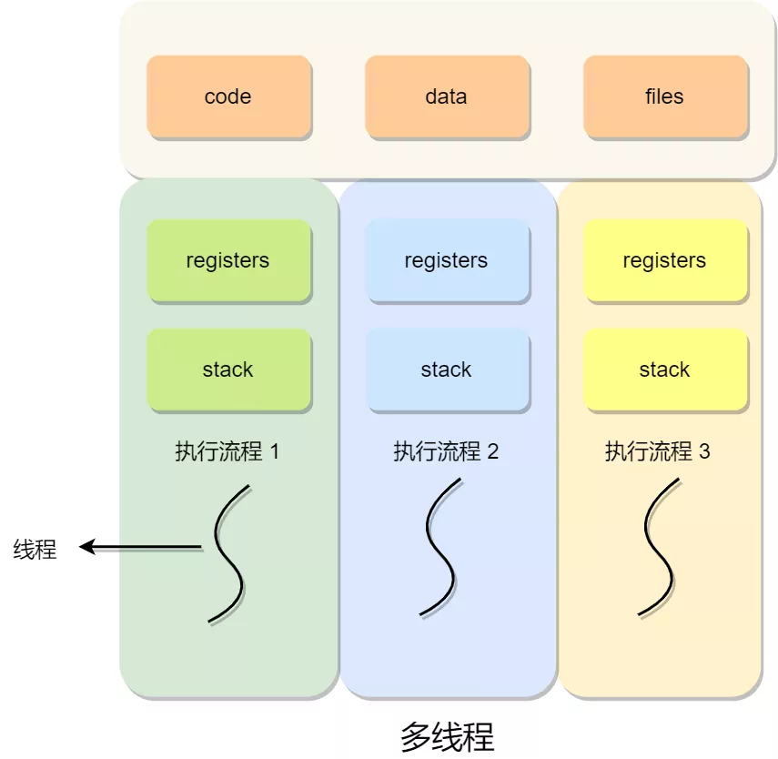

# 上下文

## CPU 上下文

在每个任务运行前，CPU 需要知道任务从哪里加载，又从哪里开始运行；操作系统需要事先帮 CPU 设置好 CPU 寄存器和程序计数器

CPU 寄存器和程序计数器是 CPU 在运行任何任务前，所必须依赖的环境，这些环境就叫做 CPU 上下文

CPU 上下文切换就是先把前一个任务的 CPU 上下文（CPU 寄存器和程序计数器）保存起来，然后加载新任务的上下文到这些寄存器和程序计数器，最后再跳转到程序计数器所指的新位置，运行新任务

系统内核会存储保持下来的上下文信息，当此任务再次被分配给 CPU 运行时，CPU 会重新加载这些上下文，这样就能保证任务原来的状态不受影响，让任务看起来还是连续运行

CPU 上下文切换分成：进程上下文切换、线程上下文切换和中断上下文切换

## 进程上下文

进程是由内核管理和调度的，所以进程的切换只能发生在内核态

进程的上下文切换不仅包含了虚拟内存、栈、全局变量等用户空间的资源，还包括了内核堆栈、
寄存器等内核空间的资源

系统会把交换的信息保存在进程的 PCB，当要运行另外一个进程的时候，我们需要从这个进程的 PCB 
取出上下文，然后恢复到 CPU 中，这使得这个进程可以继续执行

为了保证所有进程可以得到公平调度，CPU 时间被划分为一段段的时间片，这些时间片再被轮流分配给各个进程。
这样，当某个进程的时间片耗尽了，就会被系统挂起，切换到其它正在等待 CPU 的进程运行

进程在系统资源不足（比如内存不足）时，要等到资源满足后才可以运行，这个时候进程也会被挂起，
并由系统调度其他进程运行

当进程通过睡眠函数 sleep 这样的方法将自己主动挂起时，自然也会重新调度

当有优先级更高的进程运行时，为了保证高优先级进程的运行，当前进程会被挂起，由高优先级进程来运行

发生硬件中断时，CPU 上的进程会被中断挂起，转而执行内核中的中断服务程序

## 线程上下文

同一个进程内多个线程之间可以共享代码段、数据段、打开的文件等资源，但每个线程都有独立一套的寄存器和栈，这样可以确保线程的控制流是相对独立的

系统的任务调度，实际上的调度对象是线程，而进程只是给线程提供了虚拟内存、全局变量等资源

线程上下文切换分为同一进程线程切换和不同进程线程切换：当两个线程不是属于同一个进程，则切换的过程就跟进程上下文切换一样；当两个线程是属于同一个进程，因为虚拟内存是共享的，所以在切换时，虚拟内存这些资源就保持不动，只需要切换线程的私有数据、寄存器等不共享的数据