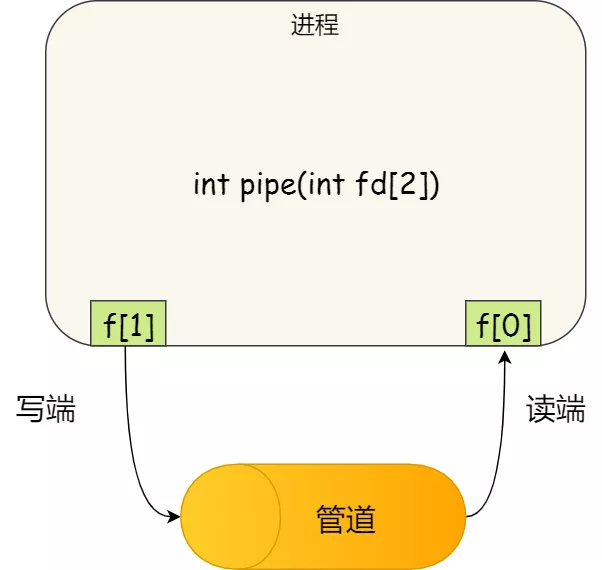
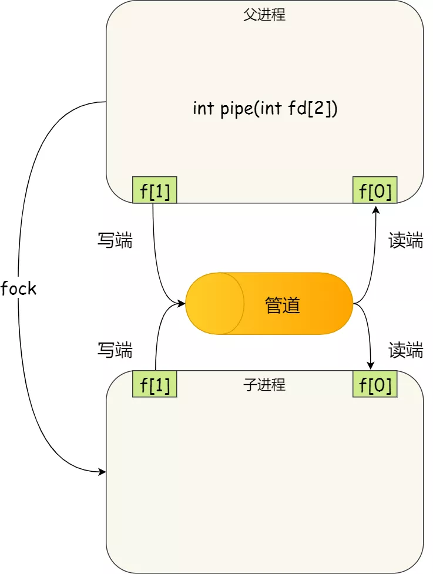
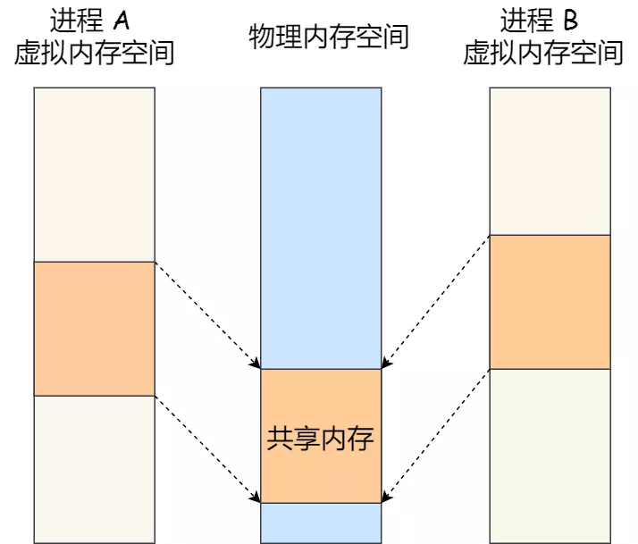
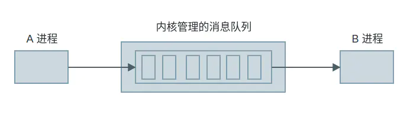

# 进程通信

每个进程的用户地址空间都是独立的，一般而言是不能互相访问的，但内核空间是每个进程都共享的，
所以进程之间要通信必须通过内核

进程间通信主要包括管道、消息队列、信号量、信号、共享内存、以及套接字 socket 等

## 管道

主要包括匿名管道和命名管道，匿名管道用于具有亲缘关系的父子进程通信，命名管道还可允许无亲缘关系进程通信

管道的实质是一个内核缓冲区，进程以先进先出的方式从缓冲区存取数据，管道一端的进程顺序的将数据写入缓冲区，另一端的进程则顺序的读出数据

- 匿名管道：半双工的，数据只能在一个方向上流动，具有固定的读端和写端；只能用于具有亲缘关系的进程之间的通信（父子进程或者兄弟进程之间）；可以看成是一种特殊的文件，对于它的读写也可以使用普通的 `read`、`write` 等函数，但不是普通的文件，并不属于其他任何文件系统，并且只存在于内存中；缓冲区是有限，所传送的是无格式字节流，这就要求管道的读出方和写入方必须事先约定好数据的格式

- 命名管道：可以在无关的进程之间交换数据；有路径名与之相关联，它以一种特殊设备文件形式存在于文件系统中；

命名管道严格遵循先进先出

管道的效率低，不适合进程间频繁地交换数据

### 匿名管道创建

通过系统调用 `int pipe(int fd[2])` 创建匿名管道， 并返回了两个描述符，一个是管道的读取端描述符 fd[0]，另一个是管道的写入端描述符 fd[1]

使用 `fork` 创建子进程，创建的子进程会复制父进程的文件描述符，这样就做到了两个进程各有两个 `fd[0]` 与 `fd[1]`，两个进程就可以通过各自的 `fd` 写入和读取同一个管道文件实现跨
进程通信了

如果需要双向通信，则应该创建两个管道

### 命名管道创建

通过系统调用 `int mkfifo(const char * filename, mode_t mode)`，创建成功则返回 0，否则返回 -1，使用 `open()` 打开命名管道

当前进程以写方式（且设置了阻塞标识）打开命名管道时，如果已有别的进程以读打开该命名管道时，则当前的打开操作成功返回，否则一直阻塞直到有进程为读打开该命名管道

当前进程以读方式（且设置了阻塞标识）打开命名管道时，如果已有别的进程为写打开该命名管道时，则当前的打开操作成功返回，否则一直阻塞直到有进程为写打开该管道

## 共享内存

系统加载一个进程的时候，分配给进程的内存并不是实际物理内存，而是虚拟内存空间；让两个进程各自拿出一块虚拟地址空间来，然后映射到相同的物理内存中，两个进程虽然有着独立的虚拟内存空间，但有一部分却是映射到相同的物理内存，解决了由用户态向内核态拷贝所消耗的时间；需要依靠某种进程同步操作，如互斥锁和信号量等

## 消息队列

消息队列存放在内核中，具有写权限的进程可以按照一定得规则向消息队列中添加新信息，有读权限的进程则可以从消息队列中读取信息；消息队列是面向记录的，其中的消息具有特定的格式以及特定的优先级；消息队列独立于发送与接收进程，进程终止时，消息队列及其内容并不会被删除；消息队列可以实现消息的随机查询，消息不一定要以先进先出的次序读取，也可以按消息的类型读取；消息队列存放在内核中，只有在内核重启或者显示地删除一个消息队列时，该消息队列才会被真正的删除；消息队列克服了信号承载信息量少，管道只能承载无格式字节流以及缓冲区大小受限等缺点

消息队列不适合比较大数据的传输，因为在内核中每个消息体都有一个最大长度的限制，同时所有队列所包含的全部消息体的总长度也是有上限

## socket

特性由 3 个属性确定，它们分别是：域、端口号、协议类型；域指定套接字通信中使用的网络介质（网络或 UNIX 文件系统）

同一主机不同进程使用 socket 通信时，可以使用 UNIX Domain Socket，其优势：

- 传输不需要经过网络协议栈，不需要打包拆包等操作，只是数据的拷贝过程

- 分为 SOCK_STREAM 和 SOCK_DGRAM，由于是在本机通过内核通信，不会丢包也不会出现发送包的次序和接收包的次序不一致的问题

## 信号

信号是进程间通信机制中唯一的异步通信机制，因为可以在任何时候发送信号给某一进程

## 信号量

信号量是是一个计数器，可以用来控制多个进程对共享资源的访问，用于实现进程间的互斥与同步，
而不是用于存储进程间通信数据

若要在进程间传递数据需要结合共享内存

程序对信号量的操作都是原子操作

通过对信号量进行 PV 操作，获取共享资源；P 操作将信号量减一，若减一后大于等于 0，则继续执行，否者进入等待队列；S 操作将信号量加一，若加一后大于 0，则继续执行，否则释放等待队列中第一个进程

互斥信号量的初值一般为 1，P、V 操作必须成对出现，先做 P 操作，进临界区，后做 V 操作，出临界区