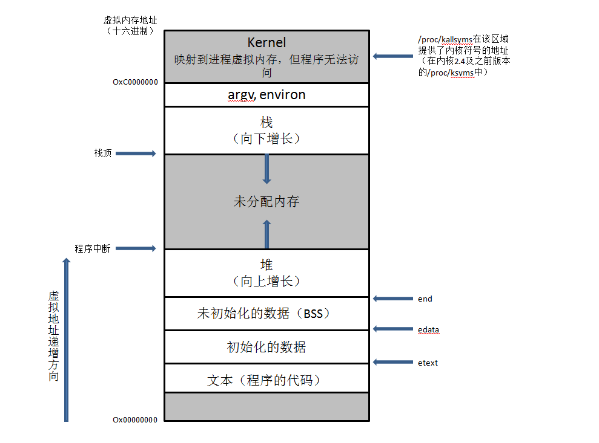

# 进程的内存结构

每个进程所分配的内存由很多部分组成，通常称之为段



## 文本段 （text 段）

- 包含了进程运行的程序机器语言指令

- 文本段具有只读属性，以防止进程通过错误指针意外修改自身指令

- 因为多个进程可同时运行同一程序，所以又将文本段设为可共享，一份程序代码的拷贝可以映射到所有这些进程的虚拟地址空间中

## 初始化的数据段（data 段）

- 包含显式初始化的全局变量和静态变量

- 当程序加载到内存时，从可执行文件中读取这些变量的值

## 未初始化数据段（BSS 段）

- 包含了未进行显式初始化的全局变量和静态变量

- 程序启动之前，系统将本段内所有内存初始化为 0

- 程序结束后静态变量资源由系统自动释放

- 将经过初始化的全局变量和静态变量与未初始化的全局变量和静态变量分开存放，其主要原因在于程序在磁盘上存储时，没有必要为未经初始化的变量分配存储空间；可执行文件只需记录未初始化数据段的位置及所需大小，直到运行时再由程序加载器来分配空间

## 堆

- 可在运行时为变量动态进行内存分配的一块区域

- 从低地址位向高地址位增长，采用链式存储结构

## 栈

- 一个动态增长和收缩的段，由栈帧组成

- 从高地址位向低地址位增长的，是一块连续的内存区域，最大容量是由系统预先定义好的，用户能从栈中获取的空间较小

- 系统会为每个当前调用的函数分配一个栈帧

## 包含 static、virtual 的类内存分布

- `static` 修饰成员变量在全局数据区分配内存

- `static` 修饰的成员函数在代码区分配内存

- 虚指针和该类其他成员一起存储，指向只读数据段中的类虚函数表，虚函数表中存放着一个个函数指针，函数指针指向代码段中的具体函数，虚函数表存储在 data 段的只读数据段


## 堆内存分配

C 标准函数库提供了许多函数来实现对堆上内存管理，其中包括：`malloc()`、`free()`、`calloc()` 和 `realloc()`

### malloc()

```cpp
void * malloc(size_t n);

void * memset (void * p, int c, size_t n);
```

如果函数执行成功，`malloc()` 返回获得内存空间的首地址；如果函数执行失败，那么返回值为 `NULL`。由于 `malloc()` 函数值的类型为 `void*`，因此可以将其值类型转换后赋给任意类型指针，这样就可以通过操作该类型指针来操作从堆上获得的内存空间

`malloc()` 分配得到的内存空间是未初始化的，一般在使用该内存空间时要调用另一个函数 `memset()` 来将其初始化为全 0

### calloc()

`calloc()` 的功能与 `malloc()` 的功能相似，都是从堆分配内存

```cpp
void *calloc(size_t n, size_t size);
```

函数返回值为 `void*`，如果执行成功函数从堆上获得 size * n 的字节空间，并返回该空间的首地址，如果执行失败，函数返回 `NULL`；`calloc()` 适合为数组申请空间，可以将 size 设置为数组元素的空间长度，将 n 设置为数组的容量

`calloc()` 得到的内存空间是经过初始化的，其内容全为 0

### realloc()

`realloc()` 可以实现内存分配和内存释放的功能

```cpp
void * realloc(void * p, size_t n);
```

指针 p 必须为指向堆内存空间的指针，即由 `malloc()`、`calloc()` 或 `realloc()` 分配空间的指针

`realloc()`将指针 p 指向的内存块的大小改变为 n 字节，如果 n 小于或等于 p 之前指向的空间大小，那么保持原有状态不变；如果 n 大于原来 p 之前指向的空间大小，那么系统将重新为 p 从堆上分配一块大小为 n 的内存空间，同时将原来指向空间的内容依次复制到新的内存空间上，p 之前指向的空间被释放

`realloc()`分配的空间也是未初始化的

`realloc()` 有可能操作失败，返回 `NULL`，所以不要把它的返回值直接赋值给原来的指针变量，以免原值丢失

### free()

```cpp
void free(void * p);
```

`free()` 只是释放指针指向的内容，而该指针仍然指向原来指向的地方，此时指针为野指针