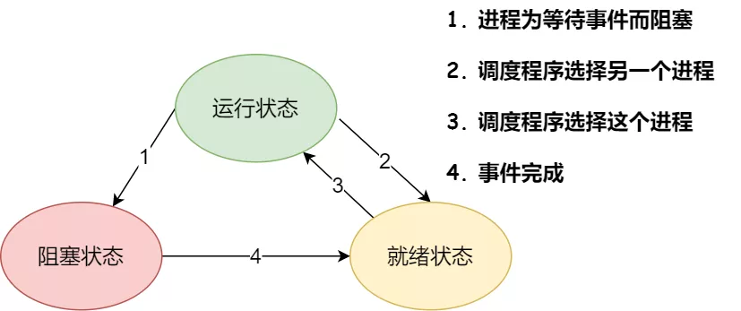
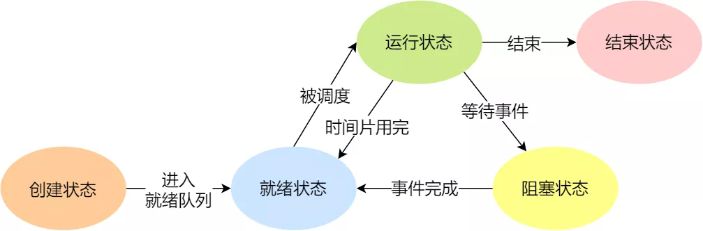
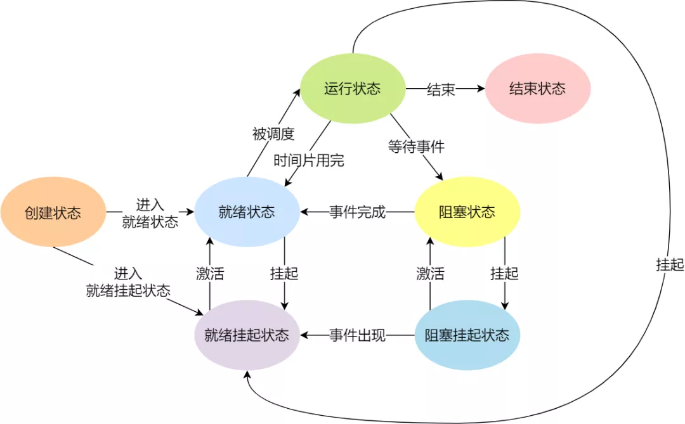
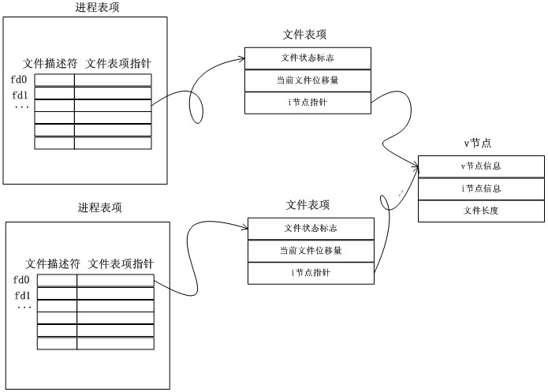
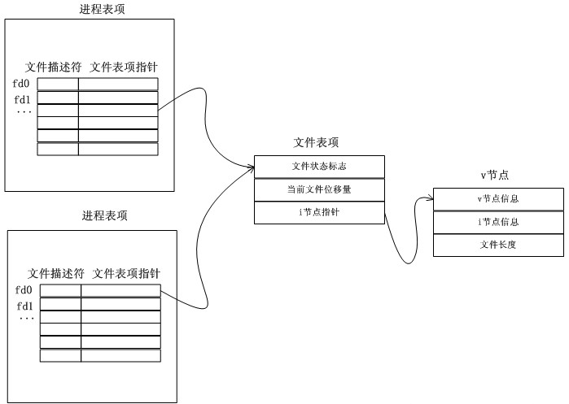

# 进程

进程是对运行时程序的封装，是系统进行资源调度和分配的的基本单位，实现了操作系统的并发

- 一个线程只能属于一个进程，而一个进程可以有多个线程，但至少有一个线程，线程依赖于进程而存在

- 进程在执行过程中拥有独立的内存单元，而多个线程共享进程的内存；资源分配给进程，同一进程的所有线程共享该进程的所有资源，共享代码段（代码和常量），数据段（全局变量和静态变量），扩展段（堆存储）；每个线程拥有自己的栈段，栈段又叫运行时段，用来存放所有局部变量和临时变量

- 进程是资源分配的最小单位，线程是 CPU 调度的最小单位

- 进程切换的开销远大于线程切换的开销；在创建或撤消进程时，系统都要为之分配或回收资源，因此系统开销远大于创建或撤销线程的开销

- 由于同一进程中的多个线程具有相同的地址空间，致使它们之间的同步和通信可以使用直接读写进程数据段（如全局变量）；进程通信需要使用进程同步和互斥手段来保证数据的一致性

- 进程编程调试简单可靠性高，线程编程调试相对复杂

- 进程间不会相互影响；一个线程挂掉将导致整个进程挂掉

- 进程适应于多核、多机分布，线程适用于多核

## 进程状态

在一个进程的基本状态，即创建状态、运行状态、就绪状态、阻塞状态、挂起状态、结束状态

- 创建状态：进程正在被创建时的状态

- 运行状态：该时刻进程占用 CPU

- 就绪状态：可运行，但因为其他进程正在运行而暂停停止

- 阻塞状态：该进程正在等待某一事件发生而暂时停止运行，即使给它 CPU 控制权，它也无法运行

- 结束状态：进程正在从系统中消失时的状态

挂起状态表示进程没有占有物理内存空间（由于虚拟内存管理原因，进程所使用的空间可能并没有映射到物理内存，而是在硬盘上）

- 阻塞挂起状态：进程在外存（硬盘）并等待某个事件的出现

- 就绪挂起状态：进程在外存（硬盘），但只要进入内存，即刻立刻运行

## 进程控制结构

在操作系统中，是用进程控制块（process control block，PCB）数据结构来描述进程，PCB 是进程存在的唯一标识

一个进程的存在，必然会有一个 PCB，如果进程消失了，那么 PCB 也会随之消失

### PCB 结构体

#### 进程描述信息

- 进程标识符：标识各个进程，每个进程都有一个并且唯一的标识符

- 用户标识符：进程归属的用户，用户标识符主要为共享和保护服务

#### 进程控制和管理信息

- 进程当前状态，如 new、ready、running、waiting 或 blocked 等

- 进程优先级：进程抢占 CPU 时的优先级

#### 资源分配清单

- 内存信息

- 进程打开所有文件的文件描述符表

- 进程的信号处理函数

- I/O 设备

#### CPU 信息

- CPU 中各个寄存器的值，当进程被切换时，CPU 的状态信息都会被保存在相应的 PCB 中，以便进程重新执行时，能从断点处继续执行

### PCB 组织方式

通过链表的方式进行组织，把具有相同状态的进程链在一起，组成各种队列

- 将所有处于就绪状态的进程链在一起，称为就绪队列

- 把所有因等待某事件而处于等待状态的进程链在一起就组成各种阻塞队列

- 对于运行队列，在单核 CPU 系统中则只有一个运行指针了，因为单核 CPU 在某个时间，只能运行一个程序

因为面临进程创建，销毁等调度导致进程状态发生变化，所以使用链表，以便能够更加灵活的插入和删除

## 进程控制

### 创建

操作系统允许一个进程创建另一个进程，而且允许子进程继承父进程所拥有的资源，当子进程被终止时，其在父进程处继承的资源应当还给父进程，终止父进程时同时也会终止其所有的子进程

1. 为新进程分配一个唯一的进程标识号，并申请一个空白的 PCB，PCB 是有限的，若申请失败则创建失败

2. 为进程分配资源，此处如果资源不足，进程就会进入等待状态，以等待资源

3. 初始化 PCB

4. 如果进程的调度队列能够接纳新进程，那就将进程插入到就绪队列，等待被调度运行

### 终止

进程可以有 3 种终止方式：正常结束、异常结束以及外界干预（信号 kill 掉）

1. 查找需要终止的进程的 PCB

2. 如果处于执行状态，则立即终止该进程的执行，然后将 CPU 资源分配给其他进程

3. 如果其还有子进程，则应将其所有子进程终止

4. 将该进程所拥有的全部资源都归还给父进程或操作系统

5. 将其从 PCB 所在队列中删除

### 阻塞

当进程需要等待某一事件完成时，它可以调用阻塞语句把自己阻塞等待；一旦被阻塞等待，它只能由另一个进程唤醒

1. 找到将要被阻塞进程标识号对应的 PCB

2. 如果该进程为运行状态，则保护其现场，将其状态转为阻塞状态，停止运行

3. 将该 PCB 插入的阻塞队列中去

### 唤醒

只有当该进程所期待的事件出现时，才由发现者进程用唤醒语句叫醒它

1. 在该事件的阻塞队列中找到相应进程的 PCB

2. 将其从阻塞队列中移出，并置其状态为就绪状态

3. 把该 PCB 插入到就绪队列中，等待调度程序调度

## 多进程管理

### 多进程并行

对于一个单核 CPU 来讲，从宏观上是并行的，而从微观上是串行的，它使用时间片划分周期调用来实现；每个任务在一段时间内会分到一段时间片(占 cpu 的时间)，在这段时间内该任务只能运行时间片长度从而达到同时的效果

### 父子进程

Linux 中的进程都是由其它进程启动

Linux 启动时，0 进程启动 1 号进程 (init) 和 2 号进程(内核线程)，0 号进程退出，其它进程是由 1、2 直接或间接产生

- 1号进程 (init) 是所有用户进程的祖先

- 2号进程(内核线程)是内核进程的祖先

### 进程退出

- 正常退出：`main()` 中 `return` 进程的所有线程结束；`exit()` 代表整个进程的结束，是库函数；`_exit()` 或者 `_Exit()` 是系统调用函数；`exit()` 通过调用 `_exit()` 来实现退出的，但 `exit()` 多干了两件事情: 清空缓冲区、调用退出处理函数；退出处理函数可以做一些清理工作，需要先登记才生效，退出处理函数保存在退出处理函数栈中(先进后出的原则)

- 异常退出：被信号打断（ctrl + c、段错误、kill -9）；主线程被取消

### 资源回收

子进程退出时, 不管是正常还是异常, 父进程会收到信号；子进程退出后，内核会释放掉该进程资源（打开的文件、占用的内存等），但仍会保留一部分信息由父进程负责回收（进程号、退出状态、
运行时间），系统所能使用的进程号是有限的，如果大量的产生僵死进程，将因为没有可用的进程号而导致系统不能产生新的进程

- 僵尸进程：子进程先结束，会通知父进程(通过信号)，让父进程回收资源，如果父进程不处理信号，子进程则变成僵尸进程；僵尸进程是一个进程必然会经过的过程，这是每个子进程在结束时都要经过的阶段

- 孤儿进程：父进程先结束，子进程就会变成孤儿进程，就会由 1 号进程（ init ）负责回收，但在实际编程中要避免这种情况

僵尸进程是一个早已死亡的进程，但在进程表中仍占了一个位置。由于进程表的容量是有限的，所以僵尸进程不仅占用系统的内存资源，影响系统的性能，而且如果其数目太多，还会导致系统瘫痪

当子进程结束的时候，它并没有真正的被销毁，而是留下一个称为僵尸进程的数据结构，这些数据会一直保留到系统将它传递给它的父进程为止。此时，该僵尸子进程已经放弃了几乎所有的内存空间，没有任何可执行代码，也不能被调度，仅仅在进程列表中保留一个位置，记载该进程的退出状态信息供其他进程收集

如果父进程没有捕获 SIGCHLD 信号处理函数调用 `wait()` 或 `waitpid()` 等待子进程结束，也没有显式忽略该信号，那么它就一直保持僵尸状态。如果父进程结束时子进程仍为僵尸进程，那么 init 进程会自动接手这个子进程，将它清除掉的。但是如果父进程是一个循环，不会结束，那么子进程就会一直保持僵尸状态

僵尸进程是不能直接使用 kill -9 命令杀掉的，重启电脑或杀掉父进程可解决僵尸进程

预防僵尸进程措施：

- 在父进程创建子进程之前，就向系统申明自己不会对这个子进程的 exit 动作进行任何关注行为，这样子进程退出后，系统不会去等待父进程的操作，而是直接将该子进程的资源回收掉，也就不会出现僵尸进程了

- 在创建完子进程后，用 `waitpid()` 等待子进程返回

### 父子进程共享的文件描述符

PCB 里有个数组专门用于记录打开的文件，数组元素为指向所打开的文件所创建的文件表项，文件表项是用于描述文件当前被某个进程打开后的状态信息，包括文件状态标志，记录当前文件读取的位移量，以及文件的 i 节点指针

不同进程打开同一个文件后，进程表和文件表的关系；`fork()` 之后打开文件，与不同进程打开同一文件情况相同

`fork()` 之前打开文件，子进程是共享父进程的文件表项

进程调用 `fork()` 后，子进程和父进程的文件描述符所对应的文件表项是共享的，这意味着子进程对文件的读写直接影响父进程的文件位移量(反之同理)

## 优先级

自从多任务操作系统诞生以来，进程执行占用 cpu 的能力就是一个必须要可以人为控制的事情

进程优先级起作用的方式，无论是只有一个 cpu 的时代，还是多核 cpu 时代，都是通过控制进程占用 cpu 时间的长短来实现的

在同一个调度周期中，优先级高的进程占用的时间长些，而优先级低的进程占用的短些

cgroup 相较于优先级，更能直观的反馈出资源分配的比例，但实际上从内核目前的进程调度器 cfs 的角度看，同时实现 cpushare 方式的 cgroup 和优先级这两个机制完全是相同的概念

### nice

nice 值是反应一个进程静态优先级状态的值，其取值范围是 -20 至 19，一共 40 个级别

nice 越小，表示进程优先级越高，而值越大优先级越低

可以通过 `nice` 命令来对一个将要执行的命令进行 `nice`值设置

使用 `renice` 命令可以对一个正在运行的进程进行 nice 值的调整

### priority

priority 值表示 PRI 和 PR 值，动态优先级