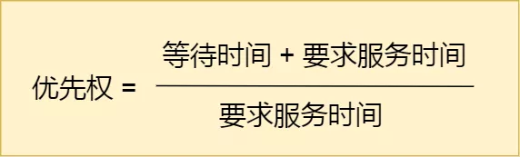
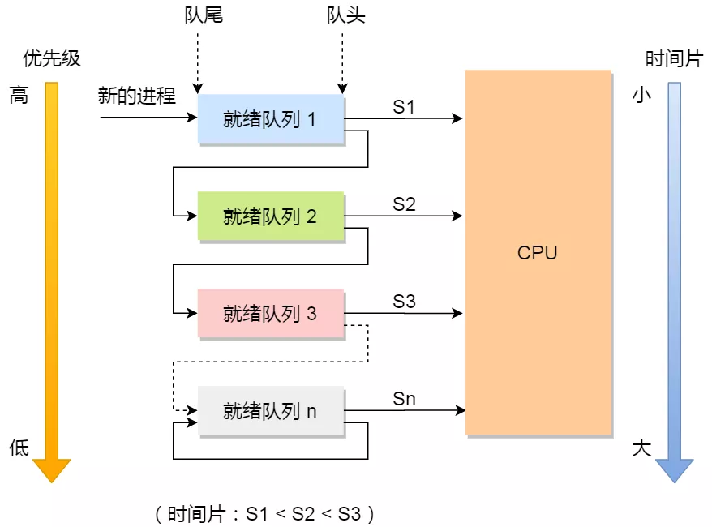

# 进程调度

## 调度算法

- 非抢占式调度算法：挑选一个进程，然后让该进程运行直到被阻塞，或者直到该进程退出，才会调用另外一个进程，也就是说不会理时钟中断这个事情

- 抢占式调度算法挑选一个进程，然后让该进程只运行某段时间，如果在该时段结束时，该进程仍然在运行时，则会把它挂起，接着调度程序从就绪队列挑选另外一个进程。这种抢占式调度处理，需要在时间间隔的末端发生时钟中断，以便把 CPU 控制返回给调度程序进行调度，也就是常说的时间片机制

## 调度原则

- CPU 利用率：如果运行的程序，发生了 I/O 事件的请求，那 CPU 使用率必然会很低，为了提高 CPU 利用率，
在这种发生 I/O 事件致使 CPU 空闲的情况下，调度程序需要从就绪队列中选择一个进程来运行

- 系统吞吐量：有的程序执行某个任务花费的时间会比较长，如果这个程序一直占用着 CPU，会造成系统吞吐量（CPU 在单位时间内完成的进程数量）
的降低；要提高系统的吞吐率，调度程序要权衡长任务和短任务进程的运行完成数量

- 周转时间：进程运行时间和进程等待时间总和称为周转时间；一个进程的周转时间越小越好

- 等待时间：处于就绪队列的进程不能等太久

- 响应时间：用户提交请求到系统第一次产生响应所花费的时间，在交互式系统中，响应时间是衡量调度算法好坏的主要标准

## 调度算法

### 非抢占式的先来先服务（First Come First Severd, FCFS）

每次从就绪队列选择最先进入队列的进程，然后一直运行，直到进程退出或被阻塞，
才会继续从队列中选择第一个进程接着运行

FCFS 对长作业有利，适用于 CPU 繁忙型作业的系统，而不适用于 I/O 繁忙型作业的系统

### 非抢占式的最短作业优先（Shortest Job First, SJF）

优先选择运行时间最短的进程来运行，这有助于提高系统的吞吐量

对长作业不利，很容易造成一种极端现象

### 非抢占式高响应比优先（Highest Response Ratio Next, HRRN）

每次进行进程调度时，先计算响应比优先级，然后把响应比优先级最高的进程投入运行

等待时间越长，优先权越高

### 抢占式时间轮片

每个进程被分配一个时间段，称为时间片（Quantum），即允许该进程在该时间段中运行

如果时间片用完，进程还在运行，那么将会把此进程从 CPU 释放出来，并把 CPU 分配另外一个进程

如果该进程在时间片结束前阻塞或结束，则 CPU 立即进行切换

### 最高优先级

从就绪队列中选择最高优先级的进程进行运行

进程的优先级可以分为，静态优先级或动态优先级：

- 静态优先级：创建进程时候，就已经确定了优先级了，然后整个运行时间优先级都不会变化

- 动态优先级：根据进程的动态变化调整优先级，比如如果进程运行时间增加，则降低其优先级，如果进程等待时间（就绪队列的等待时间）增加，则升高其优先级，也就是随着时间的推移增加等待进程的优先级

该算法还分为抢占式和非抢占式：

- 非抢占式：当就绪队列中出现优先级高的进程，运行完当前进程，再选择优先级高的进程

- 抢占式：当就绪队列中出现优先级高的进程，当前进程挂起，调度优先级高的进程运行

### 多级反馈队列

多级反馈队列是时间片轮转和最高优先级的综合和发展

多级：有多个队列，每个队列优先级从高到低，同时优先级越高时间片越短

反馈：如果有新的进程加入优先级高的队列时，立刻停止当前正在运行的进程，转而去运行优先级高的队列

- 设置了多个队列，赋予每个队列不同的优先级，每个队列优先级从高到低，同时优先级越高时间片越短

- 新的进程会被放入到第一级队列的末尾，按先来先服务的原则排队等待被调度，如果在第一级队列规定的时间片没运行完成，则将其转入到第二级队列的末尾，以此类推，直至完成

- 当较高优先级的队列为空，才调度较低优先级的队列中的进程运行。如果进程运行时，有新进程进入较高优先级的队列，则停止当前运行的进程并将其移入到原队列末尾，接着让较高优先级的进程运行

对于短作业可能可以在第一级队列很快被处理完；对于长作业，如果在第一级队列处理不完，可以移入下次队列等待被执行，虽然等待的时间变长了，但是运行时间也会更长了，所以该算法很好的兼顾了长短作业，同时有较好的响应时间