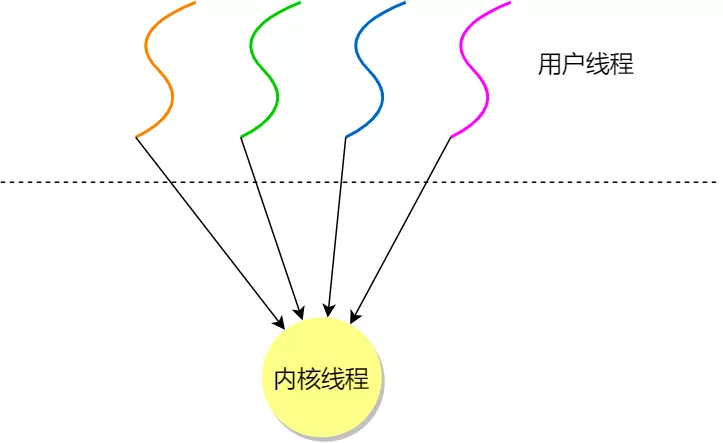
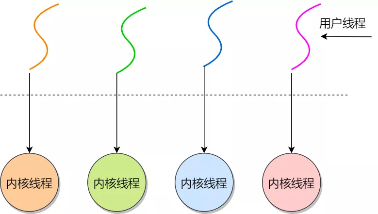
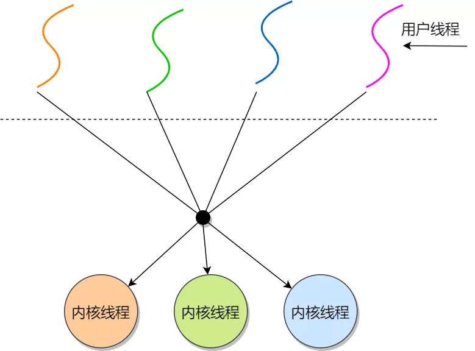

# 线程

线程是进程的子任务，是 CPU 调度和分派的基本单位，实现进程内部的并发；进程内每个线程完成不同的任务，但是共享同一地址空间（也就是同样的动态内存，映射文件，目标代码等等），打开的文件队列和其他内核资源

## 线程实现

- 用户线程：在用户空间实现的线程，不是由内核管理的线程，是由用户态的线程库来完成线程的管理

- 内核线程：在内核中实现的线程，是由内核管理的线程

- 轻量级进程：在内核中来支持用户线程

## 用户线程

用户线程是基于用户态的线程管理库来实现的，那么线程控制块（Thread Control Block, TCB） 
也是在库里面来实现的，对于操作系统而言是看不到这个 TCB 的，它只能看到整个进程的 PCB

用户线程的整个线程管理和调度，操作系统是不直接参与的，而是由用户级线程库函数来完成线程的管理，
包括线程的创建、终止、同步和调度等

优点：

- 每个进程都需要有它私有的线程控制块（TCB）列表，用来跟踪记录它各个线程状态信息（PC、栈指针、寄存器），
TCB 由用户级线程库函数来维护，可用于不支持线程技术的操作系统

- 用户线程的切换也是由线程库函数来完成的，无需用户态与内核态的切换，所以速度特别快

缺点：

- 由于操作系统不参与线程的调度，如果一个线程发起了系统调用而阻塞，那进程所包含的用户线程都不能执行了

- 当一个线程开始运行后，除非它主动地交出 CPU 的使用权，否则它所在的进程当中的其他线程无法运行，因为用户态的线程没法打断当前运行中的线程，它没有这个特权，只有操作系统才有，但是用户线程不是由操作系统管理的

- 由于时间片分配给进程，在多线程执行时，每个线程得到的时间片较少，执行会比较慢

## 内核线程

内核线程是由操作系统管理的，线程对应的 TCB 自然是放在操作系统里的，这样线程的创建、终止和管理都是由操作系统负责

优点：

- 在一个进程当中，如果某个内核线程发起系统调用而被阻塞，并不会影响其他内核线程的运行

- 多线程的进程获得更多的 CPU 运行时间

缺点：

- 在支持内核线程的操作系统中，由内核来维护进程和线程的上下文信息，如 PCB 和 TCB

- 线程的创建、终止和切换都是通过系统调用的方式来进行，因此对于系统来说，系统开销比较大