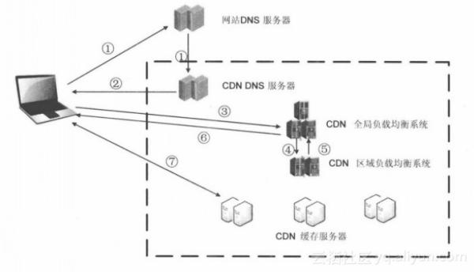

## CDN

CDN 全称 Content Delivery Network，即内容分发网络

为尽可能避开互联网上有可能影响数据传输速度和稳定性的瓶颈和环节，使内容传输的更快、更稳定，CDN 在现有的互联网基础之上，通过在网络各处放置节点服务器构成一层智能虚拟网络，实时地根据网络流量和各节点的连接、负载状况以及到用户的距离和响应时间等综合信息将用户的请求重新导向离用户最近的服务节点上，使用户可就近取得所需内容，解决网络拥挤的状况，提高用户访问网站的响应速度和成功率

CDN 的意图就是尽可能的减少资源在转发、传输、链路抖动等情况下顺利保障信息的连贯性

1. 当用户点击网站页面上的内容 URL，经过本地 DNS 系统解析，DNS 系统会最终将域名的解析权交给 CDN 专用 DNS 服务器

2. CDN 的 DNS 服务器将 CDN 的全局负载均衡设备 IP 地址返回用户

3. 用户向 CDN 的全局负载均衡设备发起内容 URL 访问请求

4. CDN 全局负载均衡设备根据用户 IP 地址，以及用户请求的内容 URL，选择一台用户所属区域的区域负载均衡设备，告诉用户向这台设备发起请求

5. 区域负载均衡设备会为用户选择一台合适的缓存服务器提供服务，选择的依据包括：根据用户 IP 地址，判断哪一台服务器距用户最近；根据用户所请求的 URL 中携带的内容名称，判断哪一台服务器上有用户所需内容；查询各个服务器当前的负载情况，判断哪一台服务器尚有服务能力。基于以上这些条件的综合分析之后，区域负载均衡设备会向全局负载均衡设备返回一台缓存服务器的IP地址

6. 全局负载均衡设备把服务器的 IP 地址返回给用户

7. 用户向缓存服务器发起请求，缓存服务器响应用户请求，将用户所需内容传送到用户终端

CDN 是只对网站的某一个具体的域名加速。如果同一个网站有多个域名，则访客访问加入 CDN 的域名获得加速效果，访问未加入 CDN 的域名，或者直接访问 IP 地址，则无法获得 CDN 效果
