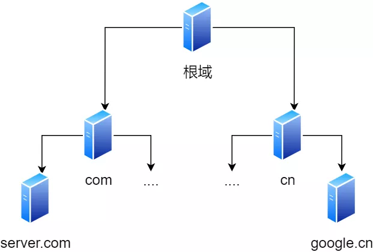

# DNS 域名系统

DNS 是一个分布式数据库，提供了主机名和 IP 地址之间相互转换的服务

在域名系统中，用句点分割，越靠右层级越高

```cpp
/*
www.server.com

根域是在最顶层，它的下一层就是 com 顶级域名，server 是二级域名，www 为三级域名

域名的层级关系类似一个树状结构：

- 根 DNS 服务器

- 定义域 DNS 服务器

- 权威 DNS 服务器
*/
```



1. 客户端向本地域名服务器发出解析域名的请求

2. 本地域名服务器查看本地缓存，是否有缓存过域名 IP，如果有直接返回给客户端，如果没有执行下一步

3. 本地域名服务器先向一个根域名服务器查询，根域名服务器告诉本地域名服务器应该向哪个顶级域名进行查询

4. 顶级域名再告诉本地域名服务器向哪个二级域名服务器进行查询，依次类推直到找到域名 IP

5. 本地域名服务器将得到的 IP 告诉客户端

域名服务器大量使用缓存存放最近查询过的域名以及从何处获得域名映射信息的记录，如直接存有网站映射的 IP 或顶级域名服务器地址，从而不需要向根域名查询，而是直接对顶级域名查询

DNS 可以使用 UDP 或者 TCP 进行传输