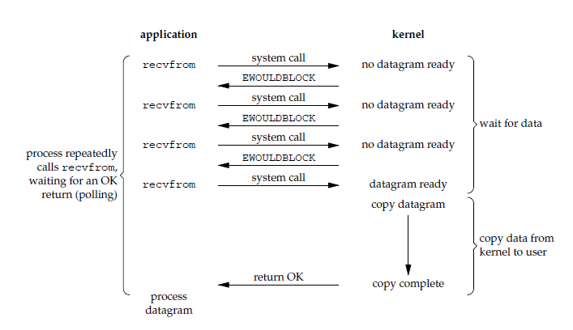
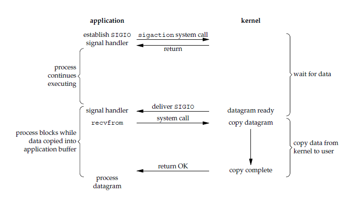

# I/O 模型

一个输入操作通常包括两个阶段：

1. 等待数据准备好

2. 从内核向进程复制数据

对于一个套接字上的输入操作，第一步通常涉及等待数据从网络中到达。当所等待数据到达时，它被复制到内核中的某个缓冲区。第二步就是把数据从内核缓冲区复制到应用进程缓冲区

```cpp
/*
1、输入操作：read、readv、recv、recvfrom、recvmsg 共 5 个函数，如果是阻塞状态，则会在 wait data 和 copy data 两个阶段阻塞，如果设置为非阻塞则在 wait 不到 data 时抛出异常

2、输出操作：write、writev、send、sendto、sendmsg 共 5 个函数，在发送缓冲区满了会阻塞在原地，如果设置为非阻塞，则会抛出异常

3、接收外来链接：accept，与输入操作类似

4、发起外出链接：connect，与输出操作类似
*/
```

## 同步阻塞式 I/O

应用进程被阻塞，直到数据从内核缓冲区复制到应用进程缓冲区中才返回

在阻塞的过程中，其它应用进程还可以执行，因此阻塞不意味着整个操作系统都被阻塞

因为其它应用进程还可以执行，所以不消耗 CPU 时间，这种模型的 CPU 利用率会比较高

`recvfrom()` 用于接收 Socket 传来的数据，并复制到应用进程的缓冲区 buf 中


解决方案：服务器端使用多线程或多进程，让每个连接都拥有独立的线程或进程，但面对成千上万的连接请求，都会严重占据系统资源，降低系统对外界响应效率，而且线程和进程更容易进入假死状态

`connect(), accept(), send(), recv()` 默认都是同步阻塞模式

## 同步非阻塞式 I/O

应用进程执行系统调用之后，内核返回一个错误码。应用进程可以继续执行，但是需要不断的执行系统调用来获知 I/O 是否完成，这种方式称为轮询（polling）

因为应用进程在数据没有到达之前会不停查询，使 CPU 要处理更多的系统调用，因此这种模型的 CPU 利用率比较低


非阻塞 I/O 决不被推荐，虽然能够在等待任务完成的时间里干其他活，但轮询将推高 CPU 占用，同时任务完成的响应延迟增大了，因为任务会在轮询间隔之间的任意时间完成，降低整体数据吞吐量

## I/O 复用

在同步非阻塞 I/O 中，`recv()` 更多的是起到检测的作用，而操作系统提供了更为高效的检测操作是否完成接口，同时接口可以一次检测多个连接是否活跃

使用 select 或者 poll 等待数据，并且可以等待多个套接字中的任何一个变为可读。这一过程会被阻塞，当某一个套接字可读时返回，之后再使用 recvfrom 把数据从内核复制到进程中

它可以让单个进程具有处理多个 I/O 事件的能力。又被称为 Event Driven I/O，即事件驱动 I/O

如果一个 Web 服务器没有 I/O 复用，那么每一个 Socket 连接都需要创建一个线程去处理。如果同时有几万个连接，那么就需要创建相同数量的线程。相比于多进程和多线程技术，I/O 复用不需要进程线程创建和切换的开销，系统开销更小

这种模型中，使用非阻塞 I/O，然后使用阻塞 select，用 select 来管理多个 I/O，当没有数据时 select 阻塞，如果在超时时间内数据到来则 select 返回，再调用 recv 进行数据的复制，recv 返回后处理数据



当用户调用 select，整个进程会被阻塞，当 select 负责的 socket 数据准备好了 select 便会返回，整个过程和阻塞 I/O 并没有太大的不同，其实要更差一些，因为使用了两个系统调用（select 和 recvfrom），但 select 的优势在于可以同时处理多个连接

如果处理的连接数不是很高的话，使用 I/O 复用不一定比使用多线程阻塞 I/O 性能更好，可能延迟更高，I/O 复用的优势在于能处理更多的连接

## 信号驱动 I/O

应用进程使用 sigaction 系统调用，内核立即返回，应用进程可以继续执行，也就是说等待数据阶段应用进程是非阻塞的。内核在数据到达时向应用进程发送 SIGIO 信号，应用进程收到之后在信号处理程序中调用 recvfrom 将数据从内核复制到应用进程中

相比于非阻塞式 I/O 的轮询方式，信号驱动 I/O 的 CPU 利用率更高



## 异步 I/O（非阻塞）

应用进程执行 aio_read 系统调用会立即返回，应用进程可以继续执行，不会被阻塞，内核会在所有操作完成之后向应用进程发送信号

异步 I/O 与信号驱动 I/O 的区别在于，异步 I/O 的信号是通知应用进程 I/O 完成，而信号驱动 I/O 的信号是通知应用进程可以开始 I/O


## I/O 模型比较

- 同步 I/O：将数据从内核缓冲区复制到应用进程缓冲区的阶段（第二阶段），应用进程会阻塞

- 异步 I/O：第二阶段应用进程不会阻塞

同步 I/O 包括阻塞式 I/O、非阻塞式 I/O、I/O 复用和信号驱动 I/O ，它们的主要区别在第一个阶段

非阻塞式 I/O 、信号驱动 I/O 和异步 I/O 在第一阶段不会阻塞


## I/O 复用

select/poll/epoll 都是 I/O 多路复用的具体实现，`select` 出现的最早，之后是 `poll`，再是 `epoll`

## 应用场景

- `select` 的 `timeout` 参数精度为微秒，而 `poll` 和 `epoll` 为毫秒，因此 `select` 更加适用于实时性要求比较高的场景；`select` 可移植性更好，几乎被所有主流平台所支持

- `poll` 没有最大描述符数量的限制，如果平台支持并且对实时性要求不高，应该使用 `poll` 而不是 `select`

- 只需要运行在 Linux 平台上，有大量的描述符需要同时轮询，并且这些连接最好是长连接；需要同时监控小于 1000 个描述符，就没有必要使用 `epoll`，因为这个应用场景下并不能体现 `epoll` 的优势；需要监控的描述符状态变化多，而且都是非常短暂的，也没有必要使用 `epoll`，因为 `epoll` 中的所有描述符都存储在内核中，造成每次需要对描述符的状态改变都需要通过 `epoll_ctl()` 进行系统调用，频繁系统调用降低效率。并且 `epoll` 的描述符存储在内核，不容易调试