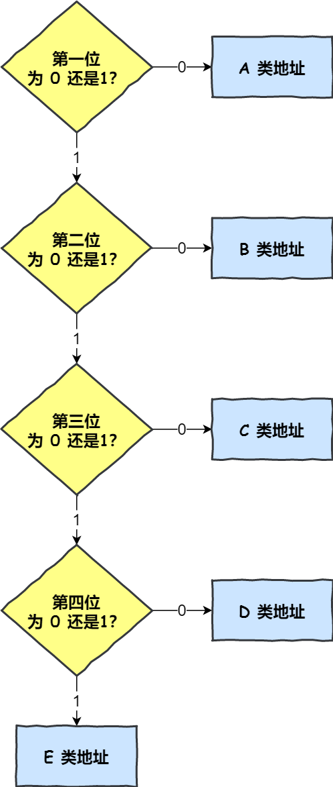

# IP 协议

MAC 地址只与厂商有关，与所处的网络无关，所以无法通过 MAC 地址来判断两台主机是否属于同一个子网，因此网络层引入了 IP 协议，制定了一套新地址，使得我们能够区分两台主机是否同属一个网络

IP地址目前有 IPv4 和 IPv6

IPv4 是一个 32 位的地址，并且将这个 32 位的地址分为两部分，前面部分代表网络地址，后面部分表示该主机在局域网中的地址

## IPv4 分类

A、B 和 C 类用于单播通信中设备 IP 地址分配，D 类属于组播地址，用于组播通信；E 类是保留地址

A 类地址第 1 字节为网络地址，其它 3 个字节为主机地址，第 1 个字节的第一位固定为 0，而 0 和 127 的 A 类网络不可用的，所以网络号范围：1.0.0.0—126.0.0.0，子网掩码固定为 255.0.0.0

B 类地址第 1 字节和第 2 字节为网络地址，其它 2 个字节为主机地址，第 1 个字节的前两位固定为 10，网络号范围：128.0.0.0—191.255.0.0，子网掩码为固定的255.255.0.0

C 类地址第 1 字节、第 2 字节和第 3 个字节为网络地址，第 4 个字节为主机地址，第1个字节的前三位固定为110，地址网络号范围：192.0.0.0—223.255.255.0，子网掩码为固定的 255.255.255.0

D 类地址不分网络地址和主机地址，第 1 个字节的前四位固定为 1110，地址范围：240.0.0.0—255.255.255.254

### 特殊 IP

- IP 地址中全为 0 表示本网络，为保留地址

- 网络号为 127（0111 1111）为本地软件回环测试地址，回环地址的 IP 数据报不会出现在网络中

- 128.0.0.0 不可指派

- 192.0.0.0 不可指派

- 主机号全为 0 指定本主机所连接的网络

- 主机号全为 1 指定本主机所连接的网络里的所有主机，用于广播

### 子网划分

子网划分实际上是将主机地址分为两个部分：子网网络地址和子网主机地址

### 子网掩码

从 IP 数据报无法看出主机所连接的网络是否进行了子网划分

如果两个 IP 地址在同一个子网内，则网络地址和子网网络地址一定相同

IP 协议引入了子网掩码，IP 地址和子网掩码通过按位与运算后就可以得到网络地址和子网地址

### 无分类编址

32 比特的 IP 地址被划分为两部分，前面是网络号，后面是主机号，表示形式 a.b.c.d/x，其中 /x 表示前 x 位属于网络号， x 的范围是 0 ~ 32

无分类编址不使用子网，斜线后面数据就是地址掩码中 1 的个数

### IP 包

IP 数据包由首部和数据两部分组成，首部长度为 20 个字节，主要包含了目标 IP 地址和源 IP 地址，目标 IP 地址是网关路由的线索和依据；数据部分的最大长度为 65515 字节，理论上一个 IP 数据包的总长度可以达到 65535 个字节，而以太网数据包的最大长度是 1500 个字符，如果超过这个大小，就需要对 IP 数据包进行分割，分成多帧发送