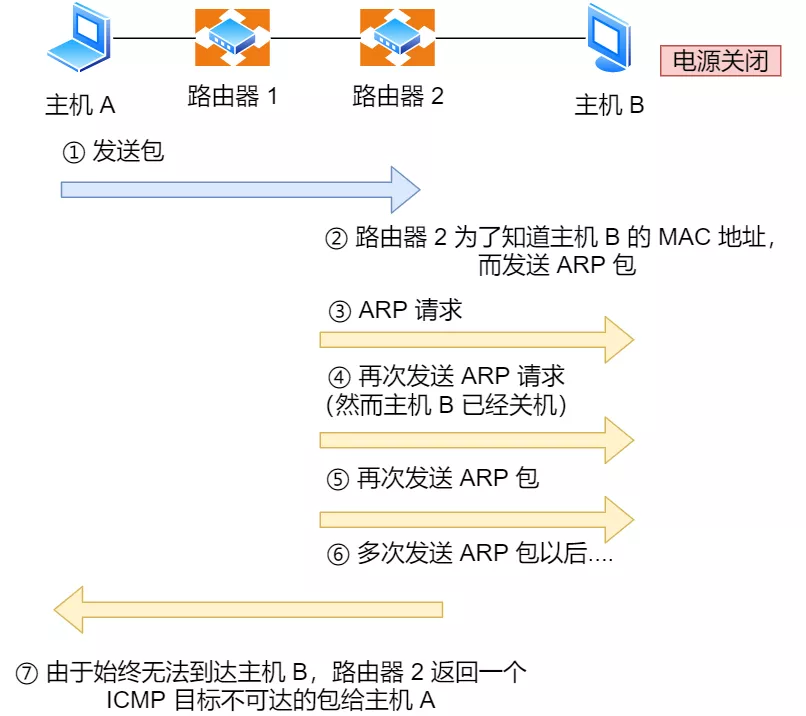
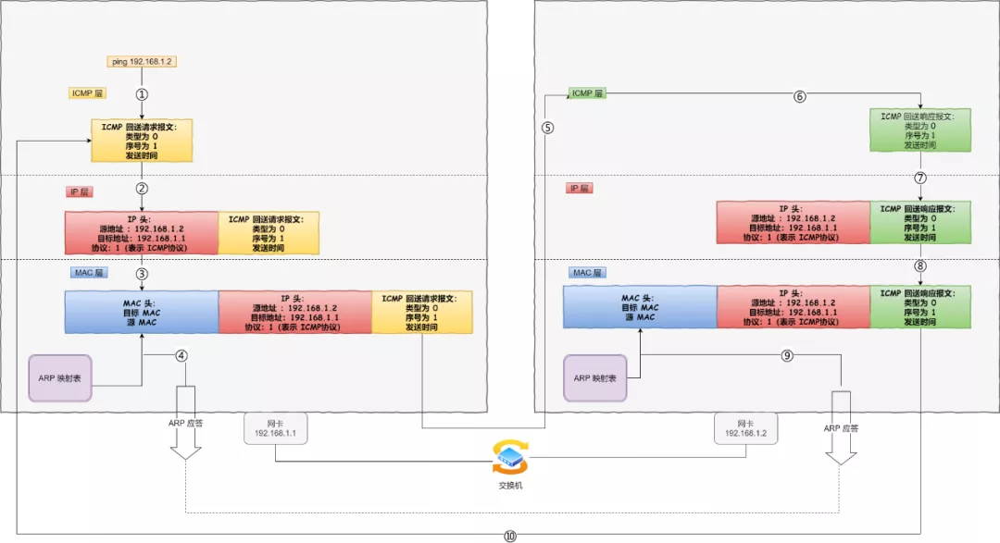

# PING 工作原理

ping 是基于 ICMP(Internet Control Message Protocol，互联网控制报文协议) 协议工作的

## ICMP

网络包在复杂的网络传输环境里，常常会遇到各种问题，传出消息，报告遇到了什么问题，这样才可以调整传输策略，以此来控制整个局面

ICMP 主要的功能包括：确认 IP 包是否成功送达目标地址、报告发送过程中 IP 包被废弃的原因和改善网络设置等

在 IP 通信中如果某个 IP 包因为某种原因未能达到目标地址，那么这个具体的原因将由 ICMP 负责通知

ICMP 报文是封装在 IP 包里面，它工作在网络层，是 IP 协议的助手

## PING 过程

- 主机 A ping 主机 B，A 会先构建一个 ICMP 数据包

- ICMP 协议将这个数据包连同主机 B 地址一起交给 IP 层，IP 层将以该地址作为目的地址，本机 IP 地址作为源地址，构建一个 IP 数据包

- 加入 MAC 头；如果在本地 ARP 映射表中查找出目标 IP 地址所对应的 MAC 地址，则可以直接使用；如果没有，则需要发送 ARP 协议查询 MAC 地址，获得 MAC 地址后，由数据链路层构建一个数据帧，目的地址是 IP 层传过来的 MAC 地址，源地址则是本机的 MAC 地址

- 主机 B 收到这个数据帧后，先检查它的目的 MAC 地址，并和本机的 MAC 地址对比，如符合，则接收，否则就丢弃

- 将 IP 数据包从帧中提取出来，交给本机的 IP 层；IP 层检查后，将有用的信息提取后交给 ICMP 协议

- 主机 B 会构建一个 ICMP 回送响应消息数据包，然后再发送出去给主机 A

- 在规定的时候间内，源主机如果没有接到 ICMP 的应答包，则说明目标主机不可达；如果接收到了 ICMP 回送响应消息，则说明目标主机可达

