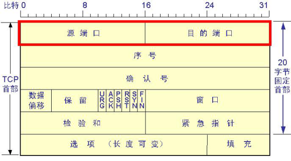
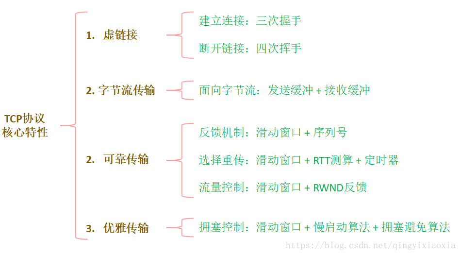
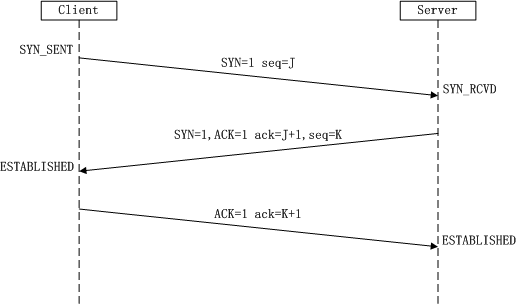
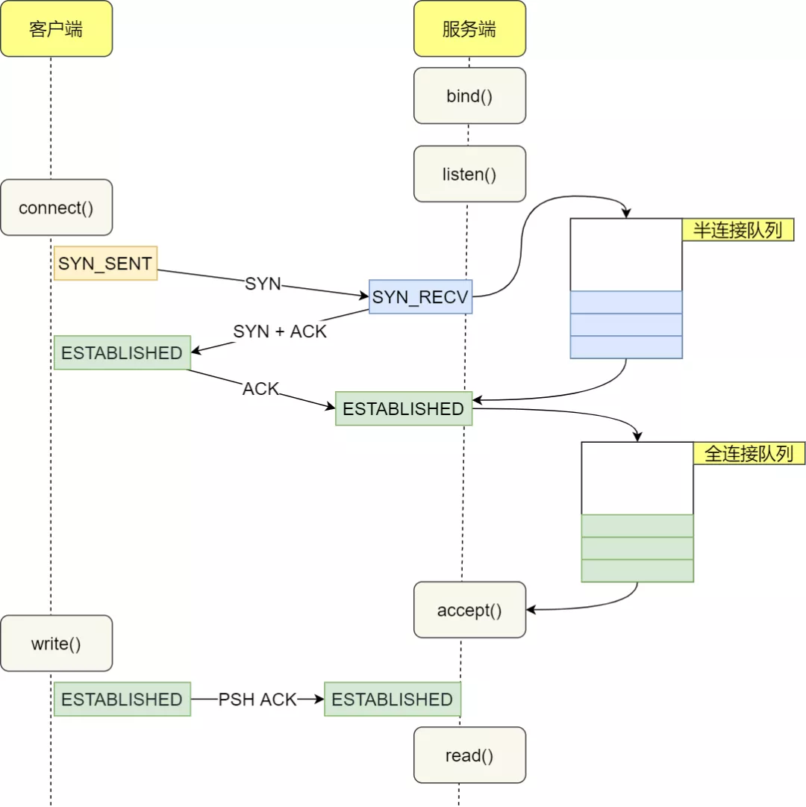
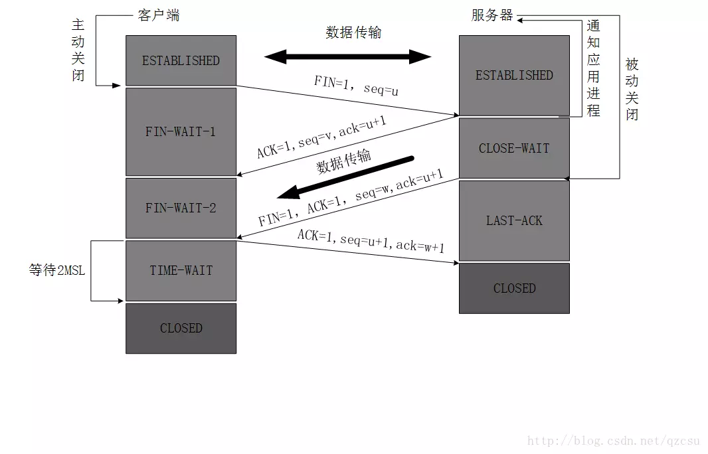
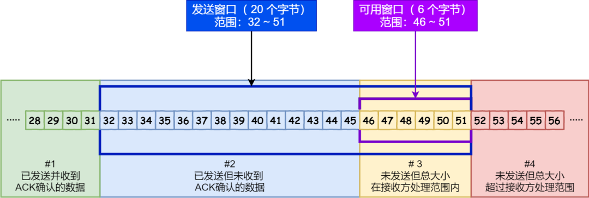
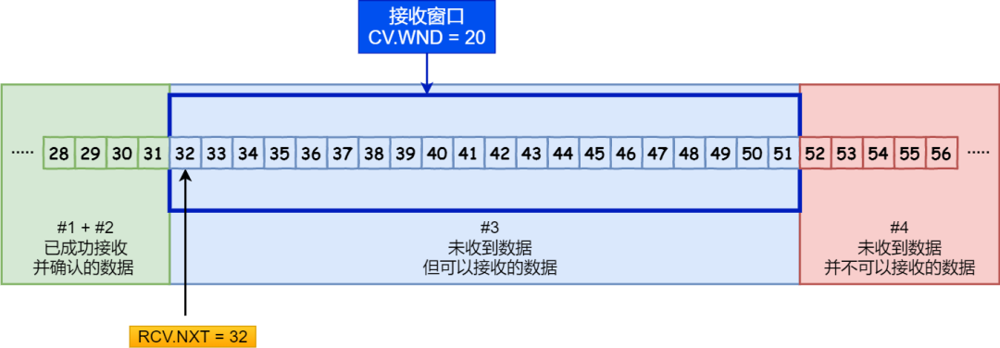
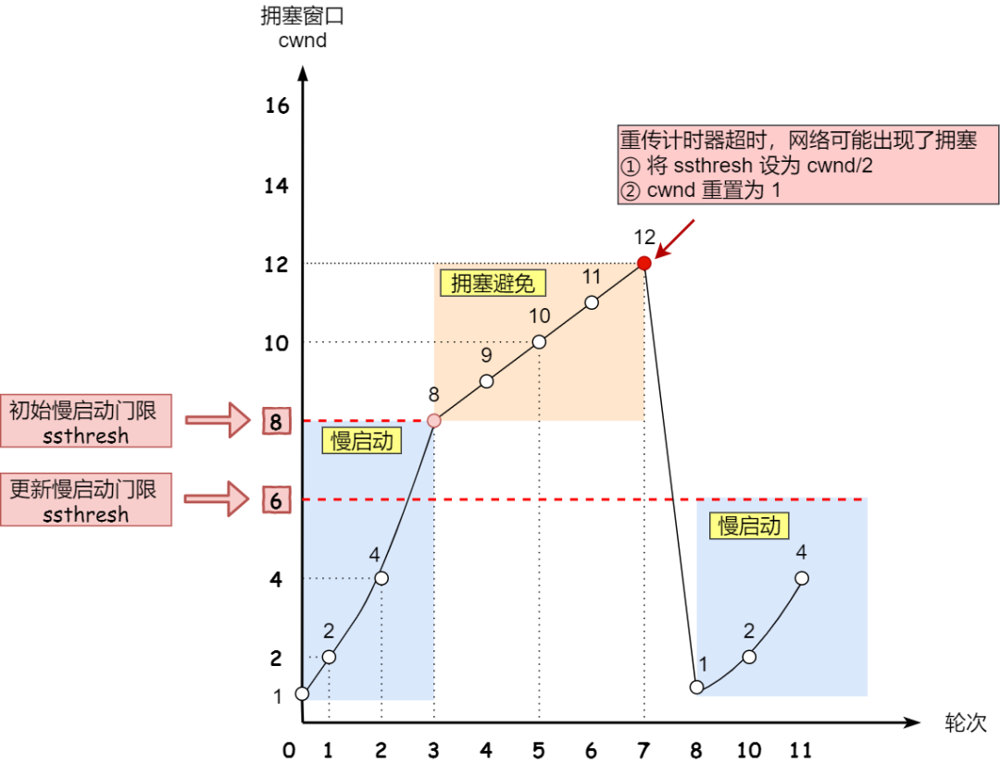
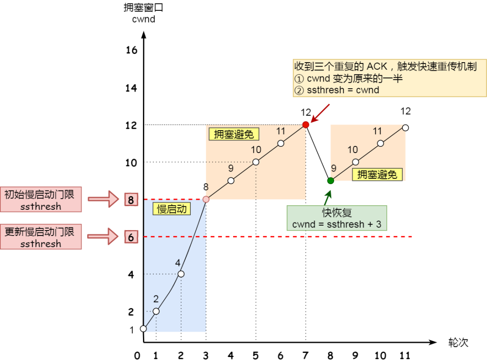

## TCP

TCP（Transmission Control Protocol）是面向连接的，提供可靠交付，有流量控制，拥塞控制，提供全双工通信，面向字节流（把应用层传下来的报文看成字节流，把字节流组织成大小不等的数据块），每一条 TCP 连接只能是点对点的

TCP 数据包和 UDP 一样，都是由首部和数据两部分组成，唯一不同的是，TCP 数据包没有长度限制，理论上可以无限长，但是为了保证网络的效率，通常 TCP 数据包的长度不会超过 IP 数据包的长度，以确保单个 TCP 数据包不必再分割

TCP 负责应用软件和网络软件之间的通信：IP 负责计算机之间的通信；TCP 负责将数据分割并装入 IP 包，然后在它们到达的时候重新组合它们；IP 负责将包发送至接受者

- 32 位序列号：用于对字节流进行编号，例如序号为 301，表示第一个字节的编号为 301，如果携带的数据长度为 100 字节，那么下一个报文段的序号应为 401

- 32 位确认号：期望收到的下一个报文段的序号。例如 B 正确收到 A 发送来的一个报文段，序号为 501，携带的数据长度为 200 字节，因此 B 期望下一个报文段的序号为 701，B 发送给 A 的确认报文段中确认号就为 701

- 4 位首部长度：数据部分距离报文段起始处的偏移量，实际上指的是首部的长度

- 源端口号/目的端口号: 表示数据从哪个进程来, 到哪个进程去

- 16 位窗口大小：作为接收方让发送方设置其发送窗口的依据

- 6 位标志域：紧急标志 URG (1 表示有效)、有意义的应答标志 ACK （1 时确认号字段有效，否则无效，在连接建立后所有传送的报文段都必须把 ACK 置 1）、推 PSH （1 时表示接收端不将该数据进行队列处理，而是尽可能快地将数据转由应用处理）、重置连接标志 RST 、同步序列号标志 SYN (仅在三次握手建立 TCP 连接时有效，当 SYN=1，ACK=0 时表示这是一个连接请求报文段。若对方同意建立连接，则响应报文中 SYN=1，ACK=1)、完成发送数据标志 FIN (1 表示此报文段的发送方的数据已发送完毕，并要求释放连接)

- TCP 校验和会覆盖首部和数据

## TCP 三次握手

建立一个 TCP 连接时，需要客户端和服务端总共发送 3 个包以确认连接的建立，在 socket 编程中，这一过程由客户端执行 connect 来触发

- 第一次：客户端 - - > 服务器。此时服务器知道了客户端要建立连接了  Client 将标志位 SYN 置为 1，随机产生一个值 seq = J，并将该数据包发送给 Server，Client 进入 SYN_SENT 状态，等待 Server 确认

- 第二次：客户端 < - - 服务器。此时客户端知道服务器收到连接请求了 Server 收到数据包后由标志位 SYN = 1 知道 Client 请求建立连接，Server 将标志位 SYN 和 ACK 都置为 1，ack = J + 1，随机产生一个值 seq=K ，并将该数据包发送给 Client 以确认连接请求，Server 进入 SYN_RCVD 状态

- 第三次：客户端 - - > 服务器。此时服务器知道客户端收到了自己的回应 Client 收到确认后，检查 ack 是否为 J + 1 ，ACK 是否为 1，如果正确则将标志位 ACK 置为 1，ack = K + 1，并将该数据包发送给 Server，Server 检查 ack 是否为 K + 1，ACK 是否为 1，如果正确则连接建立成功，Client 和 Server 进入 ESTABLISHED 状态

## 为什么不两次握手

### 避免历史连接

为了防止已经失效的连接请求报文突然又传送到了服务器，从而产生错误

如果是历史连接（序列号过期或超时），则第三次握手发送的报文是 RST 报文，终止历史连接

### 同步双方初始序列号

确保双方的初始序列号能被可靠的同步，保证 TCP 的可靠性

### 避免资源浪费

客户端发送的连接请求如果在网络中滞留，那么就会隔很长一段时间才能收到服务器端发回的连接确认。客户端等待一个超时重传时间之后，就会重新请求连接。但是这个滞留的连接请求最后还是会到达服务器，如果不进行三次握手，那么服务器就会打开两个连接。如果有第三次握手，客户端会忽略服务器之后发送的对滞留连接请求的连接确认，不进行第三次握手，因此就不会再次打开连接

## SYN 攻击

Server 发送 SYN-ACK 之后，收到 Client 的 ACK 之前的 TCP 连接称为半连接。SYN 攻击就是 Client 在短时间内伪造大量不存在的 IP 地址，并向 Server 不断地发送 SYN 包，Server 回复确认包，并等待 Client 的确认，由于源地址是不存在的，因此，Server 需要不断重发直至超时，这些伪造的 SYN 包将产时间占用未连接队列，导致正常的 SYN 请求因为队列满而被丢弃，从而引起网络堵塞甚至系统瘫痪

## 半连接队列和全连接队列

在 TCP 三次握手的时候，Linux 内核会维护两个队列，分别是：半连接队列，也称 SYN 队列；全连接队列，也称 accepet 队列

服务端收到客户端发起的 SYN 请求后，内核会把该连接存储到半连接队列，并向客户端响应 SYN+ACK，接着客户端会返回 ACK，服务端收到第三次握手的 ACK 后，内核会把连接从半连接队列移除，然后创建新的完全的连接，并将其添加到 accept 队列，等待进程调用 accept 函数时把连接取出来

不管是半连接队列还是全连接队列，都有最大长度限制，超过限制时，内核会直接丢弃，或返回 RST 包

当服务端并发处理大量请求时，如果 TCP 全连接队列过小，就容易溢出；Linux 溢出的默认操作时丢弃连接，也可以选择向客户端发送 RST 复位报文，告诉客户端连接已经建立失败

## TCP 四次挥手

断开一个 TCP 连接时，需要客户端和服务端总共发送 4 个包以确认连接的断开，在 socket 编程中，这一过程由客户端或服务端任一方执行 close 来触发，由于 TCP 连接时全双工的，因此，每个方向都必须要单独进行关闭；发送一个 FIN 来终止这一方向的连接，收到一个 FIN 只是意味着这一方向上没有数据流动了，即不会再收到数据了，但是在这个 TCP 连接上仍然能够发送数据，直到这一方向也发送了 FIN

- 客户端进程发出连接释放报文，并且停止发送数据，客户端进入 FIN - WAIT - 1 状态

- 服务器收到连接释放报文，发出确认报文，ACK = 1，ack = u + 1，并且带上自己的序列号 seq = v，服务端就进入了 CLOSE-WAIT 状态，此时处于半关闭状态，即客户端已经没有数据要发送了，但是服务器若发送数据，客户端依然要接受客户端收到服务器的确认请求后，客户端就进入 FIN-WAIT-2 状态，等待服务器发送连接释放报文

- 服务器将最后的数据发送完毕后，就向客户端发送连接释放报文，FIN = 1，ack = u + 1，服务器就进入了 LAST-ACK （最后确认）状态，等待客户端的确认

- 客户端收到服务器的连接释放报文后，必须发出确认，ACK = 1，ack = w + 1，seq = u + 1，客户端就进入了 TIME-WAIT 状态，此时TCP连接还没有释放，必须经过 2 ∗ MSL （最长报文段寿命）的时间后，才进入 CLOSED 状态，服务器只要收到了客户端发出的确认，立即进入 CLOSED 状态

## 客户端最后需要等待 2 * MSL 的时间

- 保证客户端发送的最后一个 ACK 报文能够到达服务器，因为这个 ACK 报文可能丢失，站在服务器的角度看来，我已经发送了 FIN + ACK 报文请求断开了，客户端还没有给我回应，应该是我发送的请求断开报文它没有收到，于是服务器又会重新发送一次，而客户端就能在这个 2 MSL 时间段内收到这个重传的报文，接着给出回应报文，并且会重启 2 MSL 计时器

- 客户端发送完最后一个确认报文后，在这个 2 * MSL 时间中，可以使本连接持续的时间内所产生的所有报文段都从网络中消失，这样新的连接中不会出现旧连接的请求报文

## 为什么四次挥手

建立连接的时候， 服务器在 LISTEN 状态下，收到建立连接请求的 SYN 报文后，把 ACK 和 SYN 放在一个报文里发送给客户端，而关闭连接时服务器收到对方的 FIN 报文时，仅仅表示对方不再发送数据了但是还能接收数据，而自己也未必全部数据都发送给对方了，所以己方可以立即关闭，也可以发送一些数据给对方后，再发送 FIN 报文给对方来表示同意现在关闭连接，因此，己方 ACK 和 FIN 一般都会分开发送，从而导致多了一次

## 建立连接后客户端突发故障

TCP 的连接实际上是一种纯软件层面的概念，在物理层面并没有连接这种概念。在长时间无数据交互的时间段内，交互双方都有可能出现掉电、死机、异常重启等各种意外，当这些意外发生之后，这些 TCP 连接并未来得及正常释放。在软件层面上，连接的另一方并不知道对端的情况，它会一直维护这个连接，长时间的积累会导致非常多的半打开连接，造成端系统资源的消耗和浪费 

## KEEP-ALIVE

TCP 有一个保持活跃的机制叫做 Keep-Alive

定义一个时间段，在这个时间段内，如果没有任何连接相关的活动，TCP 保活机制会开始作用，每隔一个时间间隔，发送一个探测报文，该探测报文包含的数据非常少，如果连续几个探测报文都没有得到响应，则认为当前的 TCP 连接已经死亡，系统内核将错误信息通知给上层应用程序

在 Linux 系统中，保活时间、保活时间间隔和保活探测次数分别对应 sysctl 变量 net.ipv4.tcp_keepalive_time、net.ipv4.tcp_keepalive_intvl、 net.ipv4.tcp_keepalve_probes，默认设置是 7200 秒、75 秒和 9 次探测

如果开启了 TCP 保活:

- 对端程序是正常工作的，当 TCP 保活的探测报文发送给对端, 对端会正常响应，这样 TCP 保活时间会被重置，等待下一个 TCP 保活时间的到来

- 对端程序崩溃并重启，当 TCP 保活的探测报文发送给对端后，对端是可以响应的，但由于没有该连接的有效信息，会产生一个 RST 报文，这样很快就会发现 TCP 连接已经被重置

- 对端程序崩溃，或对端由于其他原因导致报文不可达，当 TCP 保活的探测报文发送给对端后，石沉大海，没有响应，连续几次，达到保活探测次数后，TCP 会报告该 TCP 连接已经死亡

TCP 保活机制默认是关闭的，因为早期的网络带宽非常有限，如果提供一个频率很高的保活机制，对有限的带宽是一个比较严重的浪费

可以通过在应用程序中模拟 TCP Keep-Alive 机制，来完成在应用层的连接探活

## 滑动窗口

窗口是缓存的一部分，用来暂时存放字节流。发送方和接收方各有一个窗口，接收方通过 TCP 报文段中的窗口字段告诉发送方自己的窗口大小，发送方根据这个值和其它信息设置自己的窗口大小

发送窗口内的字节都允许被发送，接收窗口内的字节都允许被接收。如果发送窗口左部的字节已经发送并且收到了确认，那么就将发送窗口向右滑动一定距离，直到左部第一个字节不是已发送并且已确认的状态；接收窗口的滑动类似，接收窗口左部字节已经发送确认并交付主机，就向右滑动接收窗口

接收窗口只会对窗口内最后一个按序到达的字节进行确认，例如接收窗口已经收到的字节为 {31, 34, 35}，其中 {31} 按序到达，而 {34, 35} 就不是，因此只对字节 31 进行确认。发送方得到一个字节的确认之后，就知道这个字节之前的所有字节都已经被接收

## 流量控制

流量控制是为了控制发送方发送速率，保证接收方来得及接收

接收方发送的确认报文中的窗口字段可以用来控制发送方窗口大小，从而影响发送方的发送速率。将窗口字段设置为 0，则发送方不能发送数据

## 阻塞控制

如果网络出现拥塞，分组将会丢失，此时发送方会继续重传，从而导致网络拥塞程度更高。因此当出现拥塞时，应当控制发送方的速率

阻塞窗口用来控制多条连接公平使用的有限带宽

TCP 主要通过四个算法来进行拥塞控制：慢开始、拥塞避免、快重传、快恢复

发送方维护一个叫做拥塞窗口 cwnd 的状态变量，拥塞窗口只是一个状态变量，实际决定发送方能发送多少数据的是发送方窗口

慢开始：发送的最初执行慢开始，令 cwnd = 1，发送方只能发送 1 个报文段；当收到确认后，将 cwnd 加倍，因此之后发送方能够发送的报文段数量为：2、4、8 ...

拥塞避免：cwnd 加倍递增，增长速度非常快，从而使得发送方发送的速度增长速度过快，网络拥塞的可能性也就更高。设置一个慢开始门限 ssthresh，当 cwnd >= ssthresh 时，进入拥塞避免，每个轮次只将 cwnd 加 1，如果出现了超时，则令 ssthresh = cwnd / 2，然后重新执行慢开始

快重传：要求接收方在收到一个失序的报文段后就立即发出重复确认，发送方只要一连收到三个重复确认就应当立即重传对方尚未收到的报文段，而不必继续等待设置的重传计时器时间到期

快恢复：快重传因为丢失个别报文段，而不是网络拥塞，因此执行快恢复，令 ssthresh = cwnd / 2 ，cwnd = ssthresh，直接进入拥塞避免

慢开始 cwnd 设定为 1，而快恢复 cwnd 设定为 ssthresh

## TCP 重传机制

### 超时重传

在发送数据时，设定一个定时器，当超过指定的时间后，没有收到对方的 ACK 确认应答报文，就会重发该数据，也就是我们常说的超时重传

解决：数据包丢失、确认应答丢失

超时时间需要根据网络延迟进行动态调整，延迟越大，超时时间越长

RTT（Round Trip Time）：往返时延，也就是数据包从发出去到收到对应 ACK 的时间。RTT 是针对连接的，每一个连接都有各自独立的 RTT

RTO（Retransmission Time Out）：重传超时时间

RTO 根据网络中的 RTT 来自适应调整，往往大于两倍的 RTT

超时往往意味着拥塞，一旦发生这种情况，TCP 不仅会重传对应数据段，还会降低当前的数据发送速率，因为 TCP 会认为当前网络发生了拥塞

### 快速重传

不以时间为驱动，而是以数据驱动重传，当收到三个相同的 ACK 报文时，会在定时器过期之前，重传丢失的报文段

解决：丢失连续数据的中间部分

问题：重传时是重传之前的一个还是重传全部，但根据不同实现，两种情况都可能发生

### SACK

只重传丢失的数据

### D-SACK

使用了 SACK 来告诉发送方有哪些数据被重复接收了

## TCP 粘包和拆包

UDP 是基于报文发送的，UDP 并不对数据进行拆分合并，且 UDP 首部有指示 UDP 报文长度，所以没有粘包的问题

TCP 是基于字节流的，虽然应用层和传输层之间的数据交互是大小不等的数据块，但是 TCP 并没有把这些数据块区分边界，仅仅是一连串没有结构的字节流，且 TCP 首部并没有指示数据长度，所以 TCP 有粘包问题

当 client 向 server 连续发送两个数据：server 可能会分开收到两个数据；也有可能只收到一个包含两个数据的数据包，server 不知道这两个数据包的界限，即粘包现象；server 收到两个数据，但这两个数据要么不完整要么多出一部分，即发生了粘包和拆包

### 为什么会粘包

- 要发送的数据小于 TCP 发送缓冲区的大小，TCP 将多次写入缓冲区的数据一次发送出去，将会发生粘包

- 接收数据端的应用层没有及时读取接收缓冲区中的数据，将发生粘包

### 为什么会拆包

- 要发送的数据大于 TCP 发送缓冲区剩余空间大小，将会发生拆包

- 待发送数据大于最大报文长度，TCP 在传输前将进行拆包

### 粘包、拆包解决方案

由于 TCP 本身是面向字节流的，无法理解上层的业务数据，所以在底层是无法保证数据包不被拆分和重组的，这个问题只能通过上层的应用协议栈设计来解决

- 消息定长：发送端将每个数据包封装为固定长度，这样接收端每次接收缓冲区中读取固定长度的数据就自然而然的把每个数据包拆分开来

- 设置消息边界：服务端从网络流中按消息边界分离出消息内容

- 将消息分为消息头和消息体：消息头中包含表示消息总长度的字段

## socket 的 accept 与三次握手

- 客户端的协议栈向服务器端发送了 SYN 包，并告诉服务器端当前发送序列号 client_isn，客户端进入 SYNC_SENT 状态

- 服务器端的协议栈收到这个包之后，和客户端进行 ACK 应答，应答的值为 client_isn+1，表示对 SYN 包 client_isn 的确认，同时服务器也发送一个 SYN 包，告诉客户端当前我的发送序列号为 server_isn，服务器端进入 SYNC_RCVD 状态

- 客户端协议栈收到 ACK 之后，使得应用程序从 connect 调用返回，表示客户端到服务器端的单向连接建立成功，客户端的状态为 ESTABLISHED，同时客户端协议栈也会对服务器端的 SYN 包进行应答，应答数据为 server_isn+1

- 应答包到达服务器端后，服务器端协议栈使得 accept 阻塞调用返回，这个时候服务器端到客户端的单向连接也建立成功，服务器端也进入 ESTABLISHED 状态

客户端 connect 成功返回是在第二次握手，服务端 accept 成功返回是在三次握手成功之后

## TCP 保证可靠性

TCP 发送的报文是交给 IP 层的，但 IP 层只能提供最大努力服务，所以 TCP 下面的网络层并不可靠，所以 TCP 需要采用适当措施保证传输可靠

TCP 主要提供了检验和、序列号/确认应答、超时重传、最大消息长度、滑动窗口控制等方法实现了可靠性传输

- 校验和：接收端通过对 TCP 首部、TCP 伪首部和 TCP 数据进行校验计算，可以检测出来数据是否有差错和异常，假如有差错就会直接丢弃 TCP 段

- 序列号/确认应答：发送端发送信息给接收端，接收端会回应一个应答包；只要发送端有一个包传输，但没有收到应答包都会重发数据，这样保证了数据完整性

- 超时重传：发送出去的数据包到接收到确认包之间的时间，如果超过了这个时间会被认为是丢包了，需要重传

- 最大消息长度：在建立 TCP 连接的时候，双方约定一个最大的长度（MSS）作为发送的单位，重传的时候也是以这个单位来进行重传

- 滑动窗口：发送方可连续发送多个分组，不必每发完一个包就停下来等待确认，提高信道利用率，通过滑动窗口机制，接收方对按序到达的最后一个包进行确认，表示最后一个包以前的都是正确收到

- 拥塞控制

## Nagle 算法

本质是限制大批量的小数据包同时发送，为此，它提出在任何一个时刻，未被确认的小数据包不能超过一个

这里的小数据包，指的是长度小于最大报文段长度 MSS 的 TCP 分组

发送端就可以把接下来连续的几个小数据包存储起来，等待接收到前一个小数据包的 ACK 分组之后，再将数据一次性发送出去

仅在下列任意一种条件下才能发送数据：

- 已发送的数据都已经收到确认应答

- 可以发送最大段长度的数据时

## 延迟确认应答

接收方收到数据之后可以并不立即返回确认应答，而是延迟一段时间的机制

- 在没有收到 2 * 最大段长度的数据为止不做确认应答

- 其他情况下，最大延迟 0.5 秒发送确认应答

- TCP 文件传输中，大多数是每两个数据段返回一次确认应答

Nagle 算法和延时确认组合在一起，增大了处理时延

## 最大报文长度 MSS

MSS 与接收窗口无关；选择较小 MSS 则对网络利用率较低，选择较大 MSS，则可能在 IP 层分解成多个数据报，这样不仅需要在接收端装配报文，而且如果出错还会重传使得增大开销；因此，只要在 IP 层不分片的情况下尽可能大

TCP 在三次握手建立连接过程中，会在 SYN 报文中使用 MSS（Maximum Segment Size）选项功能，协商交互双方能够接收的最大段长 MSS 值，交互双方会以双方通告的 MSS 值中取最小值作为发送报文的最大段长

MSS = MTU - 20 字节 TCP 报头 - 20 字节 IP 报头，那么在以太网环境下 MSS 值一般就是 1500 - 20 - 20 = 1460 字节

通过在 TCP 连接之初，协商 MSS 值巧妙的解决了避免端系统分片的问题，但是在复杂的实际网络环境下，影响到 IP 报文分片的并不仅仅是发送方和接收方，还有路由器、防火墙等中间系统

## 初始 SYN 号是随机值

源 IP 可以伪造，所以序列号要随机，使得伪造的随机值不在合法范围内，而被接收方丢弃，增加安全性

## 系统中过多 TIME_WAIT 状态连接

高并发可以让服务器在短时间范围内同时占用大量端口，短连接处理完业务，在关闭连接之后，这个业务用过的端口会停留在 TIME_WAIT 状态几分钟，而这几分钟，其他请求来临的时候是无法占用此端口的

解决方案：

- 使用长连接，如果是 http，可以使用 keepalive

- 修改内核参数，提高 TIME_WAIT 连接状态的上限

- 启动快速回收机制，但 NAT 网络下可能会出现问题

- 开启重用机制，允许将 TIME-WAIT socket 重新用于新的 TCP 连接

- 由客户端来发起关闭连接请求

现代 Linux 系统针对连接复用进行了一些优化：

- 新连接 SYN 告知的初始序列号，一定比 TIME_WAIT 老连接的末序列号大，这样通过序列号就可以区别出新老连接

- 新连接的时间戳比老连接的时间戳大，这样通过时间戳也可以区别出新老连接

## TIME_WAIT 相关参数

- `tcp_tw_reuse` 的内核配置选项：主要用在连接的发起方，TIME_WAIT 状态的连接创建时间超过 1 秒后，新的连接才可以被复用；`tcp_tw_reuse` 是为了缩短 time_wait 的时间，避免出现大量的 time_wait 链接而占用系统资源，解决的是 `accept` 后的问题

- `SO_REUSEADDR` 是用户态的选项，`SO_REUSEADDR` 选项用来告诉操作系统内核，如果端口已被占用，但是 TCP 连接状态位于 TIME_WAIT ，可以重用端口，这里一般都是连接的服务方；`SO_REUSEADDR` 是为了解决 time_wait 状态带来的端口占用问题，以及支持同一个 port 对应多个 ip，解决的是 `bind` 时的问题

## TCP 传输速率

传输速度和接收方的接受窗口 RWND 以及发送方的拥塞窗口 CWND 有关，传输速率取 RWND 和 CWND 中小的那一个

RWND 通过滑动窗口机制来控制接收窗口，表示着自己此刻还能接收多少字节的报文

CWND 由拥塞控制算法控制

## FIN 包

TCP 协议栈为 FIN 包插入一个文件结束符 EOF 到接收缓冲区中，应用程序可以通过 `read` 调用来感知这个 FIN 包

EOF 会被放在已排队等候的其他已接收的数据之后，这就意味着接收端应用程序需要处理这种异常情况，因为 EOF 表示在该连接上再无额外数据到达

## 惊群效应

惊群效应就是多进程（多线程）在同时阻塞等待同一个事件的时候（休眠状态），如果等待的这个事件发生，那么就会唤醒等待的所有进程（或者线程），但是最终却只可能有一个进程（线程）获得这个时间的控制权，对该事件进行处理，而其他进程（线程）获取控制权失败，只能重新进入休眠状态，这种现象和性能浪费就叫做惊群

### 消耗

- 系统对用户进程/线程频繁地做无效的调度，上下文切换系统性能大打折扣

- 为了确保只有一个线程得到资源，用户必须对资源操作进行加锁保护，进一步加大了系统开销

### accept 惊群

主进程创建了 `socket()`、`bind()`、`listen()` 之后，`fork()` 出来多个进程，每个子进程都开始循环处理 `accept()` 这个 listen_fd

linux 内核通过睡眠队列来组织所有等待某个事件的 task，而 wakeup 机制则可以异步唤醒整个睡眠队列上的 task，wakeup 逻辑在唤醒睡眠队列时，会遍历该队列链表上的每一个节点，调用每一个节点的 `callback`，从而唤醒睡眠队列上的每个 task

每个进程都阻塞在 `accept()` 上，当一个新的连接到来时候，所有阻塞在 `accept` 上的的进程都会被唤醒，但是其中只有一个进程会接受成功，其余皆失败，重新休眠

现在的内核解决了 accept 惊群，通过添加了一个 `WQ_FLAG_EXCLUSIVE` 标记告诉内核进行排他性的唤醒，即唤醒一个进程后即退出唤醒的过程

当多个进程/线程都阻塞在对同一个 socket 的接受调用上时，当有一个新的连接到来，内核只会唤醒一个进程，其他进程保持休眠，压根就不会被唤醒

### epoll 惊群

主进程创建 `socket()`、`bind`、`listen()` 后，将该 socket 加入到 `epoll()` 中，然后 `fork()` 出多个子进程，每个进程共享一颗红黑树，都阻塞在 `epoll_wait()` 上

当 `accept` 事件进来时可以选择一个进程来 `accept`，这时任何一个进程都可以，但后续的读写事件也应该由该进程来处理，但当读写事件进来时 epoll 并不知道该由哪个进程来处理，可能会错误通知另一个进程来处理

一般在每个进程（线程）里面会再次创建一个 epoll 事件循环机制，每个进程的读写事件只注册在自己进程的 epoll 中

### NGINX 解决方案

在用户空间进程间锁实现的原理：弄一个让所有进程共享的东西，比如 mmap 的内存，比如文件，然后通过这个东西来控制进程的互斥

每个进程在监听 FD 事件之前，先要通过 ngx_trylock_accept_mutex 去获取一个全局的锁。如果拿锁成功，那么则开始通过 ngx_process_events 尝试去处理事件。如果拿锁失败，则放弃本次操作。所以从某种意义上来讲，对于某一个 FD，Nginx 同时只有一个 Worker 来处理 FD 上的事件，从而避免惊群

## TCP 故障排查

通过 TCP 各个状态，可以排除和定位网络或系统故障

### 常用命令

- `netstat -nat`：查看 TCP 各个状态的数量

- `lsof -i: port`：检测到打开套接字的状况

- `tcpdump -iany tcp port 9090`：对 tcp 端口为 9000 的进行抓包

### 常见状态

#### LISTENING

当提供的服务没有被连接时就处于 LISTENING 状态

#### SYN_SENT

发送连接请求后等待匹配的连接请求，客户端 tcp 发送一个 SYN 以请求建立一个连接，之后状态置为 SYN_SENT

连接成功了就变为 ESTABLISHED，正常情况下 SYN_SENT 状态非常短暂

如果发现有很多 SYN_SENT，一般是网络不好或服务器不存在

#### SYN_RECV

当服务器收到客户端发送的同步信号时，将标志位 ACK 和 SYN 置 1 发送给客户端，此时服务器端处于 SYN_RCVD 状态，如果连接成功了就变为 ESTABLISHED，正常情况下 SYN_RCVD 状态非常短暂

如果发现有很多 SYN_RECV，可能出现 SYN 攻击，服务器端一般会重试（再次发送 SYN + ACK 给客户端）并等待一段时间后丢弃这个未完成的连接

#### CLOSE_WAIT

客户端断开的时候发送了 FIN 包，则服务端将会处于 CLOSE_WAIT 状态

客户端断开的时候未发送 FIN 包，则服务端处还是显示 ESTABLISHED 状态

## 数据切分与重组

数据链路层的数据为数据帧，网络层的数据为数据片，传输层的数据为数据段

传输分段的原因是 MSS，网络层分片的原因是 MTU，由于一直有 MSS<=MTU，所有分段后的每一段 TCP 报文段再加上 IP 首部后的长度不可能超过 MTU，因此也就不需要在网络层进行 IP 分片了

### MTU

MTU 是数据链路层对数据帧的一个限制，以太网是 1500 字节

一个 IP 数据报在网络中传输，如果它的长度大于 MTU 值就要进行分片传输，使得每片数据报的长度小于 MTU

分片传输的 IP 数据报不一定按序到达，但 IP 首部中的信息能让这些数据报片按序组装

### MSS

MSS 的值一般为 MTU 值减去两个首部大小（网络层首部和传输层首部），以太网是 1460 字节

## IP 层分片

IP 报文的大小超过最大传输单位 MTU 时就会产生 IP 分片情况

使用 UDP 很容易导致 IP 分片，TCP 因为有 MSS 所以很难发送一个需要进行分片的报文

分片和重新组装的过程对传输层是透明的，分片之后的数据报根据需要也可以再次进行分片，由目的端的 IP 层来完成组装

在传输过程中，如果某一段链路 MTU 小于包长，若在 IP 头设置了 Dont Fragment 则会丢弃这个包并通过 ICMP 告知源主机因为不能分片丢弃了信息，不设置则会在该路由继续分片传输

## MSL

MSL 是任何 IP 数据报能够在因特网中存活的最长时间

每个数据报里都包含有一个被称为 TTL（time to live）的 8 位字段，它的最大值为 255

这个生存时间由源主机设置初始值，它表示的是一个 IP 数据报可以经过的最大跳跃数，每经过一个路由器，就相当于经过了一跳，它的值就减 1，当此值减为 0 时，则所在的路由器会将其丢弃，同时发送 ICMP 报文通知源主机