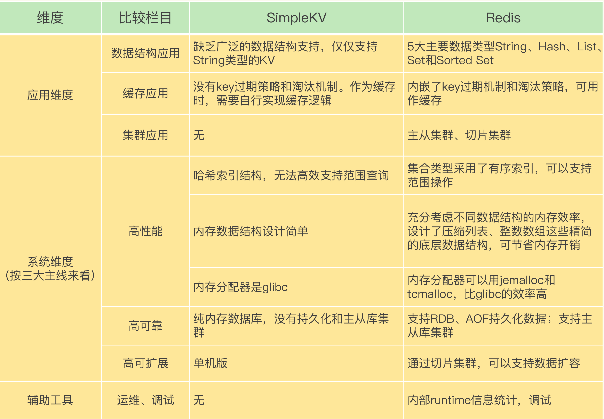
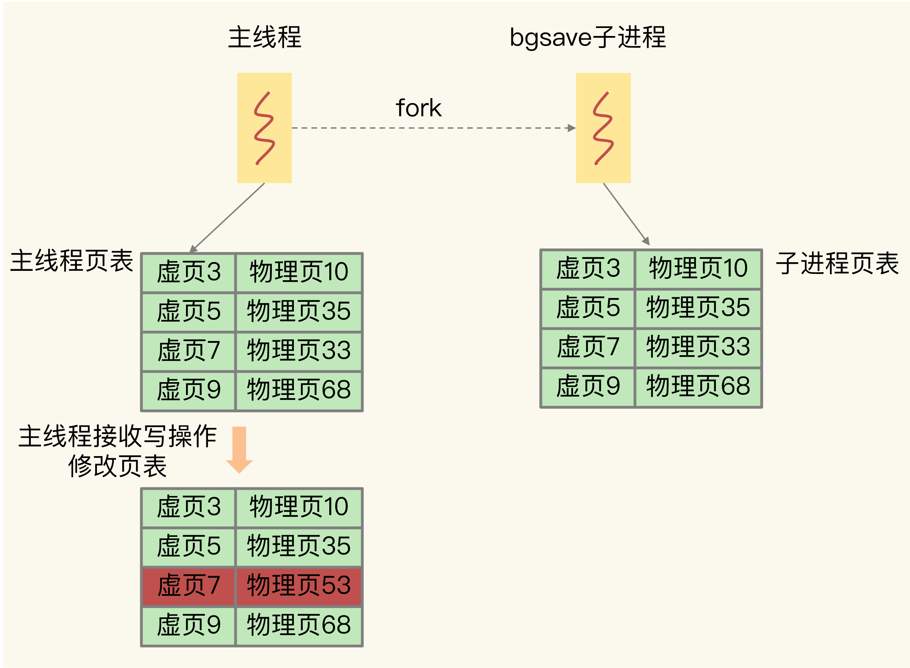
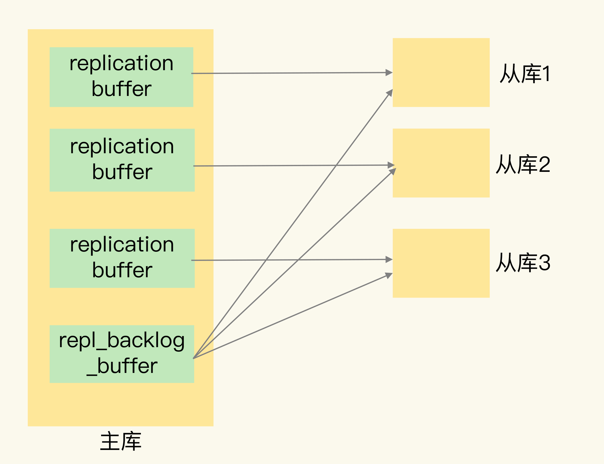

# 总结

## Redis 与普通 KV 数据库对比

## rehash

### rehash 条件

Redis 会使用装载因子（load factor）来判断是否需要做 rehash

在进行 RDB 生成和 AOF 重写时，哈希表的 rehash 是被禁止的，这是为了避免对 RDB 和 AOF 重写造成影响

- 装载因子 ≥1，同时哈希表没有进行 RDB 和 AOF 重写，则被允许进行 rehash

- 装载因子 ≥5，则立马开始 rehash

### 渐进式 rehash

采用渐进式 hash，如果实例暂时没有收到新请求，Redis 依然会执行 rehash

Redis 会执行定时任务，定时任务中就包含了 rehash 操作；在 rehash 被触发后，即使没有收到新请求，Redis 也会定时执行一次 rehash 操作，而且每次执行时长不会超过 1ms，以免对其他任务造成影响

## Redis 子进程和子线程

- 创建 RDB 的后台子进程，同时由它负责在主从同步时传输 RDB 给从库

- 通过无盘复制方式传输 RDB 的子进程

- bgrewriteaof 子进程

- 使用 `pthread_create` 创建后台线程，一般会自行执行一些任务，例如执行异步删除任务

## 写时复制底层实现机制

对 Redis 来说，主线程 fork 出 bgsave 子进程后，bgsave 子进程实际是复制了主线程的页表。这些页表中，就保存了在执行 bgsave 命令时，主线程的所有数据块在内存中的物理地址。这样一来，bgsave 子进程生成 RDB 时，就可以根据页表读取这些数据，再写入磁盘中。如果此时，主线程接收到了新写或修改操作，那么，主线程会使用写时复制机制。具体来说，写时复制就是指，主线程在有写操作时，才会把这个新写或修改后的数据写入到一个新的物理地址中，并修改自己的页表映射

bgsave 子进程复制主线程的页表以后，假如主线程需要修改虚页 7 里的数据，那么，主线程就需要新分配一个物理页（假设是物理页 53），然后把修改后的虚页 7 里的数据写到物理页 53 上，而虚页 7 里原来的数据仍然保存在物理页 33 上。这个时候，虚页 7 到物理页 33 的映射关系，仍然保留在 bgsave 子进程中。所以，bgsave 子进程可以无误地把虚页 7 的原始数据写入 RDB 文件

## Redis 基本 IO 模型中潜在的性能瓶颈

在 Redis 基本 IO 模型中，主要是主线程在执行操作，任何耗时的操作，例如 bigkey、全量返回等操作，都是潜在的性能瓶颈

## AOF 重写过程中的潜在阻塞风险

- Redis 主线程 fork 创建 bgrewriteaof 子进程时，内核需要创建用于管理子进程的PCB，内核要把主线程的 PCB 内容拷贝给子进程，这个创建和拷贝过程由内核执行，是会阻塞主线程的

- 在拷贝过程中，子进程要拷贝父进程的页表，这个过程的耗时和 Redis 实例的内存大小有关。如果 Redis 实例内存大，页表就会大，fork 执行时间就会长，这就会给主线程带来阻塞风险

- bgrewriteaof 子进程会和主线程共享内存，当主线程收到新写或修改的操作时，主线程会申请新的内存空间，用来保存新写或修改的数据，如果操作的是 bigkey，也就是数据量大的集合类型数据，那么，主线程会因为申请大空间而面临阻塞风险。因为操作系统在分配内存空间时，有查找和锁的开销，这就会导致阻塞

## AOF 重写不共享 AOF 日志本身

如果都用 AOF 日志的话，主线程要写，bgrewriteaof 子进程也要写，这两者会竞争文件系统的锁，这就会对 Redis 主线程的性能造成影响

## 主从复制使用 RDB 文件

- RDB 文件是二进制文件，无论是要把 RDB 写入磁盘，还是要通过网络传输 RDB，IO 效率都比记录和传输 AOF 的高

- 在从库端进行恢复时，用 RDB 的恢复效率要高于用 AOF

## 主从复制时的 replication buffer 和 repl_backlog_buffer

Redis 主从库在进行复制时，当主库要把全量复制期间的写操作命令发给从库时，主库会先创建一个客户端，用来连接从库，然后通过这个客户端，把写操作命令发给从库。在内存中，主库上的客户端就会对应一个 buffer，这个 buffer 就被称为 replication buffer。Redis 通过 client_buffer 配置项来控制这个 buffer 的大小。主库会给每个从库建立一个客户端，所以 replication buffer 不是共享的，而是每个从库都有一个对应的客户端

repl_backlog_buffer 是一块专用 buffer，在 Redis 服务器启动后，开始一直接收写操作命令，这是所有从库共享的。主库和从库会各自记录自己的复制进度，所以，不同的从库在进行恢复时，会把自己的复制进度（slave_repl_offset）发给主库，主库就可以和它独立同步

## 主从切换时的请求操作

主从集群一般是采用读写分离模式，当主库故障后，客户端仍然可以把读请求发送给从库，让从库服务。但是，对于写请求操作，客户端就无法执行了

## 主从切换如何使客户端没有感知

- 客户端缓存写请求

- 哨兵提供订阅频道，让客户端能够订阅到新主库的信息

## 哨兵数量

哨兵实例越多，误判率会越低，但是在判定主库下线和选举 Leader 时，实例需要拿到的赞成票数也越多，等待所有哨兵投完票的时间可能也会相应增加，主从库切换的时间也会变长，客户端容易堆积较多的请求操作，可能会导致客户端请求溢出，从而造成请求丢失

## 调大 down-after-milliseconds 后果

调大 down-after-milliseconds 后，可能发生主库实际已经发生故障了，但是哨兵过了很长时间才判断出来，会影响到 Redis 对业务的可用性