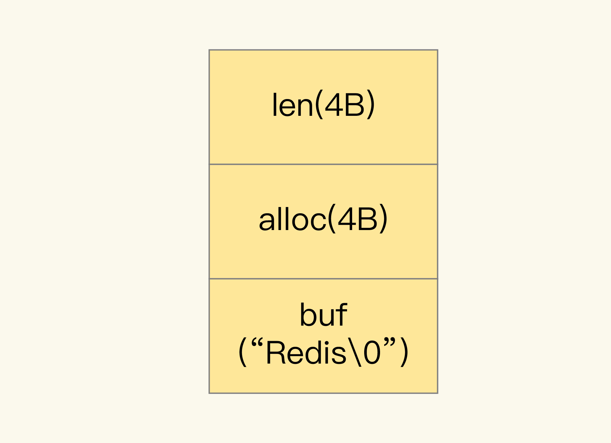
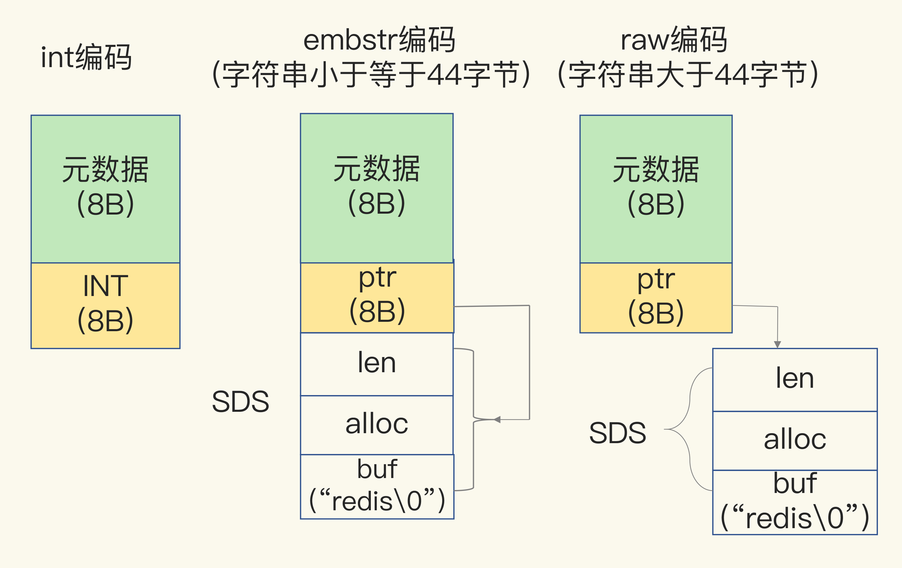

# 编码

当保存 64 位有符号整数时，String 类型会把它保存为一个 8 字节的 Long 类型整数，这种保存方式通常也叫作 int 编码方式

当你保存的数据中包含字符时，String 类型就会用简单动态字符串（Simple Dynamic String，SDS）结构体来保存

buf：字节数组，保存实际数据。为了表示字节数组的结束，Redis 会自动在数组最后加一个 `\0`，这会额外占用 1 个字节的开销

len：占 4 个字节，表示 buf 的已用长度

alloc：也占个 4 字节，表示 buf 的实际分配长度，一般大于 len

当保存的是 Long 类型整数时，RedisObject 中的指针就直接赋值为整数数据了，这样就不用额外的指针再指向整数了，节省了指针的空间开销，布局方式为 int 编码

当保存的是字符串数据，并且字符串小于等于 44 字节时，RedisObject 中的元数据、指针和 SDS 是一块连续的内存区域，这样就可以避免内存碎片，布局方式为 embstr 编码

当字符串大于 44 字节时，SDS 的数据量就开始变多了，Redis 就不再把 SDS 和 RedisObject 布局在一起了，而是会给 SDS 分配独立的空间，并用指针指向 SDS 结构，布局方式为 raw 编码

