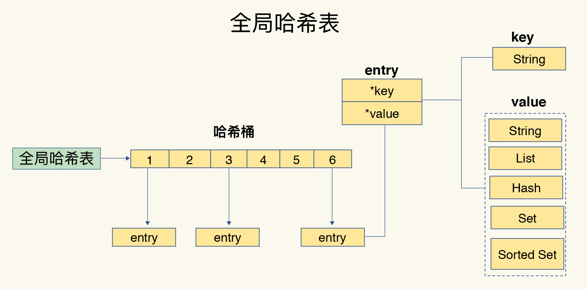
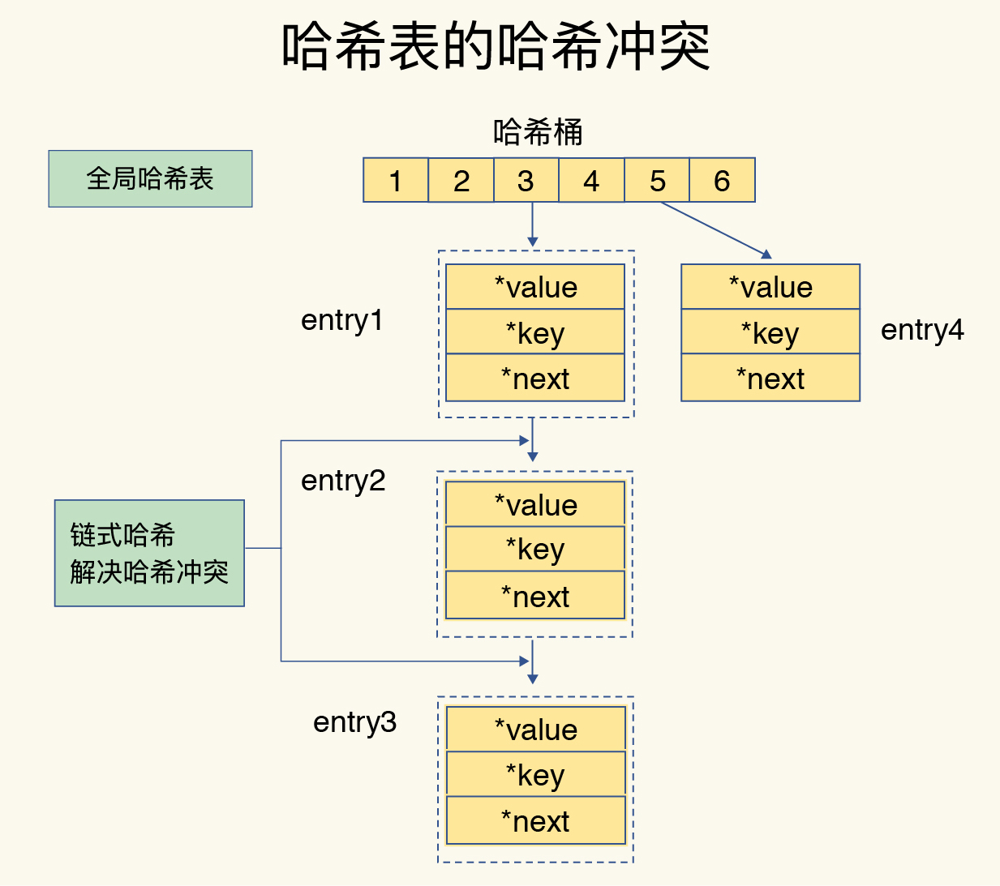
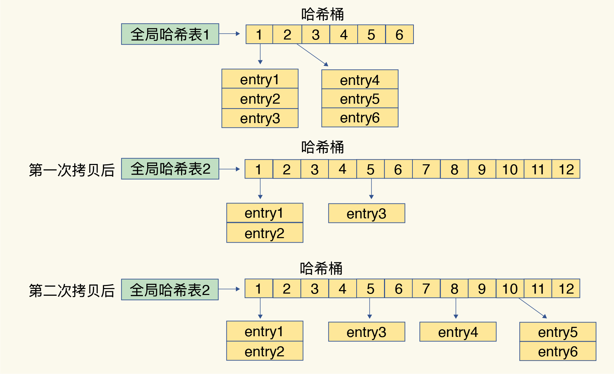
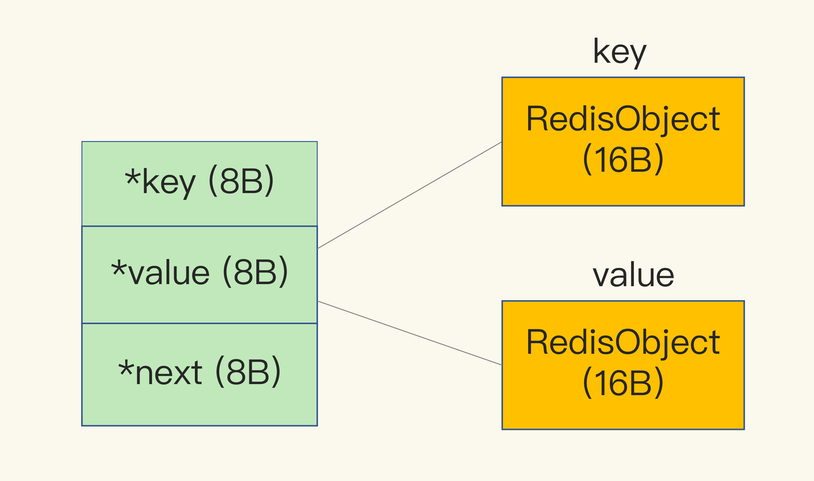

# 全局哈希表

为了实现从键到值的快速访问，Redis 使用了一个哈希表来保存所有键值对

一个哈希表，其实就是一个数组，数组的每个元素称为一个哈希桶，每个哈希桶中保存了键值对数据；哈希桶中的元素保存的并不是值本身，而是指向具体值的指针；哈希桶中的 entry 元素中保存了 *key 和 *value 指针，分别指向了实际的键和值，这样一来，即使值是一个集合，也可以通过 *value 指针被查找到

使用哈希表可以很快查找键值对，但哈希表的冲突问题和 rehash 可能带来的操作阻塞

### 哈希冲突

当往哈希表中写入更多数据时，哈希冲突是不可避免的问题，毕竟哈希桶的个数通常要少于 key 的数量，这也就是说，难免会有一些 key 的哈希值对应到了同一个哈希桶中

Redis 使用开链的方式解决哈希冲突，同一个哈希桶中的多个元素用一个链表来保存，它们之间依次用指针连接

### rehash

Redis 会对哈希表做 rehash 操作，rehash 也就是增加现有的哈希桶数量，让逐渐增多的 entry 元素能在更多的桶之间分散保存，减少单个桶中的元素数量，从而减少单个桶中的冲突

为了使 rehash 操作更高效，Redis 默认使用了两个全局哈希表：哈希表 1 和哈希表 2

一开始，当你刚插入数据时，默认使用哈希表 1，此时的哈希表 2 并没有被分配空间，随着数据逐步增多，Redis 开始执行 rehash

1. 给哈希表 2 分配更大的空间

2. 把哈希表 1 中的数据重新映射并拷贝到哈希表 2 中

3. 释放哈希表 1 的空间，留作下一次 rehash 扩容备用

第二步涉及大量的数据拷贝，如果一次性把哈希表 1 中的数据都迁移完，会造成 Redis 线程阻塞，无法服务其他请求，所以 Redis 采用了渐进式 rehash

在第二步拷贝数据时，Redis 仍然正常处理客户端请求，每处理一个请求时，从哈希表 1 中的第一个索引位置开始，顺带着将这个索引位置上的所有 entries 拷贝到哈希表 2 中；等处理下一个请求时，再顺带拷贝哈希表 1 中的下一个索引位置的 entries；把一次性大量拷贝的开销，分摊到了多次处理请求的过程中，避免了耗时操作，保证了数据的快速访问

## 内存分配

Redis 使用内存分配库 jemalloc

jemalloc 在分配内存时，会根据我们申请的字节数 N，找一个比 N 大，但是最接近 N 的 2 的幂次数作为分配的空间，这样可以减少频繁分配的次数

dictEntry 结构就占用了 32 字节