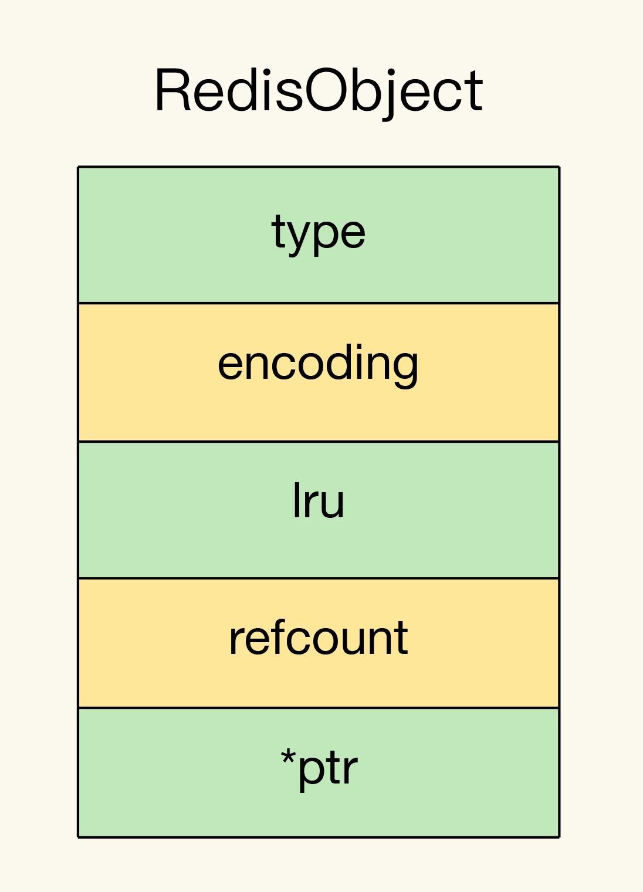
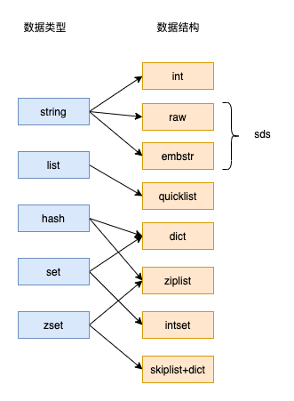
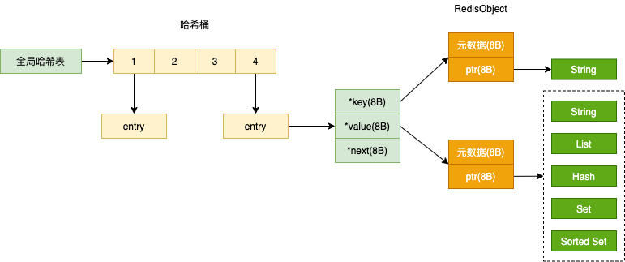

# RedisObject

Redis 键值对中的每一个值都是用 RedisObject 保存的

## 基本对象结构

因为 Redis 的数据类型有很多，而且不同数据类型都有些相同的元数据要记录（比如最后一次访问的时间、被引用的次数等），所以，Redis 会用一个 RedisObject 结构体来统一记录这些元数据，同时指向实际数据

```c
typedef struct redisObject {
    unsigned type:4;
    unsigned encoding:4;
    /* LRU time (relative to global lru_clock) or
     * LFU data (least significant 8 bits frequency
     * and most significant 16 bits access time). 
     * #define LRU_BITS 24
     */
    unsigned lru:LRU_BITS;
    int refcount;
    void *ptr;
} robj;
```

一个 `redisObject` 占 16 个字节，元数据占 8 个字节，实际数据指针占 8 个字节

- type：表示值的类型，涵盖了五大基本类型

- encoding：值的编码方式，用来表示 Redis 中实现各个基本类型的底层数据结构，如 SDS、压缩列表、哈希表、跳表等

- lru：记录了这个对象最后一次被访问的时间，用于淘汰过期的键值对

- refcount：记录了对象的引用计数

- *ptr：是指向数据的指针



## 基本数据结构

Redis 的 value 支持的数据结构为：String、List、Hash、Set、Sorted Set

底层数据结构一共有 6 种，分别是简单动态字符串、双向链表、压缩列表、哈希表、跳表和整数数组



String 类型的底层实现只有一种数据结构，也就是简单动态字符串

List、Hash、Set 和 Sorted Set 这四种数据类型，都有两种底层实现结构，这四种类型为集合类型，特点是一个键对应一个集合的数据



## 定义新数据

定义了新的数据类型，只要在 RedisObject 中设置好新类型的 type 和 encoding，再用 *ptr 指向新类型的实现

1. newtype.h 文件中定义好新类型

2. server.h 文件中增加一个宏定义，用来在代码中指代新类型

3. object.c 文件中增加创建函数和释放函数

4. 开发新类型的命令操作