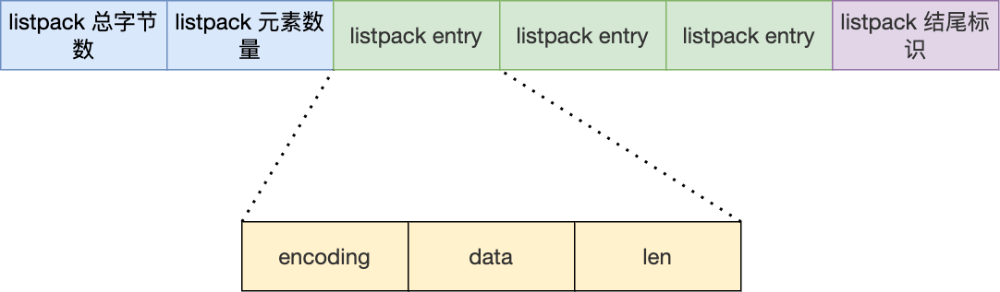

# listpack

quicklist 虽然通过控制 quicklistNode 结构里的压缩列表的大小或者元素个数，来减少连锁更新带来的性能影响，但是并没有完全解决连锁更新的问题

listpack 用来替代压缩列表，它最大特点是 listpack 中每个节点不再包含前一个节点的长度

listpack 用一块连续的内存空间来紧凑地保存数据，并且为了节省内存的开销，listpack 节点会采用不同的编码方式保存不同大小的数据



- encoding：定义该元素的编码类型，会对不同长度的整数和字符串进行编码

- data：实际存放的数据

- len：encoding+data的总长度

listpack 没有压缩列表中记录前一个节点长度的字段了，listpack 只记录当前节点的长度，当向 listpack 加入一个新元素的时候，不会影响其他节点的长度字段的变化，从而避免了压缩列表的连锁更新问题

## 一般结构

listpack 拥有一个固定的 6 字节头部信息，相比 ziplist 的 10 字节的头部信息，listpack 少了指向最后一个 element 的指针

在 listpack 尾部有一个 255 的终止符

```
<tot-bytes> <num-elements> <element-1> ... <element-N> <listpack-end-byte>
```

- tot-bytes：类型 `uint32_t`，采用小端存储，表示 listpack 全部字节

- num-elements：类型 `uint16_t`，采用小端存储，表示 listpack 包含 element 数量，当 num-elements 被设置为 65535 时表示 element 数量不可知，此时获取 element 数量需要通过扫描整个 listpack

## element 结构

```
<encoding-type><element-data><element-tot-len>
|                                            |
+--------------------------------------------+
            (This is an element)
```

encoding-type 和 element-tot-len 总是存在的，但 data 部分可能会放在 encoding-type 里

element-tot-len 只能在反向遍历时使用，因为在正向遍历时不需要该字段就能知道数据大小

encoding-type 第一个字节的前两位表示编码方式，这里有三种编码方式

1. 当数据是字符串，且可以被表示小数字（0-127）时，encoding 第一位为 0，后七位表示数据

```
0|xxxxxxx

"\x03" -- 0000 0011 --The string "3"
"\x12" -- 0001 0010 --The string "18"
```

2. 当数据是小字符串，字符串长度可以用后六位表示（0-63）

```
10|xxxxxx <string-data>

"\x80" -- 1000 0000 --The empty string
"\x85hello" -- 1000 0101 -- The string "hello"
```

3. 高两位都被设置为 1，且紧随的后两位不是 11

```
110|xxxxx yyyyyyyy -- 后面 13 位直接编码有符号整数
1110|xxxx yyyyyyyy -- 编码长度不大于 4095 的字符串
```

4. 高四位都被设置为 1

```
1111|0000 <4 字节字符串长度> <大字符串>
1111|0001 -- 编码 int16_t
1111|0010 -- 编码 int24_t
1111|0011 -- 编码 int32_t
1111|0100 -- 编码 int64_t
1111|0101 ~ 1111|1110 未使用
1111|1111 -- 终止符
```

element-tot-len 使用变长字段存储，并且从右往左存储，每个字节的最高有效位用于指示是否有更多字节，这意味着在每个字节中只使用 7 位

```
"\x20" -- 0010 0000 --32 bytes entry length

500 二进制 1111 0100
"\xf4\x03" -- 0000 0011 1111 0100 -- 500 bytes entry length
[0]000 0011          [1]111 0100
 |                   |
 `- no more bytes    `- more bytes to the left!
```