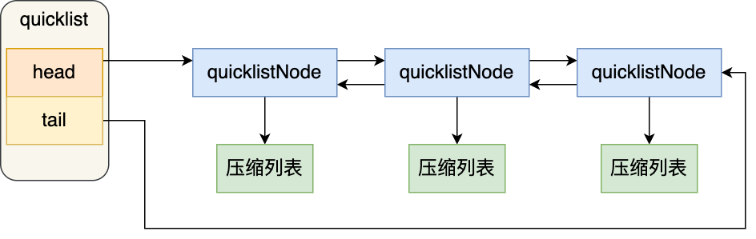

# quicklist

1. 双向链表的问题：内存碎片、保存前后节点指针导致内存开销大

2. ziplist 有连锁更新隐患

quicklist 是一个双向链表，链表中的每个元素是一个压缩列表

quicklist 通过控制每个链表节点中的压缩列表的大小或者元素个数，来规避连锁更新的问题，从而提供了更好的访问性能



在向 quicklist 添加一个元素的时候，不会像普通的链表那样，直接新建一个链表节点，而是会检查插入位置的压缩列表是否能容纳该元素，如果能容纳就直接保存到 quicklistNode 结构里的压缩列表，如果不能容纳，才会新建一个新的 quicklistNode 结构

quicklistNode 中的 ziplist 越短，内存碎片增多，影响存储效率。当一个 ziplist 只存一个元素时，quicklist 又退化成双向链表

quicklistNode 中的 ziplist 越长，为 ziplist 分配大的连续的内存空间难度也就越大，会造成很多小块的内存空间被浪费，当 quicklist 只有一个节点，元素都存在一个 ziplist 上时，quicklist 又退化成 ziplist 了

可以在 redis.conf 中通过如下参数 list-max-ziplist-size 来决定 ziplist 能存的节点元素

## quicklistNode

```cpp
// 一个 node 占 32 个字节，位域类型对于规则
typedef struct quicklistNode {
    struct quicklistNode *prev;
    struct quicklistNode *next;
    unsigned char *zl;  // 数据指针，数据没有压缩时指向 ziplist，否则指向 quicklisLZF
    unsigned int sz;  // ziplist 占内存大小，被压缩后仍是未压缩的大小
    unsigned int count : 16;     // ziplist entry 数量
    unsigned int encoding : 2;   // RAW==1 没有压缩 LZF==2 使用 LZF 算法压缩
    unsigned int container : 2;  // 固定为 ZIPLIST==2，表示使用 ziplist 作为数据容器
    unsigned int recompress : 1; // 数据压缩后被临时解压，将这个字段置为 1，后面有机会再将数据压缩
    unsigned int attempted_compress : 1; // node can't compress; too small
    unsigned int extra : 10; // 扩展字段
} quicklistNode;

typedef struct quicklistLZF {
    unsigned int sz; // compressed 长度
    char compressed[];
} quicklistLZF;
```

## quicklist

```cpp
typedef struct quicklistBookmark {
    quicklistNode *node;
    char *name;
} quicklistBookmark;

// 在 64 为系统下占 40 个字节
typedef struct quicklist {
    quicklistNode *head;  // 指向头节点
    quicklistNode *tail;  // 指向尾节点
    unsigned long count;  // 所有 ziplist 中 entry 的数量
    unsigned long len;    // quicklistNodes 数量
    int fill : 16;  // 单个 ziplist 大小阈值，存放 list-max-ziplist-size
    unsigned int compress : 16; // 压缩深度，默认 0 表示不压缩，否则表示从两端开始有多少个节点不压缩，实际深度由 ist-compress-depth 决定
    unsigned int bookmark_count: 4;
    quicklistBookmark bookmarks[];
} quicklist;

#define FILL_MAX ((1 << (QL_FILL_BITS - 1)))
#define COMPRESS_MAX ((1 << (QL_COMP_BITS - 1)))
```

`fill` 字段大于 0 时 ziplist 中的最大 entry 数

`fill` 字段小于 0 时，-1 表示 ziplist 大小不能超过 4kb，-2 表示 ziplist 大小不能超过 8kb，-3 表示 ziplist 大小不能超过 16kb，-4 表示 ziplist 大小不能超过 32kb，-5 表示 ziplist 大小不能超过 64kb