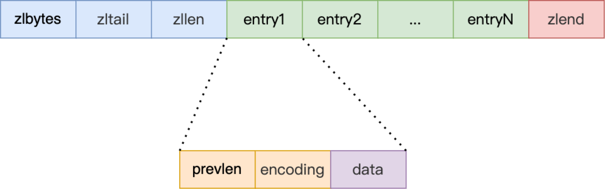

# ziplist

## 内存布局

ziplist 不是一个用结构体定义的数据结构，而是一块连续的内存，这样不仅可以利用 CPU 缓存，而且会针对不同长度的数据，进行相应编码，这种方法可以有效地节省内存开销

数组中的每一个元素都对应保存一个数据

entry 会挨个放置在内存中，不需要再用额外的指针进行连接，这样就可以节省指针所占用的空间

压缩列表在表头有三个字段 zlbytes、zltail 和 zllen，分别表示列表长度、列表尾的偏移量和列表中的 entry 个数

压缩列表在表尾还有一个 zlend，表示列表结束


|字段|长度|值|字节序|
|-|-|-|-|
zlbytes|uint32_t|整个 ziplist 占用的内存字节数|小端
zltail|uint32_t|起始位置与最后一个元素的偏移量|小端
zllen|uint16_t|ziplist 中节点的数量，当这个值小于 UINT16_MAX （65535）时，这个值就是 ziplist 中节点的数量； 当这个值等于 UINT16_MAX 时，节点的数量需要遍历整个 ziplist 才能计算得出|小端
zlend|uint8_t|255 的二进制值 1111 1111 （UINT8_MAX） ，用于标记 ziplist 的末端|小端

```cpp
// ziplist 结束标志位
#define ZIP_END 255
// zlbytes(32) + zltail(32) + zllen(16)
#define ZIPLIST_HEADER_SIZE     (sizeof(uint32_t)*2+sizeof(uint16_t))
// zlend(8)
#define ZIPLIST_END_SIZE        (sizeof(uint8_t))

// 获取 zlbytes 值
#define ZIPLIST_BYTES(zl)       (*((uint32_t*)(zl)))
// 获取 zltail 值
#define ZIPLIST_TAIL_OFFSET(zl) (*((uint32_t*)((zl)+sizeof(uint32_t))))
// 获取 zllen 值
#define ZIPLIST_LENGTH(zl)      (*((uint16_t*)((zl)+sizeof(uint32_t)*2)))
// 获取 ziplist 最后一个字节的指针
// 由于需要从 zlbytes 取值所以需要大小端转换
#define ZIPLIST_ENTRY_END(zl)   ((zl)+intrev32ifbe(ZIPLIST_BYTES(zl))-1)
```

在压缩列表中，如果要查找定位第一个元素和最后一个元素，可以通过表头三个字段的长度直接定位，复杂度是 O(1)

查找其他元素则只能逐个查找，此时的复杂度就是 O(N)

## entry

压缩列表之所以能节省内存，就在于它是用一系列连续的 entry 保存数据



- prev_len：表示前一个 entry 的长度，可能会占用 1 字节或 5 字节。占用 1 字节时，表示上一个 entry 的长度小于 254 字节。虽然 1 字节的值能表示的数值范围是 0 到 255，但是压缩列表中 zlend 的取值默认是 255，因此，就默认用 255 表示整个压缩列表的结束，其他表示长度的地方就不能再用 255 这个值了。所以，当上一个 entry 长度小于 254 字节时，prev_len 占用 1 字节，否则，就占用 5 字节，并通过最低字节 254 做标记

- encoding：可以表示整型和字符串；当高两位是 11 时表示编码方式是整型，高两位其他情况时表示编码方式是字符串，并且还表示字符串长度

- data：保存实际数据，当 data 存储整型时，都会使用小端表示，即便运行的机器是大端序

```cpp
#define ZIP_BIG_PREVLEN 254
// 获取第一个 entry 地址
// 这里不需要打小端转换是因为 ZIPLIST_HEADER_SIZE 不从 ziplist 中取值
#define ZIPLIST_ENTRY_HEAD(zl)  ((zl)+ZIPLIST_HEADER_SIZE)
// 获取最后一个 entry 地址
// 由于需要从 zltail 取值所以需要大小端转换
#define ZIPLIST_ENTRY_TAIL(zl)  ((zl)+intrev32ifbe(ZIPLIST_TAIL_OFFSET(zl)))

// ptr 指向 entry
// 因为数据都是小端存储，所以可以直接通过 ptr[0] 取到低位的数据，从而判断与 254 的关系
// 返回本 entry 的 prevlen 字段所占内存大小
#define ZIP_DECODE_PREVLENSIZE(ptr, prevlensize) do {                          \
    if ((ptr)[0] < ZIP_BIG_PREVLEN) {                                          \
        (prevlensize) = 1;                                                     \
    } else {                                                                   \
        (prevlensize) = 5;                                                     \
    }                                                                          \
} while(0)

// 返回 entry prevlen 字段和 prevlen 字段所占内存
// 当 prevlen 占 5 个字节时，不会占用最低位的一个字节
// 
#define ZIP_DECODE_PREVLEN(ptr, prevlensize, prevlen) do {                     \
    ZIP_DECODE_PREVLENSIZE(ptr, prevlensize);                                  \
    if ((prevlensize) == 1) {                                                  \
        (prevlen) = (ptr)[0];                                                  \
    } else { /* prevlensize == 5 */                                            \
        (prevlen) = ((ptr)[4] << 24) |                                         \
                    ((ptr)[3] << 16) |                                         \
                    ((ptr)[2] <<  8) |                                         \
                    ((ptr)[1]);                                                \
    }                                                                          \
} while(0)
```

|编码|encoding 长度|data|
|-|-|-|
|00pppppp|1 字节|字符串长度小于等于 63（2^6 -1），后 6 位表示长度|
|01pppppp,qqqqqqqq|2 字节，后 14 位使用大端存储|字符串长度小于等于 16383（2^14 -1），后 14 位表示长度，大端序|
|10000000,qqqqqqqq,rrrrrrrr,ssssssss,tttttttt|5 字节，后 32 位使用大端存储|字符串长度小于等于 2^32 -1，第一个字节的后六位未使用，大端序|
|11000000|1 字节|int16_t|
|11010000|1 字节|int32_t|
|11100000|1 字节|int64_t|
|11110000|1 字节|int24 类型|
|11111110|1 字节|int8_t|
|1111xxxx|1 字节|xxxx 是 0001(1) 到 1101(13)，分别用来表示 0～12，此时没有 data 数据|

## 例子

```cpp
 /*
 *
 *  [0f 00 00 00] [0c 00 00 00] [02 00] [00 f3] [02 f6] [ff]
 *        |             |          |       |       |     |
 *     zlbytes        zltail    entries   "2"     "5"   end
 */

// zlbytes 表示整个 ziplist 占 15 个字节
// zltail 最后一个元素离 ziplist 开始处 12 个字节
// entries 表示整个 ziplist 有两个元素
// 第一个 entry 的 prev_len 是 0，占一个字节
// 第一个 entry 的 f3 表示 encoding 是 1111xxxx，所以这个 entry 存储的值是 3 - 1 = 2
// 第二个 entry 的 prev_len 是 2
// 第二个 entry 的 f6 表示 encoding 是 1111xxxx，所以这个 entry 存储的值是 6 - 1 = 5
```

## zlentry

插入一个 entry 的全部信息，但并不是 entry 的实际信息

```cpp
typedef struct zlentry {
    unsigned int prevrawlensize;  // 前一个 entry 的 prevlen 占内存大小
    unsigned int prevrawlen;      // 
    unsigned int lensize;         // 本 entry encoding 的内存大小
                                  // 字符串对应 1、2、5 字节，整形 1 字节
    unsigned int len;             // data 所占大小
    unsigned int headersize;      // prevrawlensize + lensize
    unsigned char encoding;       // entry 的 encoding
    unsigned char *p;             // entry 的插入位置
} zlentry;
```

## 插入过程

1. 计算插入位置

2. 重新分配空间，将后面元素后移

3. 插入元素

4. 调整 ziplist 大小

## 删除过程

1. 将后面的元素向前覆盖

2. 调整 ziplist 大小

## 缺陷

- 查找复杂度高

- 压缩列表新增某个元素或修改某个元素时，如果空间不够，压缩列表占用的内存空间就需要重新分配

- 当新插入的元素较大时，因为压缩列表节点的 prevlen 属性会根据前一个节点的长度进行不同的空间大小分配，所以可能会导致后续元素的 prevlen 占用空间都发生变化，从而引起连锁更新问题，导致每个元素的空间都要重新分配，造成访问压缩列表性能的下降

压缩列表只会用于保存的节点数量不多的场景，只要节点数量足够小，即使发生连锁更新，也是能接受的

## 主要函数

### ziplistNew

```cpp
// intrev32ifbe 本机序转换成小端
unsigned char *ziplistNew(void) {
    unsigned int bytes = ZIPLIST_HEADER_SIZE+ZIPLIST_END_SIZE;
    unsigned char *zl = zmalloc(bytes);
    // 设置 zlbytes
    ZIPLIST_BYTES(zl) = intrev32ifbe(bytes);
    // 设置 zltail，直接指向 zlend
    ZIPLIST_TAIL_OFFSET(zl) = intrev32ifbe(ZIPLIST_HEADER_SIZE);
    // 设置 zllen
    ZIPLIST_LENGTH(zl) = 0;
    zl[bytes-1] = ZIP_END;
    return zl;
}
```

### ziplistPush

```cpp
#define ZIPLIST_HEAD 0
#define ZIPLIST_TAIL 1

unsigned char *ziplistPush(unsigned char *zl, unsigned char *s, unsigned int slen, int where) {
    unsigned char *p;
    p = (where == ZIPLIST_HEAD) ? ZIPLIST_ENTRY_HEAD(zl) : ZIPLIST_ENTRY_END(zl);
    return __ziplistInsert(zl,p,s,slen);
}

unsigned char *__ziplistInsert(unsigned char *zl, unsigned char *p, unsigned char *s, unsigned int slen) {
    size_t curlen = intrev32ifbe(ZIPLIST_BYTES(zl)), reqlen, newlen;
    // prevlensize 表示 entry 的 encoding 长度
    // prevlen 表示 entry 的 encoding 长度
    unsigned int prevlensize, prevlen = 0;
    size_t offset;
    int nextdiff = 0;
    unsigned char encoding = 0;
    long long value = 123456789; 
    zlentry tail;

    if (p[0] != ZIP_END) {
        // 头部插入
        // 利用 p 指向的 entry 解析 prevlensize 和 prevlen
        ZIP_DECODE_PREVLEN(p, prevlensize, prevlen);
    } else {
        // 尾部插入，插入处是 zlend
        unsigned char *ptail = ZIPLIST_ENTRY_TAIL(zl);  // 指向最后一个 entry
        if (ptail[0] != ZIP_END) {
            // ziplist 尾部插入，ziplist 中有元素
            prevlen = zipRawEntryLengthSafe(zl, curlen, ptail);
        }
    }

    /* See if the entry can be encoded */
    if (zipTryEncoding(s,slen,&value,&encoding)) {
        /* 'encoding' is set to the appropriate integer encoding */
        reqlen = zipIntSize(encoding);
    } else {
        /* 'encoding' is untouched, however zipStoreEntryEncoding will use the
         * string length to figure out how to encode it. */
        reqlen = slen;
    }
    /* We need space for both the length of the previous entry and
     * the length of the payload. */
    reqlen += zipStorePrevEntryLength(NULL,prevlen);
    reqlen += zipStoreEntryEncoding(NULL,encoding,slen);

    /* When the insert position is not equal to the tail, we need to
     * make sure that the next entry can hold this entry's length in
     * its prevlen field. */
    int forcelarge = 0;
    nextdiff = (p[0] != ZIP_END) ? zipPrevLenByteDiff(p,reqlen) : 0;
    if (nextdiff == -4 && reqlen < 4) {
        nextdiff = 0;
        forcelarge = 1;
    }

    /* Store offset because a realloc may change the address of zl. */
    offset = p-zl;
    newlen = curlen+reqlen+nextdiff;
    zl = ziplistResize(zl,newlen);
    p = zl+offset;

    /* Apply memory move when necessary and update tail offset. */
    if (p[0] != ZIP_END) {
        /* Subtract one because of the ZIP_END bytes */
        memmove(p+reqlen,p-nextdiff,curlen-offset-1+nextdiff);

        /* Encode this entry's raw length in the next entry. */
        if (forcelarge)
            zipStorePrevEntryLengthLarge(p+reqlen,reqlen);
        else
            zipStorePrevEntryLength(p+reqlen,reqlen);

        /* Update offset for tail */
        ZIPLIST_TAIL_OFFSET(zl) =
            intrev32ifbe(intrev32ifbe(ZIPLIST_TAIL_OFFSET(zl))+reqlen);

        /* When the tail contains more than one entry, we need to take
         * "nextdiff" in account as well. Otherwise, a change in the
         * size of prevlen doesn't have an effect on the *tail* offset. */
        assert(zipEntrySafe(zl, newlen, p+reqlen, &tail, 1));
        if (p[reqlen+tail.headersize+tail.len] != ZIP_END) {
            ZIPLIST_TAIL_OFFSET(zl) =
                intrev32ifbe(intrev32ifbe(ZIPLIST_TAIL_OFFSET(zl))+nextdiff);
        }
    } else {
        /* This element will be the new tail. */
        ZIPLIST_TAIL_OFFSET(zl) = intrev32ifbe(p-zl);
    }

    /* When nextdiff != 0, the raw length of the next entry has changed, so
     * we need to cascade the update throughout the ziplist */
    if (nextdiff != 0) {
        offset = p-zl;
        zl = __ziplistCascadeUpdate(zl,p+reqlen);
        p = zl+offset;
    }

    /* Write the entry */
    p += zipStorePrevEntryLength(p,prevlen);
    p += zipStoreEntryEncoding(p,encoding,slen);
    if (ZIP_IS_STR(encoding)) {
        memcpy(p,s,slen);
    } else {
        zipSaveInteger(p,value,encoding);
    }
    ZIPLIST_INCR_LENGTH(zl,1);
    return zl;
}
```
