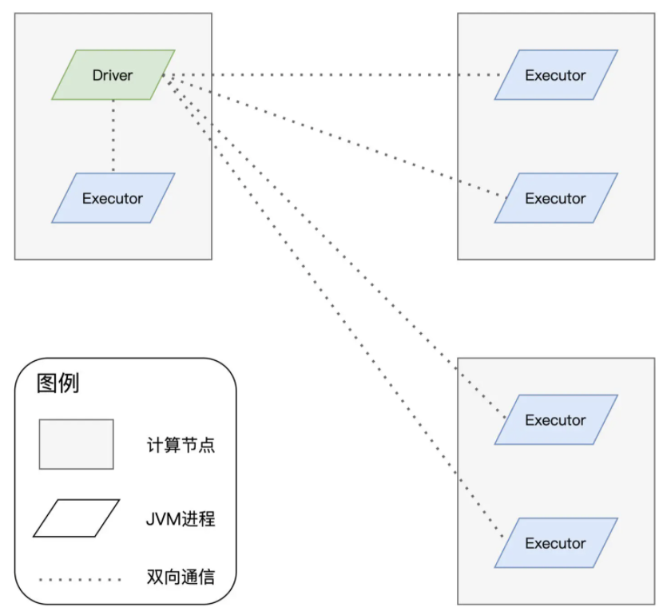

# 分布式

## 进程模型

在 Spark 的应用开发中，任何一个应用程序的入口，都是带有 SparkSession 的 main 函数

SparkSession 提供 Spark 运行时上下文的同时（如调度系统、存储系统、内存管理、RPC 通信），也可以为开发者提供创建、转换、计算分布式数据集（如 RDD）的开发 API

在 Spark 分布式计算环境中，有且仅有一个 JVM 进程运行这样的 main 函数，这个特殊的 JVM 进程，在 Spark 中有个专门的术语，叫作 Driver

Driver 最核心的作用在于，解析用户代码、构建计算流图，然后将计算流图转化为分布式任务，并把任务分发给集群中的执行进程交付运行

Driver 的角色是拆解任务、派活儿，而真正干活儿是执行进程

在 Spark 的分布式环境中，执行进程可以有一个或是多个，它们也有专门的术语，叫作 Executor

分布式计算的核心是任务调度，而分布式任务的调度与执行，仰仗的是 Driver 与 Executors 之间的通力合作

## Driver

在 Spark 的 Driver 进程中，DAGScheduler、TaskScheduler 和 SchedulerBackend 这三个对象通力合作，依次完成分布式任务调度的 3 个核心步骤：

1. 根据用户代码构建计算流图

2. 根据计算流图拆解出分布式任务

3. 将分布式任务分发到 Executors 中去

Driver 以 Shuffle 为边界创建、分发分布式任务

## Executor

接收到任务之后，Executors 调用内部线程池，结合事先分配好的数据分片，并发地执行任务代码

对于一个完整的 RDD，每个 Executors 负责处理这个 RDD 的一个数据分片子集