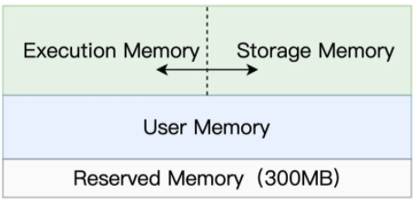
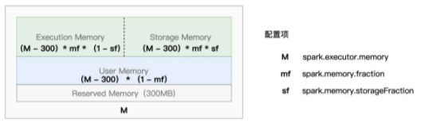
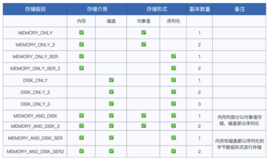

# 内存管理

相比其他大数据计算引擎，Spark 的优势和特点就是合理而充分地使用内存

## 内存区域划分

对于任意一个 Executor 来说，Spark 会把内存分为 4 个区域，分别是 Reserved Memory、User Memory、Execution Memory 和 Storage Memory

Reserved Memory 固定为 300MB，不受开发者控制，它是 Spark 预留的、用来存储各种 Spark 内部对象的内存区域

User Memory 用于存储开发者自定义的数据结构，例如 RDD 算子中引用的数组、列表、映射等等

Execution Memory 用来执行分布式任务，主要包括数据的转换、过滤、映射、排序、聚合、归并等环节的内存消耗

Storage Memory 用于缓存分布式数据集，比如 RDD Cache、广播变量等等

Spark 推出了统一内存管理模式，在这种模式下，Execution Memory 和 Storage Memory 之间可以相互转化

## 内存转换

Execution Memory 和 Storage Memory 之间的转换规则，一共可以总结为 3 条：

- 如果对方的内存空间有空闲，双方可以互相转换

- 对于 Storage Memory 转换的 Execution Memory 部分，当分布式任务有计算需要时，Storage Memory 必须立即归还内存，涉及的缓存数据要么落盘、要么清除

- 对于 Execution Memory 转换的 Storage Memory 部分，即便 Storage Memory 有收回内存的需要，也必须要等到分布式任务执行完毕才能释放

## 内存配置项

Executor JVM Heap 的划分，由 3 个配置项来决定

spark.executor.memory 是绝对值，它指定了 Executor 进程的 JVM Heap 总大小

spark.memory.fraction 和 spark.memory.storageFraction 都是比例值，它们指定了划定不同区域的空间占比

spark.memory.fraction 用于标记 Spark 处理分布式数据集的内存总大小，这部分内存包括 Execution Memory 和 Storage Memory 两部分

spark.memory.storageFraction 则用来进一步区分 Execution Memory 和 Storage Memory 的初始大小

## RDD Cache

在 RDD 完成定义之后，在这个 RDD 之上依次调用 `cache` 和 `count` 即可，`cache` 算子告知 Spark 对 RDD 加缓存，`count` 算子将 RDD 缓存到内存

`cache` 函数实际上会进一步调用 `persist(MEMORY_ONLY)` 来完成计算

`persist` 算子具有更多的存储级别，允许开发者灵活地选择 Cache 的存储介质、存储形式以及副本数量

