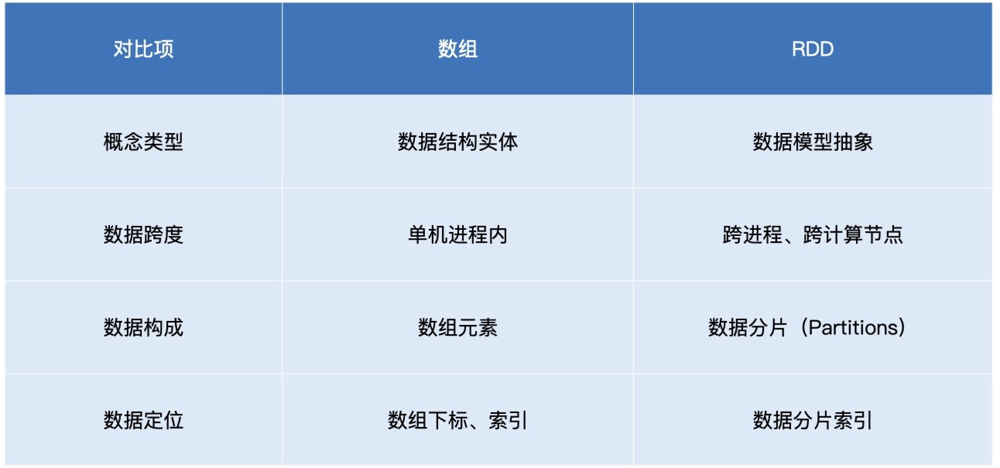
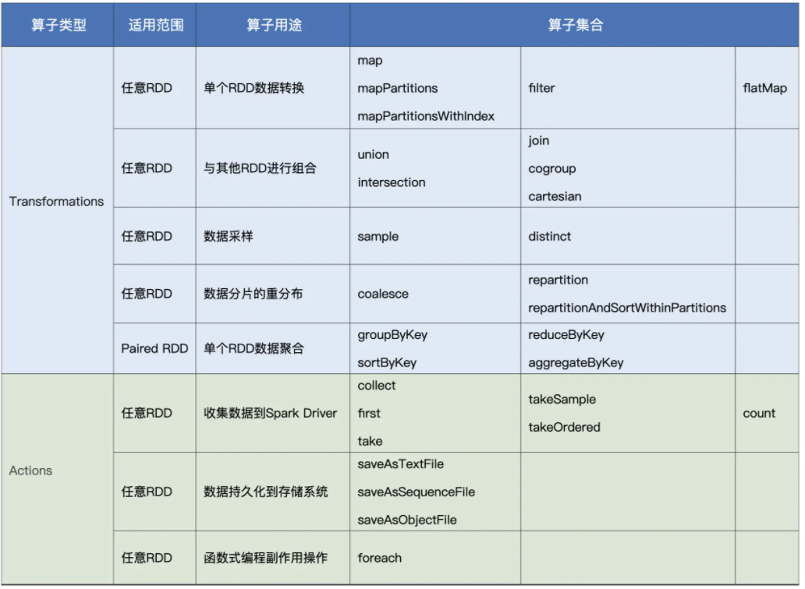
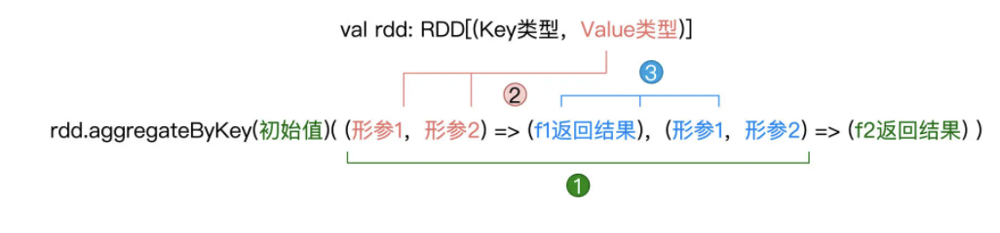

# RDD

RDD 是构建 Spark 分布式内存计算引擎的基石，很多 Spark 核心概念与核心组件，如 DAG 和调度系统都衍生自 RDD



RDD 是一种抽象，它所囊括的是分布式计算环境中的分布式数据集

RDD 代表的数据集是跨进程、跨节点的，它的活动范围是整个集群

RDD 中承载数据的基本单元是数据分片

在分布式计算环境中，一份完整的数据集，会按照某种规则切割成多份数据分片。这些数据分片被均匀地分发给集群内不同的计算节点和执行进程，从而实现分布式并行计算

RDD 的四个重要属性：

- partitions：数据分片

- partitioner：分片切割规则

- dependencies：RDD 依赖

- compute：转换函数

数据分片的分布，是由 RDD 的 partitioner 决定的，两者是强相关的

在数据形态的转换过程中，每个 RDD 都会通过 dependencies 属性来记录它所依赖的前一个、或是多个 RDD

RDD 使用 compute 属性，来记录从父 RDD 到当前 RDD 的转换操作

## 创建 RDD

### 内部数据创建

在 Spark 应用中自定义的各类数据结构，如数组、列表、映射等，都属于内部数据

```scala
import org.apache.spark.rdd.RDD
val words: Array[String] = Array("Spark", "is", "cool")
```

用 `parallelize` 函数来封装内部数据即可 RDD

在 Spark 应用内定义体量超大的数据集，其实都是不太合适的，因为数据集完全由 Driver 端创建，且创建完成后，还要在全网范围内跨节点、跨进程地分发到其他 Executors，所以往往会带来性能问题

### 外部数据创建

Spark 系统之外的所有数据形式，如本地文件系统或是分布式文件系统中的数据，再比如来自其他大数据组件（Hive、Hbase、RDBMS 等）的数据，都是外部数据

```scala
val lineRDD: RDD[String] = spark.sparkContext.textFile(file)
```

## RDD 算子

RDD 代表的是分布式数据形态，RDD 到 RDD 之间的转换，本质上是数据形态上的转换；在 RDD 的编程模型中，一共有两种算子，Transformations 类算子和 Actions 类算子；使用 Transformations 类算子，定义并描述数据形态的转换过程，然后调用 Actions 类算子，将计算结果收集起来、或是物化到磁盘

调用的各类 Transformations 算子，并不立即执行计算，当且仅当开发者调用 Actions 算子时，之前调用的转换算子才会付诸执行



## 内部数据转换

- `map` 算子：给定映射函数 `f`，`map(f)` 以元素为粒度对 RDD 做数据转换；由于以元素为粒度，在某些计算场景下，这个特点会严重影响执行效率

- `mapPartitions` 算子：以数据分区为粒度的数据转换，使用映射函数 `f` 对 RDD 进行数据转换；凡是可以共享的操作，都可以用 `mapPartitions` 算子进行优化，如创建用于连接远端数据库的 Connections 对象等

- `mapPartitionsWithIndex` 算子：相比 `mapPartitions`，`mapPartitionsWithIndex` 仅仅多出了一个数据分区索引，这个数据分区索引可以为获取分区编号

- `flatMap`：以元素为粒度，对 RDD 进行数据转换，但接受的 `f` 是元素到集合（如数组、列表等）；在逻辑上分为以元素为单位创建集合和提取集合元素

- `filter` 算子：对 RDD 进行过滤

## Shuffle 计算

- `groupByKey`：按照 Key 做分组，包含分组和收集两步；对于元素类型为（Key，Value）键值对的 Paired RDD，groupByKey 的功能就是对 Key 值相同的元素做分组，然后把相应的 Value 值，以集合的形式收集到一起；Shuffle 时以全量原始数据记录的方式消耗磁盘与网络

- `reduceByKey`：根据聚合函数 f 给出的算法，把 Key 值相同的多个元素，聚合成一个元素；对于 `RDD[(Key，Value)]`，函数 f 的形参，必须是两个数值，且数值的类型必须与 Value 的类型相同，而 f 的返回值，也必须是 Value 类型的数值；Shuffle 时会在落盘与分发之前的 Map 阶段做初步的聚合计算，称之为 Map 端聚合；局限性在于其 Map 阶段与 Reduce 阶段的计算逻辑必须保持一致，这个计算逻辑统一由聚合函数 f 定义

- `aggregateByKey`：需要提供一个初始值，一个 Map 端聚合函数 f1，以及一个 Reduce 端聚合函数 f2，初始值类型必须与 f2 的结果类型保持一致，f1 的形参类型，必须与 Paired RDD 的 Value 类型保持一致，f2 的形参类型，必须与 f1 的结果类型保持一致



- `sortByKey`：以 Key 为准对 RDD 做排序，默认升序排序

### 数据准备

在数据准备阶段，`union` 与 `sample` 用于对不同来源的数据进行合并与拆分

- `union` 用于把两个类型一致、但来源不同的 RDD 进行合并，从而构成一个统一的、更大的分布式数据集；`union` 操作能够成立的前提，就是参与合并的两个 RDD 的类型必须完全一致

- `sample(withReplacement, fraction, seed)` 用于对 RDD 做随机采样，从而把一个较大的数据集变为一份小数据；`withReplacement` 的类型是 `Boolean`，表示采样是否有放回；`fraction` 类型是 `Double`，值域为 0 到 1，其含义是采样比例；`seed` 参数是可选的，它的类型是 `Long`

## 数据预处理

较为均衡的数据分布，对后面数据处理阶段提升 CPU 利用率更有帮助，可以整体提升执行效率

`coalesce` 与 `repartition` 的作用就是重新调整 RDD 数据分布

`repartition` 算子随意调整（提升或降低）RDD 的并行度，而 `coalesce` 算子则只能用于降低 RDD 并行度

每个 RDD 的数据分区，都对应着一个分布式 Task，而每个 Task 都需要一个 CPU 线程去执行

RDD 的并行度，很大程度上决定了分布式系统中 CPU 的使用效率，进而还会影响分布式系统并行计算的执行效率

使用 `repartition` 调整 RDD 并行度会引入 Shuffle，而 `coalesce` 则不会

给定 RDD，如果用 `repartition` 来调整其并行度，不论增加还是降低，对于 RDD 中的每一条数据记录，`repartition` 对它们的影响都是无差别的数据分发

`coalesce` 在降低并行度的计算中，它采取的思路是把同一个 Executor 内的不同数据分区进行合并，这样数据并不需要跨 Executors、跨节点进行分发，因而自然不会引入 Shuffle


## 数据收集

`take`、`first`、`collect` 把结果直接收集到 Driver 端

`saveAsTextFile` 将计算结果持久化到（分布式）文件系统

- `first` 用于收集 RDD 数据集中的任意一条数据记录

- `take` 用于收集多条记录

- `collect` 收集全部数据到 Driver，但有两处性能隐患，一个是拉取数据过程中引入的网络开销，另一个 Driver 的 OOM

- `saveAsTextFile` 直接通过 Executors 将 RDD 数据分区物化到文件系统，这个过程并不涉及与 Driver 端的任何交互