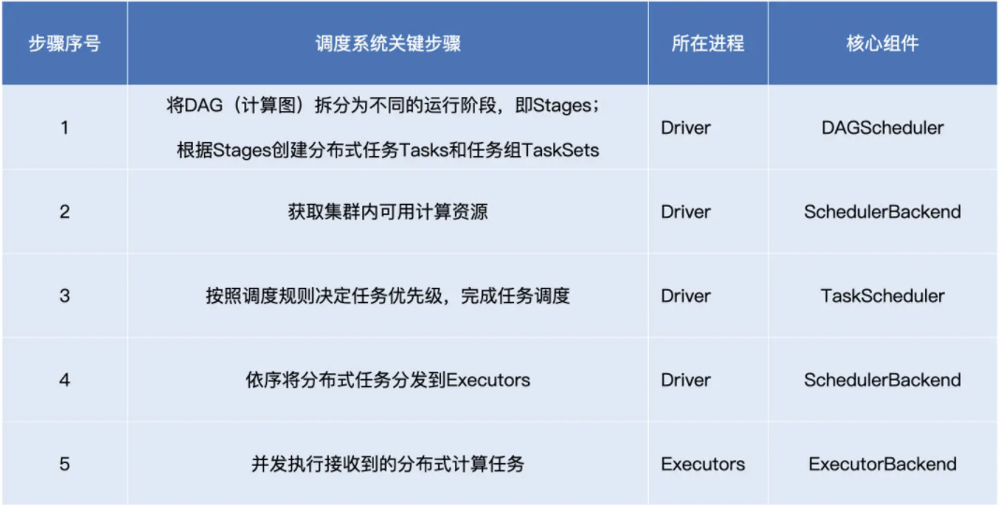
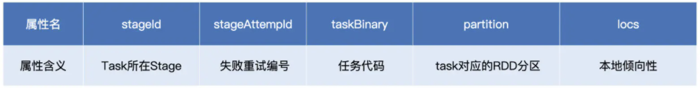
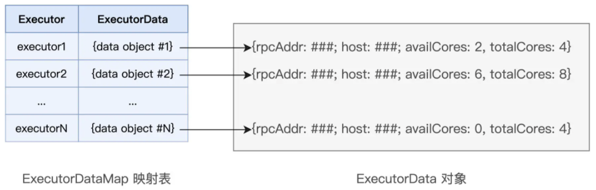
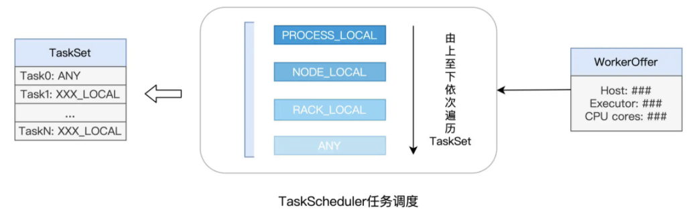

# 调度系统

分布式计算的精髓，在于如何把抽象的计算图，转化为实实在在的分布式计算任务，然后以并行计算的方式交付执行

Spark调度系统关键步骤与核心组件：

在 SparkContext / SparkSession 的初始化中，TaskScheduler 和 SchedulerBackend 是最早、且同时被创建的调度系统组件

SchedulerBackend 在构造方法中引用 TaskScheduler，而 TaskScheduler 在初始化时会引用 SchedulerBackend

SchedulerBackend 组件的实例化，取决于开发者指定的 Spark MasterURL，即与资源管理器（Standalone、YARN、Mesos 等）强绑定，是资源管理器在 Spark 中的代理

从全局视角来看，DAGScheduler 是任务调度的发起者，DAGScheduler 以 TaskSet 为粒度，向 TaskScheduler 提交任务调度请求

TaskScheduler 在初始化的过程中，会创建任务调度队列，任务调度队列用于缓存 DAGScheduler 提交的 TaskSets

TaskScheduler 结合 SchedulerBackend 提供的 WorkerOffer，按照预先设置的调度策略依次对队列中的任务进行调度

## DAGScheduler

DAGScheduler 把计算图 DAG 拆分为执行阶段 Stages

Stages 指的是不同的运行阶段，同时还要负责把 Stages 转化为任务集合 TaskSets

从 DAG 到 Stages 的拆分过程，那就是以 Actions 算子为起点，从后向前回溯 DAG，以 Shuffle 操作为边界去划分 Stages

Spark 在实际运行的过程中，会把它再细化为两个步骤。第一个步骤，就是以 Shuffle 为边界，从后向前以递归的方式，把逻辑上的计算图 DAG，转化成一个又一个 Stages

Stages 创建完毕之后，就到了触发计算的第二个步骤：Spark从后向前，以递归的方式，依次提请执行所有的 Stages

在提交 Stage 的时候，DAGScheduler 根据 Stage 是否有依赖的夫 Stage。如果依赖的夫 Stage 还没执行，则将该 Stage 的提交动作压栈，转而去请求执行夫 Stage，当夫 Stage 执行完毕的时候，DAGScheduler 通过出栈的动作，再次提请执行本 Stage

对于提请执行的每一个 Stage，DAGScheduler 根据 Stage 内 RDD 的 partitions 属性创建分布式任务集合 TaskSet

TaskSet 包含一个又一个分布式任务 Task，RDD 有多少数据分区，TaskSet 就包含多少个 Task，Task 与 RDD 的分区，是一一对应的

stageId、stageAttemptId 标记了 Task 与执行阶段 Stage 的所属关系；taskBinary 则封装了隶属于这个执行阶段的用户代码；partition 就是我们刚刚说的 RDD 数据分区；locs 属性以字符串的形式记录了该任务倾向的计算节点或是 Executor ID

taskBinary、partition 和 locs 这三个属性，一起描述了这样一件事情：Task 应该在哪里（locs）为谁（partition）执行什么任务（taskBinary）

## SchedulerBackend

SchedulerBackend 的核心职责就是实时汇总并掌握集群的计算资源状况

对于集群中可用的计算资源，SchedulerBackend 用一个叫做 ExecutorDataMap 的数据结构，来记录每一个计算节点中 Executors 的资源状态

ExecutorDataMap 是一种 HashMap，它的 Key 是标记 Executor 的字符串，Value 是一种叫做 ExecutorData 的数据结构

ExecutorData 用于封装 Executor 的资源状态，如 RPC 地址、主机地址、可用 CPU 核数和满配 CPU 核数等等，它相当于是对 Executor 做的资源画像

对外，SchedulerBackend 以 WorkerOffer 为粒度提供计算资源

WorkerOffer 封装了 Executor ID、主机地址和 CPU 核数，它用来表示一份可用于调度任务的空闲资源

SchedulerBackend 与集群内所有 Executors 中的 ExecutorBackend 保持周期性通信，双方通过 LaunchedExecutor、RemoveExecutor、StatusUpdate 等消息来互通有无、变更可用计算资源

## TaskScheduler

对于给定的 WorkerOffer，TaskScheduler 是按照任务的本地倾向性，来遴选出 TaskSet 中适合调度的 Tasks

Task 与 RDD 的 partitions 是一一对应的，在创建 Task 的过程中，DAGScheduler 会根据数据分区的物理地址，来为 Task 设置 locs 属性。locs 属性记录了数据分区所在的计算节点、甚至是 Executor 进程 ID

每个任务都是自带本地倾向性的，即每个任务都有自己的调度意愿

这种定向到计算节点粒度的本地性倾向，Spark 中的术语叫做 NODE_LOCAL，除了定向到节点，Task 还可以定向到进程（Executor）、机架、任意地址，它们对应的术语分别是 PROCESS_LOCAL、RACK_LOCAL 和 ANY

对于倾向 PROCESS_LOCAL 的 Task 来说，它要求对应的数据分区在某个进程（Executor）中存有副本；而对于倾向 RACK_LOCAL 的 Task 来说，它仅要求相应的数据分区存在于同一机架即可。ANY 则等同于无定向，也就是 Task 对于分发的目的地没有倾向性，被调度到哪里都可以

从 PROCESS_LOCAL、NODE_LOCAL、到 RACK_LOCAL、再到 ANY，Task 的本地性倾向逐渐从严苛变得宽松。TaskScheduler 接收到 WorkerOffer 之后，也正是按照这个顺序来遍历 TaskSet 中的 Tasks，优先调度本地性倾向为 PROCESS_LOCAL 的 Task，而 NODE_LOCAL 次之，RACK_LOCAL 为再次，最后是 ANY

Spark 调度系统的核心思想，是数据不动代码动，在任务调度的过程中，为了完成分布式计算，Spark 倾向于让数据待在原地、保持不动，而把计算任务（代码）调度、分发到数据所在的地方，从而消除数据分发引入的性能隐患。毕竟，相比分发数据，分发代码要轻量得多

## ExecutorBackend

ExecutorBackend 收到 Tasks 后，将 Tasks 分发给 Executors 线程池中一个又一个的 CPU 线程，每个线程负责处理一个 Task

每当 Task 处理完毕，这些线程便会通过 ExecutorBackend，向 Driver 端的 SchedulerBackend 发送 StatusUpdate 事件，告知 Task 执行状态

TaskScheduler 与 SchedulerBackend 通过接力的方式，最终把状态汇报给 DAGScheduler

对于同一个 TaskSet 当中的 Tasks 来说，当它们分别完成了任务调度与任务执行这两个环节时，Spark 调度系统就完成了 DAG 中某一个 Stage 的任务调度

一个 DAG 会包含多个 Stages，一个 Stage 的结束即宣告下一个 Stage 的开始，只有当所有的 Stages 全部调度、执行完毕，才表示一个完整的 Spark 作业宣告结束

