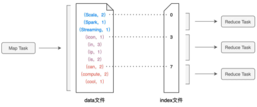

# Shuffle

任务调度的首要环节，是 DAGScheduler 以 Shuffle 为边界，把计算图 DAG 切割为多个执行阶段 Stages

在分布式计算场景中，Shuffle 为集群范围内跨节点、跨进程的数据分发

分布式数据集在集群内的分发，会引入大量的磁盘 I/O 与网络 I/O，在 DAG 的计算链条中，Shuffle 环节的执行性能是最差的

## 工作原理

以 Shuffle 为边界，计算被切割为两个执行阶段。Shuffle 之前的 Stage 叫作 Map 阶段，而把 Shuffle 之后的 Stage 称作 Reduce 阶段

在 Map 阶段，每个 Executors 先把自己负责的数据分区做初步聚合

在 Reduce 阶段，Executors 做第二次聚合（又叫全局聚合），从而完成任务

Shuffle 是 Map 阶段与 Reduce 阶段之间的数据交换

## 中间文件

Map 阶段与 Reduce 阶段，通过生产与消费 Shuffle 中间文件的方式，来完成集群范围内的数据交换

DAGScheduler 会为每一个 Stage 创建任务集合 TaskSet，而每一个 TaskSet 都包含多个分布式任务（Task）

在 Map 执行阶段，每个 Task都会生成包含 data 文件与 index 文件的 Shuffle 中间文件

Shuffle 文件的生成，是以 Map Task 为粒度的，Map 阶段有多少个 Map Task，就会生成多少份 Shuffle 中间文件

Shuffle 中间文件包含两类实体文件，一个是记录（Key，Value）键值对的 data 文件，另一个是记录键值对所属 Reduce Task 的 index 文件

index 文件标记了 data 文件中的哪些记录，应该由下游 Reduce 阶段中的哪些 Task（简称 Reduce Task）消费

## Shuffle Write

在生成中间文件的过程中，Spark 会借助一种类似于 Map 的数据结构，来计算、缓存并排序数据分区中的数据记录

这种 Map 结构的 Key 是（Reduce Task Partition ID，Record Key），而 Value 是原数据记录中的数据值

对于数据分区中的数据记录，Spark 会根据特定公式逐条计算记录所属的目标分区 ID，然后把主键（Reduce Task Partition ID，Record Key）和记录的数据值插入到 Map 数据结构中

当 Map 结构被灌满之后，Spark 根据主键对 Map 中的数据记录做排序，然后把所有内容溢出到磁盘中的临时文件

Map 结构被清空后，Spark 可以继续读取分区内容并继续向 Map 结构中插入数据，直到 Map 结构再次被灌满而再次溢，如此往复，直到数据分区中所有的数据记录都被处理完毕

最后，磁盘上存有若干个溢出的临时文件，而内存的 Map 结构中留有部分数据，Spark 使用归并排序算法对所有临时文件和 Map 结构剩余数据做合并，分别生成 data 文件、和与之对应的 index 文件

## Shuffle Read

对于每一个 Map Task 生成的中间文件，其中的目标分区数量是由 Reduce 阶段的任务数量（又叫并行度）决定的

对于所有 Map Task 生成的中间文件，Reduce Task 需要通过网络从不同节点的硬盘中下载并拉取属于自己的数据内容