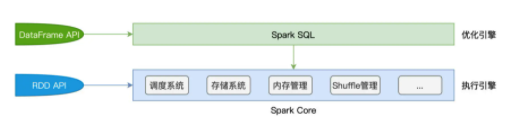
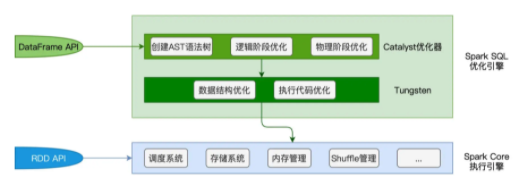

# Spark SQL

Spark Core 特指 Spark 底层执行引擎，包括了调度系统、存储系统、内存管理、Shuffle 管理等核心功能模块

Spark SQL 则凌驾于 Spark Core 之上，是一层独立的优化引擎

Spark Core 负责执行，而 Spark SQL 负责优化，Spark SQL 优化过后的代码，依然要交付 Spark Core 来做执行

在 RDD 框架下开发的应用程序，会直接交付 Spark Core 运行。而使用 DataFrame API 开发的应用，则会先过一遍 Spark SQL，由 Spark SQL 优化过后再交由 Spark Core 去做执行

Spark SQL 包含两个核心组件：Catalyst 优化器和 Tungsten

## Catalyst 优化器

Catalyst 优化器，它的职责在于创建并优化执行计划，它包含 3 个功能模块，分别是创建语法树并生成执行计划、逻辑阶段优化和物理阶段优化

## Tungsten

Tungsten 用于衔接 Catalyst 执行计划与底层的 Spark Core 执行引擎，它主要负责优化数据结果与可执行代码