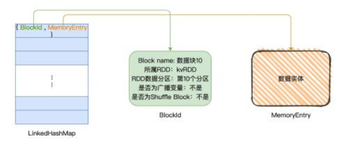
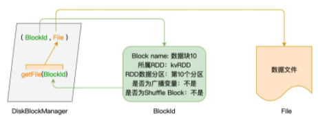

# 存储系统

Spark 存储系统负责维护所有暂存在内存与磁盘中的数据，这些数据包括 Shuffle 中间文件、RDD Cache 以及广播变量

## BlockManager

Driver 中包含 BlockManagerMaster，Executor 中包含 BlockManager

BlockManager 负责向 BlockManagerMaster 汇报 Executor 的内存、磁盘使用情况

BlockManagerMaster 与 BlockManager 之间的信息交换是双向的，但 BlockManager 之间没有信息交换，Executor 之间想交换内存、磁盘的使用情况必须通过 BlockManagerMaster

BlockManager 的职责，是在 Executors 中管理这 3 类数据的存储、读写与收发

## Block

- Shuffle 中间文件消耗的是节点磁盘

- 广播变量主要占用节点的内存空间

- RDD Cache 既可以消耗内存，也可以消耗磁盘

不管是在内存、还是在磁盘，这些数据都是以数据块（Blocks）为粒度进行存取与访问的

BlockManager 的核心职责，在于管理数据块的元数据（Meta data），这些元数据记录并维护数据块的地址、位置、尺寸以及状态

只有借助元数据，BlockManager 才有可能高效地完成数据的存与取、收与发

BlockManager 借助 MemoryStore 管理内存中的数据存取，借助 DiskStore 管理磁盘中的数据访问

## MemoryStore

MemoryStore 使用 `LinkedHashMap[BlockId, MemoryEntry]` 管理内存

BlockId 用于标记 Block 的身份，它不是一个仅仅记录 Id 的字符串，而是一种记录 Block 元信息的数据结构，包括 Block 名字、所属 RDD、Block 对应的 RDD 数据分区、是否为广播变量、是否为 Shuffle Block 等等

MemoryEntry 用于承载数据实体，数据实体可以是某个 RDD 的数据分区，也可以是广播变量

## DiskStore

DiskStore 是通过维护数据块与磁盘文件的对应关系，实现磁盘数据的存取访问

DiskStore 使用 DiskBlockManager 来维护元数据

DiskBlockManager 是类对象，它的 `getFile` 方法以 BlockId 为参数，返回磁盘文件

