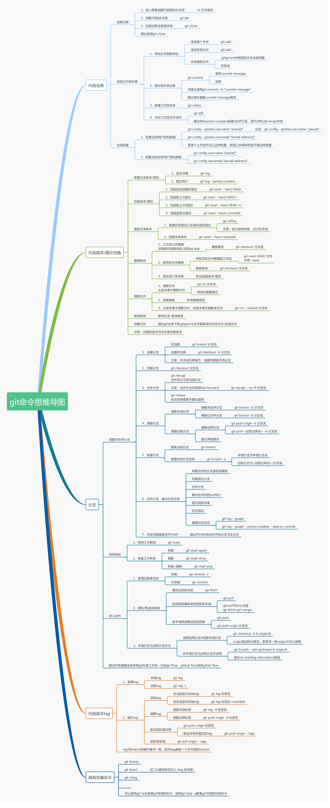

# Git



## 配置

### 系统配置

对所有用户都适用，存放在 %Git%/etc/gitconfig

使用 `git config --system` 便是读写该文件

### 用户配置

只适用于当前用户，存放于用户目录 ~/.gitconfig

使用 `git config --global` 便是读写该文件

### 仓库配置

只适用于当前仓库，存放于仓库目录 ./.git/config

使用 `git config --local` 便是读写该文件

每一个级别的配置都会覆盖上层相同配置，如 .git/config 会覆盖 %Git%/etc/gitconfig 中相同的变量名

### 配置个人身份

```
git config --global user.name "xxx"
git config --global user.email "xxx"
```

### 文本换行符配置

Windows 使用 `CRLF` 进行换行，而 Linux 和 Mac 只使用 `LF`

Git 可以在提交时自动转换换行符

```
// Windows 下打开自动替换
git config --global core.autocrlf true
// Linux Mac 下关闭
git config --global core.autocrlf input
```

### 文本编码配置

```
// git commit log 时使用 UTF-8 编码
git config --global i18n.commitEncoding utf-8
// git log 查看日志时采用 UTF-8 编码
git config --global i18n.logoutputencoding utf-8
```

### 大小写敏感性

```
// 查看是否忽略文件名大小写
git config --get core.ignorecase

// 设置文件名大小写敏感
git config core.ignorecase false
```

## 基本操作

### 同步远程代码

```
// 拉取指定分支的变化
git fetch origin master

// 拉取所有分支的变化
git fetch

// 拉取所有分支的变化，并且将远端不存在的分支同步移除【推荐】
git fetch -p
```

### 同步远程代码变化

```
// 都是先 git fetch，然后执行合并操作
// git pull 合并执行的是 git merge
git pull origin master 

// git pull -r 合并执行的是git rebase
git pull -r origin master
```

### 修改 commit

```
// 忘记提交暂存的文件
git add . && git commit --amend --no-edit

// 修改提交说明
git commit --amend -m "..."

// 移除已提交的文件
git rm --cached file && git commit --amend
```

### 回滚 commit

```
// 会将提交记录回滚，代码不回滚
git reset b14bb52

// 会将提交记录和代码全部回滚
git reset --hard b14bb52

// 将部分代码文件回滚
git checkout -- files
```

### 合并 commit

```
git merge master
git rebase master
```

- merge 是两个分支处理冲突后，新增一个 commit 追加到 master 上

- rebase 是将 someFeature 分支上的 commit 记录追加到主分支上：首先 git 会把 A 分支上所有发生在共同祖先 commit 之后的 commit 移除，暂时把他们存在别的地方；然后把 B 分支上所有新的 commit 添加到 A 分支上，此时 A 分支和 B 分支看起来是一模一样的；接着把被暂存起来的 A 分支上的 commit 会被重新添加到 A 分支上，只是这一次这些 commit 会被添加在那些来自于 B 分支的 commit 的后面

merge 处理冲突更直接，rebase 能够保证清晰的 commit 记录

### 查看操作记录

显示 `HEAD` 指向发生改变的时间列表

```
git reflog
```

### 压缩提交记录

压缩日志之后不仅能让 commit 记录非常整洁，同时也便于使用 rebase 合并代码

```
// 方法一：使用 git reset
git log
git reset commitID
git add && git commit
git push -f origin branchName

// 方法二：使用 git commit --amend 追加 commit 到上一个 commit 上
git commit --amend --no-edit

// 方法三：使用交互式 rebase
// HEAD～n 指定最近的 n 条 git 记录
// 进入 vim 编辑器后，会反序展示最近的 n 条记录
// p, pick 使用提交
// r, reword 编辑提交说明
// s, squash 与上一个提交合并
// d, drop 删除提交
// t, reset  将 HEAD 重置到该提交
git rebase -i HEAD~n
```

### 转移 commit

需要另一个分支的所有代码变动，那么就采用 merge

只需要某几个提交时，可以采用 cherry-pick

```
git cherry-pick commitID
git cherry-pick branchName

// 一次转移多个提交
git cherry-pick commitA commitB

// 转移一系列的连续提交
// commitA..commitB 前开后闭，即 (commitA, commitB]
git cherry-pick commitA..commitB
```

配置项：

- `-e`、`--edit`：编辑提交信息

- `-n`、`--no-commit`：只更新工作区和暂存区，不产生新提交

- `-x`：在提交信息的末尾追加一行 `cherry picked from commit ...`

- `--continue`：操作过程中发生代码冲突，解决冲突后继续执行 `cherry-pick`

- `--abort`：发生代码冲突后，放弃合并，回到操作前的样子

- `--quit`：发生代码冲突后，退出 `cherry pick`，但是不回到操作前的样子

### 撤销 commit

`git reset` 直接回滚到某一特定提交

```
git reset [option] [commitId]
```

选项：

- `--hard` 撤销 `commit`，撤销 `add`，删除工作区改动代码，即将 `commitId` 到 `HEAD` 的所有提交清空

- `--mixed` 默认参数，撤销 `commit`，撤销 `add`，还原工作区改动代码，即将 `commitId` 到 `HEAD` 的所有提交还原到工作区

- `--soft` 撤销 `commit`，不撤销 `add`，还原工作区改动代码，即将 `commitId` 到 `HEAD` 的所有提交还原到暂存区

`git revert` 新增一个提交，但是这个提交是将 `commitId` 的内容反向修改回去

```
git revert [option] ([commitId] | [first-commitId]..[last-commitId])
```

因为 `revert` 永远是在新增提交，因此本地仓库版本永远不可能落后于远程仓库，可以直接推送到远程仓库，故而解决了 `reset` 后推送需要加 `-f` 参数的问题，提高了安全性

### 暂存代码

- `git stash list` 查看工作进度记录堆栈列表，栈顶 `stash@{0}` 表示最新入栈的记录

- `git stash [save message]` 将未提交的修改内容保存到堆栈

- `git stash pop [stash@{num}]` 将堆栈中的工作进度记录弹出，应用到当前分支

- `git stash apply [stash@{num}]` 应用指定缓存，不出栈

- `git stash drop [stash@{num}]` 移除指定的工作记录

- `git stash clear` 清空